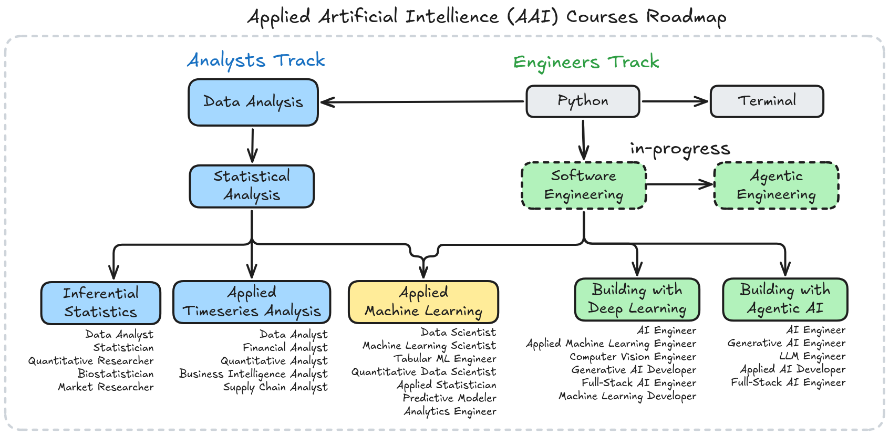

# Applied Artifical Intelligence (AAI) Roadmap

> Knowledge is power.

## Pre-requisites

Both tracks presume the following about the learner to get started:

+ **English B2 level**: IELTS 6.0 or TOEFL 4.0 (71)
+ Problem-solving mindset
+ Working laptop with internet access

## Roadmap

The floating text at the end of each path, is the **job roles** you can apply for once you are done (Insha' Allah).

## Course Material

PDF material can be downloaded from the [releases page](https://github.com/HassanAlgoz/AAI/releases).

## Core

Shared foundation for both tracks.

### 1. [Python](/courses/Python/)

Programming foundations in Python (external material).

### 2. [Terminal](/courses/Terminal/)

Understanding how to command your computer is essential for using it effectively and responsibly. Command and conquer your machine. Fear not the black box. Protect yourself from malicious code.

## Analysts Track

### 1. [Data Analysis](/courses/Data_Analysis/)

Fundamentals of data wrangling and analysis in Python via pandas, matplotlib and seaborn.

- M1. Filtering, Sorting, and Aggregation
- M2. Data Wrangling
- M3. Data Vizualization
- M4. Timeseries Analysis

### 2. [Statistical Analysis](/courses/Statistical_Analysis/)

Calculate, analyze, visualize, and extract insights from data. Formulate hypotheses and draw conclusions.

- M1. Introductions
- M2. Univariate Analysis
- M3. Bivariate Analysis

---

### 3.A [Inferential Statistics](/courses/Inferential_Statistics/)

Systematically generalize results from drawn samples onto a target population.

- M1. Inferential Statistics

### 3.B [Applied Timeseries Analysis](/courses/Timeseries/)

Visualize, analyze, and characterize time series -- then build forecasting models.

- M1. Visualizing Time Series
- M2. Correlation and Autocorrelation
- M3. Time Series Decomposition
- M4. Time Series Features
- M5. Forecasting
- M6. Model Evaluation and Tuning
- M7. Judgemental Forecasting

### 4. [Applied Machine Learning](/courses/Machine_Learning/)

Build reliable predictive modeling pipelines, debug its issues, evaluate and compare alternatives.

- M1. Supervised ML: Regression and Classification
- M2. Estimating and Improving Model Generalization Performance
- M3. Pipeline: Building Reliable Predictive Models
- M4. Decision Trees and Ensembles
- M5. AutoML

## Engineers Track

### 1. [Building with Deep Learning](/courses/Building_with_Deep_Learning/)

Select, use, compose, fine-tune, and deploy open-weight deep learning models on various unstructured data tasks.

*Depends on*: Software Engineering.

- M1. HuggingFace
- M2. Large Language Models
- M3. Applied Computer Vision

### 2. [Building with Agentic AI](/courses/Building_with_Agentic_AI/)

Develop, debug, evaluate, deploy, and monitor LLM-driven AI Agents to automate tasks involving unstructured data.

*Depends on*: Software Engineering.

- M1. Signatures and Modules
- M2. Agents, Tools, and Code
- M3. Optimization
- M4. Deployment
- M5. Retrieval Augmented Generation (RAG)

### 3. [Agentic Engineering](/courses/Agentic_Engineering/)

Learn how the tools and practices to work with coding agents.