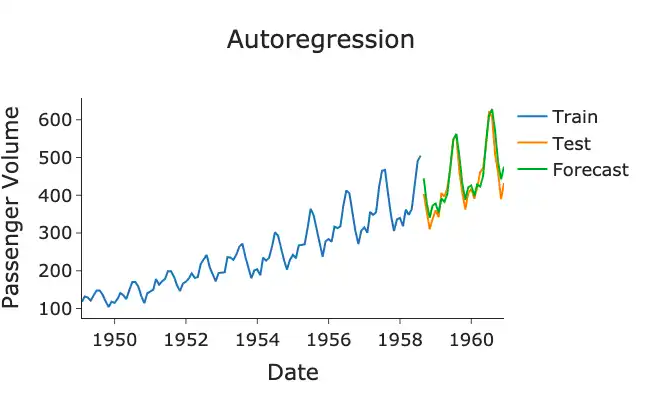
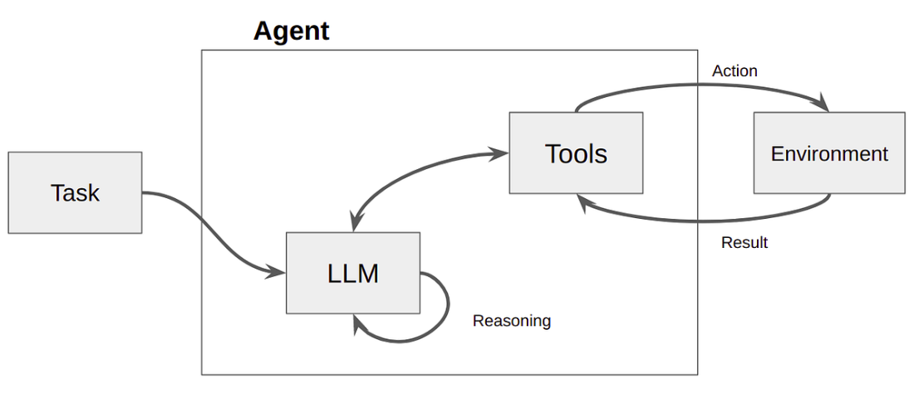

## State of Agentic AI

Reading the [State of Agent Engineering 2026](https://www.langchain.com/state-of-agent-engineering), "a survey of 1,300 professionals — from engineers and product managers to business leaders and executives — to uncover the state of AI agents." could give you an idea of what's going on in 2026 with Agentic AI. Notably:

1. It is being used in production by companies of different sizes
2. Most usage is:
   1. "**Customer Service**" (26.5%)
   2. "**Research & Data Analysis**" (24.4%)
   3. "**Internal Productivity**" (17.7%)
3. Biggest blockers being:
   1.  "**Quality of Outputs**" (32.9%)
   2. "**Latency / response time**" (20.1%)
   3. "**Security and compliance**" (16.0%)
   

## What is "Research and Productivity"?

What does "Research & Data Analysis" and "Internal Productivity" mean? To answer this, we have [summarized 30+ case Studies](./case-studies.qmd) from companies of various backgrounds using the LangChain ecosystem. Five things stand out:

1. Developer Productivity (high niche)
   - *GitLab* -> planner agent, developer agent, debugger agent, review agent (and security agent). Human-in-the-loop. PR merge.
2. Domain-Specific Copilots (a simplification of an overly complex system)
    - *Definely* -> editor assisted with AI, extracting data from docs and pdfs, and shows them and highlights them side-by-side with the editor.
3. Deep Research & Multi-Hop RAG (highly structured intelligence report)
    - *Harmonica.ai* -> retrieve and summarize news and articles for startup investors
4. Customer Support & Triage (with a hand-off to human-in-the-loop)
    - *CH Robinson* -> parse emails (text, PDF paperwork, and images) requesting shipment and attatchments.

For more, checkout [Case Studies | LangChain](https://docs.langchain.com/oss/python/langgraph/case-studies).

# The Evolution of Agents from LLMs

## First, a step back

## Prediction

**Prediction**. Can you predict the missing part?

- $0, 10, 20, 30, 40, ?$
- $5, 15, 25, 35, 45, ?$

Answers:

- $y = 10x$
- $y = 5 + 10x$

## Interpolation and Extrapolation

- **Interpolation** is predicting patterns within the range of the training data.  
	1, 2, **?**, 8, 16
- **Extrapolation** is predicting patterns beyond the range of the training data.
    - 1, 2, 3, **?**
    - **?**, 4, 5, 6
- **Forecasting** seasonal patterns (cycles), This could be daily, weekly, seasonal, …etc:  
      2, 2, 1, 2, 2, 1, 2, 2, **?**, **?**
- The more data points we have, the more confidence we have:  
    1, 2, 3, 4, 5, 6, 7, 8, 9, **?**
- The further the prediction, the less confident we get:  
    1, 2, 3, **?, ?, ?, ?, ?, ?, ?**

## Auto-regression

**Auto-regressive** models are ones which feed on their outputs to generate a sequence of predictions: ${y_1, y_2, \dots}$

The following is an example of auto-regression of three steps:

- step 0: 10, 20, 30, **?**
- step 1: 10, 20, 30, **40**, **?**
- step 2: 10, 20, 30, **40**, **50**, **?**
- step 3: 10, 20, 30, **40**, **50**, **60**

::: {.fragment}

Such models are used in Timeseries data like weather forcasting. The figure below shows an autoregressive model on timeseries data:

{fig-align="center" .r-stretch}

:::

## Tokenization

- **Language Models** first segment text into *tokens* and converts those into numbers before running a probabilstic model on them.
- You can [experiment with different tokenizers](https://agents-course-the-tokenizer-playground.static.hf.space) (first step in this phase) in the interactive playground below:

<center>
<iframe
	src="https://agents-course-the-tokenizer-playground.static.hf.space"
	frameborder="0"
	width="850"
	height="450"
></iframe>
</center>

## Attention

- When predicting the next word, not every word in a sentence carries equal weight - for example, in the sentence *"The capital of France is ..."*, the words "France" and "capital" are crucial for determining that "Paris" should come next. This ability to focus on relevant information is what we call attention.

::: {.fragment}

{fig-align="center"}

This involves many computationally intensive operations.

:::

## Context

- The model should handle the 10,000th token just as reliably as the 100th.
- However, in practice, this assumption does not hold. We observe that model performance varies significantly as input length changes, even on simple tasks.

::: {.fragment}

{fig-align="center" .r-stretch}

Figure shows 18 LLMs, including the state-of-the-art GPT-4.1, Claude 4, Gemini 2.5, and Qwen3 models. Our results reveal that models do not use their context uniformly; instead, their performance grows increasingly unreliable as input length grows. -- ([July 14, 2025 Context Rot | Chroma](https://www.trychroma.com/research/context-rot))
:::

## Language Models

**Large Language Models (LLMs)** are deep neural networks trained to model the most likely token given previous tokens.

::: {.fragment}

First application was: **Translation** ([Paper: Attention is all you need](https://arxiv.org/abs/1706.03762)). Given an English sentence, the task is to generate the most likely Arabic equivalent. This is done word-by-word, by repeatedly predicting the next Arabic word, the original sentence plus all predicted words thus far.

```
[
    ("The meuseum is far to the right", "ال")
    ("The meuseum is far to the right", "المتحف")
    ("The meuseum is far to the right", "المتحف في")
    ("The meuseum is far to the right", "المتحف في أقصى")
    ("The meuseum is far to the right", "المتحف في أقصى ال")
    ("The meuseum is far to the right", "المتحف في أقصى اليمين")
]
```
:::

## from translation to other tasks

- This technique was able to scale thanks to the **Transformers** architecture which is based on the concept of **Attention**, which learns the influence each previous token has in generating the next token, in the translation.  
  
- Same concept applied more simply in **Paraphrasing**, **Summarization**, and even **Question-Answering**.
  
- Trained on back-and-forth **Chat Conversations**, models were able to mimic chat-like interactions.  
  
- A hypothesis was proven at the time that [**Multi-task Model**](https://huggingface.co/papers/2210.11416) performs better than a single-task model. A more general idea is to train models to **"Follow Instructions"**. In which the user **Prompts** it to do any of the previously mentioned tasks, on-demand. Of course this needed lots of special *Data Curation*.
  
- One task was especially important: **JSON mode**: in which models produced their output in json format, such that it can be parsed easily by programs.

## Tool Calling

- Following that, an especially key development was the task of **Tool Calling**: in which a model is required to select from a set of Python funcition signatures (parameters, types, and docstrings) upon instruction. This is where **Agents** were born.

::: {.fragment}

{.r-stretch fig-align="center"}


*Note*: the terms *Reasoning*, *Thinking*, are just like the term *Intelligence*, not to be taken literally. See [The Illusion of Thinking | Apple](https://arxiv.org/pdf/2506.06941).
:::

## Function-calling Agents


::: {.columns}

::: {.column .nonincremental}

An **Agent** is based on an LLM in the following sequence:

- program takes input from user
- program feeds this input + available tools, into the LLM 
- **LLM generates** text parsable as a tool call
- program parses the tool call
- program executes the tool (function)
- program feeds the output to the LLM
- **LLM generates** output
- program prints this output to the user

:::

::: {.column}


:::

:::

See: [Guide > Function Calling | OpenAI](https://developers.openai.com/api/docs/guides/function-calling).


## What makes AI Agentic?

- **Artificial Intelligence** is a field of Computer Science, studying how to automate decision making.
  
- **Agentic AI** is
    1. where autonomy of the system is at the level of dealing not just with structured data, but with messy unstructured data like language, voice, and images, to inform automatic decision-making.
    2. This is growingly done in less supervised manner; and hence, more and more **autonomous**.
  
- Specifically, today's Agentic AI systems are driven by LLMs.

## A. Agent Framework

[LangChain](https://docs.langchain.com/oss/python/langchain/overview) is an agent framework that organizes components into these main categories:

| Category                                                             | Purpose                     | Key Components                      | Use Cases                                          |
| -------------------------------------------------------------------- | --------------------------- | ----------------------------------- | -------------------------------------------------- |
| **[Models](https://docs.langchain.com/oss/python/langchain/models)**                           | AI reasoning and generation | Chat models, LLMs, Embedding models | Text generation, reasoning, semantic understanding |
| **[Tools](https://docs.langchain.com/oss/python/langchain/tools)**                             | External capabilities       | APIs, databases, etc.               | Web search, data access, computations              |
| **[Agents](https://docs.langchain.com/oss/python/langchain/agents)**                           | Orchestration and reasoning | ReAct agents, tool calling agents   | Nondeterministic workflows, decision making        |
| **[Memory](https://docs.langchain.com/oss/python/langchain/short-term-memory)**                | Context preservation        | Message history, custom state       | Conversations, stateful interactions               |
| **[Retrievers](https://docs.langchain.com/oss/python/integrations/retrievers)**                | Information access          | Vector retrievers, web retrievers   | RAG, knowledge base search                         |
| **[Document processing](https://docs.langchain.com/oss/python/integrations/document_loaders)** | Data ingestion              | Loaders, splitters, transformers    | PDF processing, web scraping                       |
| **[Vector Stores](https://docs.langchain.com/oss/python/integrations/vectorstores)**           | Semantic search             | Chroma, Pinecone, FAISS             | Similarity search, embeddings storage              |

Alternative agent frameworks include: LlamaIndex, CrewAI, OpenAI Agents SDK, Google ADK.

## B. Agent Runtime

Agent runtimes like [LangGraph](https://docs.langchain.com/oss/python/langgraph/overview) manage state and state transitions (orchestration). In other words, building, managing, and deploying long-running, stateful agents. Concretely, things like:

* **Control-flow**: Step by step instructions, conditional execution, and loops.
* **Persistence**: Thread-level and cross-thread persistence for state management.
* **Durable execution**: Agents persist through failures and can run for extended periods, resuming from where they left off.
* **Streaming**: Support for streaming workflows and responses.
* **Human-in-the-loop**: Incorporate human oversight by inspecting and modifying agent state.

## C. Agent Platform

[LangFuse](https://langfuse.com/) (Open-source alternative to LangSmith): Traces, evals, prompt management and metrics to debug and improve your LLM application.

## What about Deep Agents?

- [**Deep Agents**](https://docs.langchain.com/oss/python/deepagents/overview) is LangChain's relatively new high-level library that makes it easy to get started.
- but you quickly run into issues where you need more control.
- The reason people use frameworks is to control the undeterministic nature of LLMs.
- Deep Agents doesn't help with that, it only makes the first 5 minutes easy.

## Key Takeways

Agents are LLMs. LLMs are undeterministic. Agentic AI systems are about taming this model to make it actually work reliably. To do that we will use:

- LangChain: the framework.
- LangGraph: the runtime.
- LangFuse: the platform.

## References

- [Read More](https://docs.langchain.com/oss/python/concepts/products).
- [Chat with langchain docs](https://chat.langchain.com/)