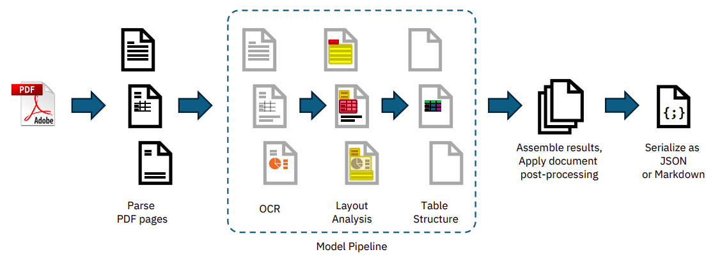

## Abstract

> This technical report introduces Docling, an easy to use, self-contained, MIT- licensed open-source package for PDF document conversion. It is powered by state-of-the-art specialized Al models for layout analysis (DocLayNet) and table structure recognition (TableFormer), and runs efficiently on commodity hardware in a small resource budget. The code interface allows for easy extensibility and addition of new features and models. -- [arXiv:2408.09869](https://arxiv.org/abs/2408.09869)

---

## Outline

* 1 Introduction
* 2 Getting Started
* 3 Processing pipeline
  * 3.1 PDF backends
  * 3.2 Al models
  * 3.3 Assembly
  * 3.4 Extensibility
* 4 Performance
* 5 Applications
* 6 Future work and contributions

---

## 1 Introduction

* Converting PDF documents is traditionally challenging due to format variability, weak standardization, and a lack of structural metadata.
* The rise of LLMs and Retrieval-Augmented Generation (RAG) has increased the demand for extracting rich content from PDFs.
* Docling bridges the gap between proprietary solutions and open-source tools.
* It is an efficient, locally-run Python library powered by specialized AI models for layout analysis and table structure recognition.

---

## 2 Getting Started

* The [`docling` package](https://www.docling.ai/) can be easily installed directly from PyPI.
* It allows users to convert PDF documents from local files, URLs, or binary streams into JSON or Markdown formats.
* Required model assets are automatically cached locally from Hugging Face on the first run.
* Pipeline features, such as OCR and thread budgeting, can be customized for batch or interactive modes.

Scroll to the **Features** section at the bottom of [this page](https://www.docling.ai/#features) and click on the interactive figure buttons to see the output of docling in details.

---

## 3 Processing pipeline

* Docling utilizes a linear sequence of operations for each document.
* **Parsing:** A PDF backend extracts text tokens, coordinates, and renders bitmap images of each page.
* **AI Models:** Specialized models extract layout and table structures independently per page.
* **Assembly:** Results are aggregated, post-processed for metadata and reading order, and serialized into the final output format.

{.r-stretch fig-align="center"}

---

## 3.1 PDF backends

* Backends must retrieve geometric text coordinates and render visual representations of pages.
* The default backend is `docling-parse`, a custom-built parser based on the low-level `qpdf` library.
* An alternative backend relying on `pypdfium` is provided as a backup for handling specific font encoding issues.

---

## 3.2 Al models

* **Layout Analysis:** Utilizes an RT-DETR based object-detector trained on DocLayNet to predict bounding boxes for paragraphs, tables, figures, and other elements.
* **Table Structure Recognition:** Uses TableFormer to recover logical row and column structures, handling complex layouts like spanning cells and absent borders.
* **OCR:** Optional EasyOCR integration is available to transcribe scanned PDFs or bitmap images.

---

## 3.3 Assembly

* Predictions from all pages are consolidated into a structured datatype defined in `docling-core`.
* A post-processing model augments the document by detecting the language and correcting the reading order.
* The system matches figures with captions and extracts metadata like titles, authors, and references before serializing to JSON or Markdown.

---

## 3.4 Extensibility

* The model pipeline is designed to be easily extensible by subclassing `BaseModelPipeline`.
* Users can completely customize the chain of operations, adding new models or replacing default ones.
* Custom pipeline classes can be passed as arguments during document conversion.
* Implementations must satisfy the Python Callable interface to augment page predictions.

---

## 4 Performance

* Docling is highly efficient and capable of running entirely on standard commodity hardware.
* On an Apple M3 Max utilizing 16 threads, Docling achieves a throughput of 1.34 pages per second with the native backend.
* Using the `pypdfium` backend requires less memory and is faster, but compromises table structure recovery quality.
* GPU acceleration support via ONNX and PyTorch runtimes is currently in progress.

---

## 5 Applications

* Docling provides a robust foundation for enterprise search, passage retrieval, and knowledge extraction pipelines.
* For generative AI and RAG, the companion package `quackling` enables document-native vector embedding and chunking.
* It integrates seamlessly with popular LLM frameworks like LlamaIndex.
* Docling is also utilized within the IBM Data Prep Kit to build large-scale multimodal training datasets.

---

## 6 Future work and contributions

* The core roadmap includes adding dedicated models for figure-classification, equation-recognition, and code-recognition.
* Ongoing work will optimize GPU acceleration and improve the native PDF backend.
* The project is open-source under the MIT license, and community contributions for new features and models are actively encouraged.