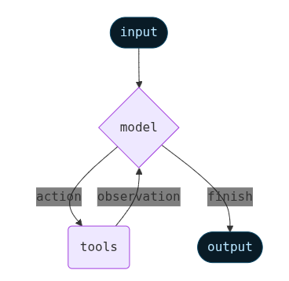

# Agent

An **Agent** runs a loop between a deterministic and a non-deterministic program:

1. Our Python code is a deterministic program which expects structured inputs to function
2. The LLM is a non-deterministic program which can handle natural language and other unstructured inputs

::: {.callout-tip .fragment}
To have the two work together, the LLM has to have the minimum function of structuring it's outputs as proper inputs to the Python program.
:::

::: {.fragment}
{.r-stretch fig-align="center"}
:::

## ReAct Loop

](../assets/Reason_plus_Action.png){.r-stretch fig-align="center"}

## Tools

::: {.fragment}
Tools extend what [agents](https://docs.langchain.com/oss/python/langchain/agents) can do—letting them fetch real-time data, execute code, query external databases, and take actions in the world.
:::

::: {.fragment}
Under the hood, tools are callable functions with well-defined inputs and outputs that get passed to a [chat model](https://docs.langchain.com/oss/python/langchain/models). The model decides when to invoke a tool based on the conversation context, and what input arguments to provide.
:::

## Agent vs LLM

An LLM is confined to its text box. You ask a question, it gives an answer, and it stops. It cannot independently take action in the real world. The `Agent` class in Python extends LLMs with:

1. the ability to interact with external environments via **Tools**
    1. **Action**
        - parsed from it's JSON output (tool + arguments).
        - executed by the Python env: (calling APIs, sending emails, ..etc.).
    2. **Observation** generate observation tokens based on the return value.
2. **Memory**: maintain state of:
    - generated text so far
    - results from tool calls
    - it's own observations on that
3. **Autonomy** means the runtime continues to loop; recognizing errors and self-correct, until the goal is achieved.

## Tool-calling

Many models have been trained to **format their output in JSON** and stop immediatly. This is done for parsability by deterministic programs like Python code:

::: {.columns}

::: {.column}

1. Output stops after generating JSON
2. Python (`Agent` class instance) parses this output
3. It indicates calling a specific function with specific arguments
4. Python calls the function and passess the arguments and assigns it to a variable
5. Check for stop condition
6. Python append the value as a string to the prompt
7. Python re-triggeres the LLM with this result
8. .. repeat (loop)

:::

::: {.column}


See: [Guide > Function Calling | OpenAI](https://developers.openai.com/api/docs/guides/function-calling).

:::

:::

## Creating an Agent

Define three things:

1. LLM (model)
2. Prompt
3. Tools


::: {.fragment}

Then pass them to the `create_agent` function:

```python
from langchain.agents import create_agent

agent = create_agent(
    model=model_nemotron3_nano, # Program (non-deterministic)
    tools=[internet_search],    # I/O (deterministic)
    system_prompt=AGENT_PROMPT  # Instructions (natural language)
)
```

:::

## Run the Agent

`Agent` is a `Runnable`; having `invoke`, `stream`, and `batch`.

```python
from langchain_core.messages import HumanMessage

question = "What's the timeline of how the AI industry has evolved over the past 10 years?"
result = agent.invoke({ "messages": [HumanMessage(question)] })
```

## Agent Prompt

```python
AGENT_PROMPT = """
    Role: You are an expert researcher. Your job is to conduct thorough research and then write a polished report.
    Style: Keep it short and concise.
    Tools: You have access to an `internet_search` tool as your primary means of gathering information.

    ## Tool: `internet_search`

    - Usage: Use this to run an internet search for a given query.
    - Parameters: You can specify the max number of results to return, the topic, and whether raw content should be included.
"""
```


## Create tools

The simplest way to create a tool is with the [`@tool`](https://reference.langchain.com/python/langchain-core/tools/convert/tool) decorator. By default, the function’s docstring becomes the tool’s description that helps the model understand when to use it:

```python
from langchain.tools import tool

@tool
def search_database(query: str, limit: int = 10) -> str:
    """Search the customer database for records matching the query.

    Args:
        query: Search terms to look for
        limit: Maximum number of results to return
    """
    return f"Found {limit} results for '{query}'"
```

Type hints are **required** as they define the tool’s input schema. The docstring should be informative and concise to help the model understand the tool’s purpose.

## Customize tool name and description

The [tool decorator](https://docs.langchain.com/oss/python/langchain/tools#create-tools) can be used to customize tool `names`, `description`, `schema` of arguments, and other properties:

```python
@tool(
    "calculator",
    description="Performs arithmetic calculations. Use this for any math problems.")
def calc(expression: str) -> str:
    """Evaluate mathematical expressions."""
    return str(eval(expression))

print(calc.name)  # calculator
```

## Define tool input schema

Schema as Pydantic class:

```python
from pydantic import BaseModel, Field
from typing import Literal

class WeatherInput(BaseModel):
    """Input for weather queries."""
    location: str = Field(description="City name or coordinates")
    units: Literal["celsius", "fahrenheit"] = Field(
        default="celsius",
        description="Temperature unit preference"
    )
    include_forecast: bool = Field(
        default=False,
        description="Include 5-day forecast"
    )
```

Tool:

```python
@tool(args_schema=WeatherInput)
def get_weather(location: str, units: str = "celsius", include_forecast: bool = False) -> str:
    """Get current weather and optional forecast."""
    temp = 22 if units == "celsius" else 72
    result = f"Current weather in {location}: {temp} degrees {units[0].upper()}"
    if include_forecast:
        result += "\nNext 5 days: Sunny"
    return result
```


## Toolkits

::: {.fragment}
A **toolkit** is a collection of tools meant to be used together.
:::

::: {.fragment}
Each tools within a toolkit is designed to be called by a model:
:::

- their inputs are designed to be generated by models
- their outputs are designed to be passed back to models

::: {.fragment}
See [Tool integrations](https://docs.langchain.com/oss/python/integrations/tools) which cover ready-made tools for various things like:
:::

- [Search](https://docs.langchain.com/oss/python/integrations/tools#search)
- [Productivity](https://docs.langchain.com/oss/python/integrations/tools#productivity)
- [Web browsing](https://docs.langchain.com/oss/python/integrations/tools#web-browsing)
- [Database](https://docs.langchain.com/oss/python/integrations/tools#database)
- [Code interpreter](https://docs.langchain.com/oss/python/integrations/tools#code-interpreter)
- [others](https://docs.langchain.com/oss/python/integrations/tools#all-tools-and-toolkits)

# Agentic Search Systems

- Build agents that iteratively search and refine results to answer complex queries.
- Instead of executing a single query and hoping for the best, let's use the LLM to break down a user query and iteratively search for information needed to generate an answer:

1. **Plan** - Break down complex queries into a sequence of retrieval steps
2. **Execute** - Perform targeted searches across Chroma collections or using other tools
3. **Evaluate** - Assess whether the retrieved information answers the question or identifies gaps
4. **Iterate** - Refine the plan and repeats steps 2-3 based on what it has learned so far
5. **Synthesize** - Combine information from multiple retrievals to form a comprehensive answer

## Applications of Agentic Search

**Agentic search is the technique that powers most production AI applications**.

- Customer support AI agents navigate product documentation, past ticket resolutions, and company knowledge bases, while dynamically adjusting their search based on specific use cases.
- Coding assistants search across documentation, code repositories, and issue trackers to help developers solve problems.
- Legal assistants search across case law databases, statutes, regulatory documents, and internal firm precedents.
- Medical AI systems query across clinical guides, research papers, patient records, and drug databases to support medical reasoning.

::: {.fragment}
See [Agentic Search | ChromaDB](https://docs.trychroma.com/guides/build/agentic-search).
:::
