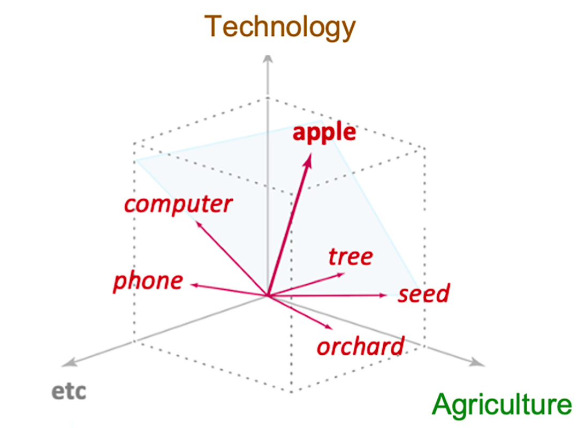
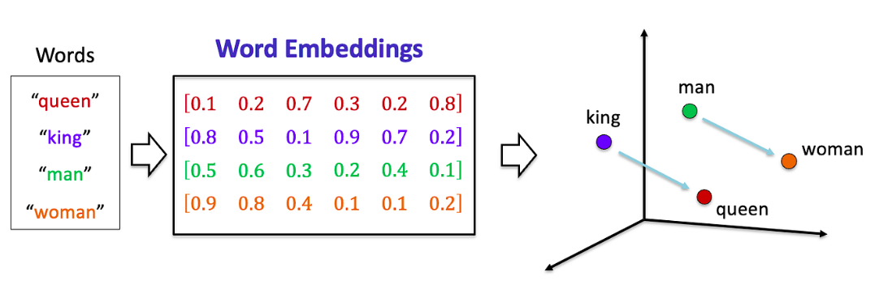
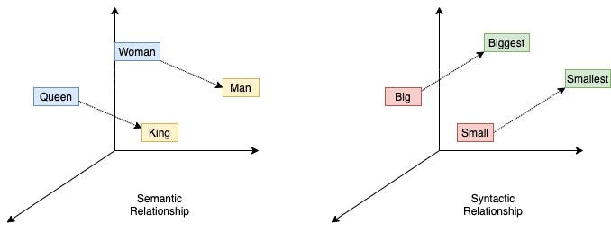
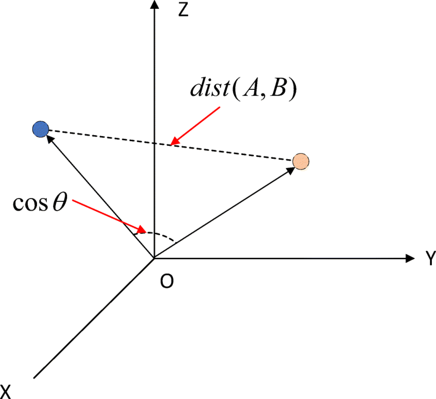
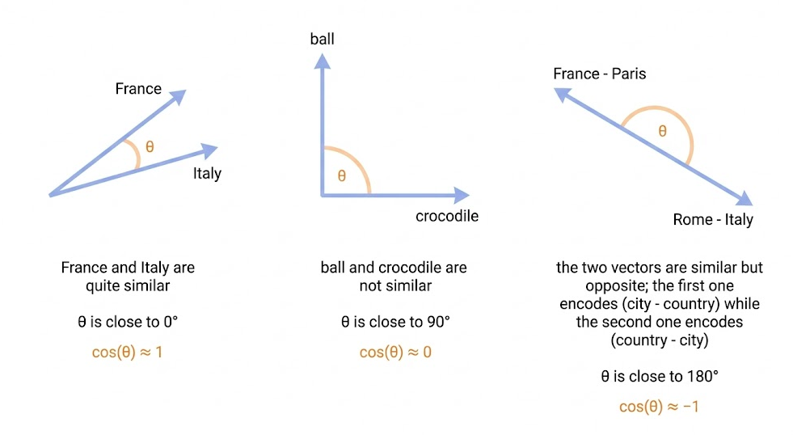
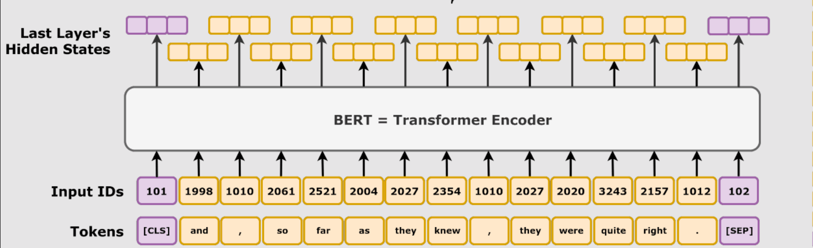
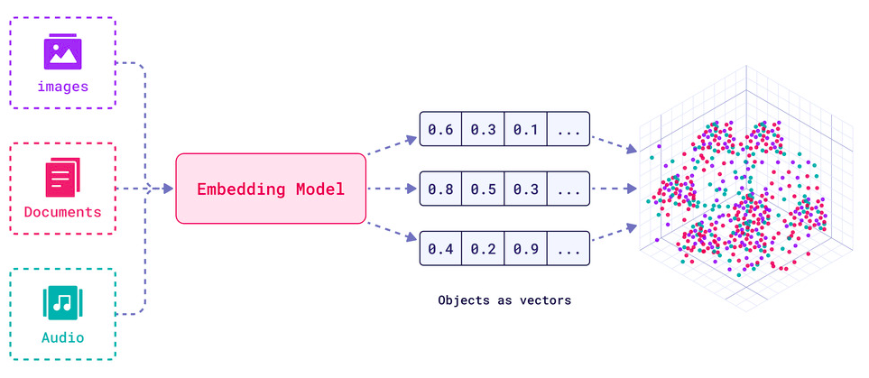
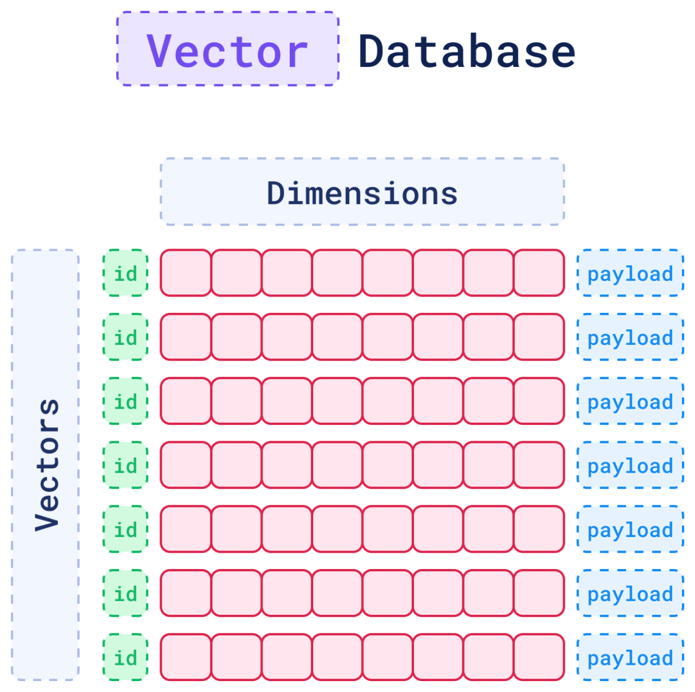
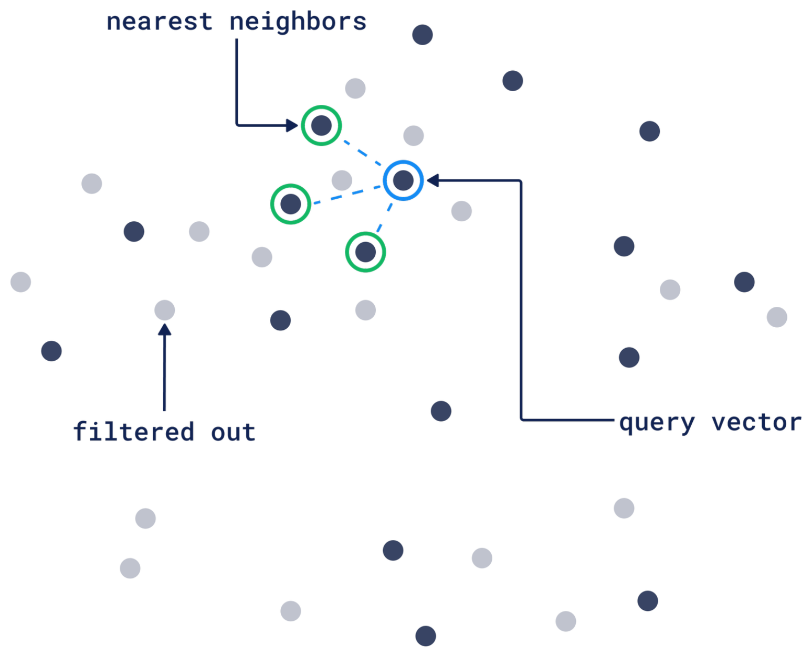

# Embeddings

- **Embeddings** are numerical representations of real-world data - text, images, audio, videos, anything.
- **Embedding Models** are deep learning models which encode these inputs into vectors.

## Distributional Hypothesis

> "You shall know a word by the company it keeps." — J.R. Firth, 1957

Here's the key insight: **words that appear near similar words have similar meanings.**

## Polysemy Example: "Apple"

A word may have different meanings based on it's context.

**Fruit**:

1. I picked a red ___ from the tree in the backyard.
2. The planted seeds in the orchard produced several ___ trees.
3. ___ are my favorite type of fruit.

**Technology**:

1. I mainly use my ___ iPhone to make phone calls.
2. The ___ MacBook Pro is a computer with a powerful processor.
3. I use an ___ computer to write emails and create documents.

## Words as Vectors

An embedding model may represent these two meanings using two dimensions:

{.r-stretch fig-align="center"}

## Vectors and relationships between words

{.r-stretch fig-align="center"}

* One dimension might represent "Gender":
    * positive for female
    * negative for male
* Another might represent "Royalty":
    * High for both King & Queen
    * low for both Man & Woman

::: {.fragment}

Mathematical relationships:

$$\vec{\text{King}} - \vec{\text{Man}} + \vec{\text{Woman}} \approx \vec{\text{Queen}}$$

:::

## Embeddings Capture Syntactic, Semantic, and other Relationships

When visualized in 2D, embeddings show clear structure:

{.r-stretch fig-align="center"}

$$\vec{\text{Walking}} - \vec{\text{Walk}} + \vec{\text{Swim}} \approx \vec{\text{Swimming}}$$
*Embedding models* learn these dimensions automatically from data. We don't manually specify what each dimension means.

## Similarity Metrics

Similarity metrics between two vectors can be:

1. **Eucledian Distance** measured by the straight line between the two points
2. **Cosine of the Angle** between the two vectors, when they are imagined as pointed lines from the origin onto the points in the space

::: {.fragment}

{.r-stretch fig-align="center"}

:::

## Cosine Similarity

**Cosine Similarity** measures the angle between two vectors (word embeddings):

- It ranges from -1 to 1
- **1.0** = vectors point in the same direction (**~same**)
- **0.0** = vectors are perpendicular (**no relationship / indifference**)
- **-1.0** = vectors point in opposite directions (**~opposite**)

::: {.fragment}

{.r-stretch fig-align="center"}

$$\vec{\text{France}} - \vec{\text{Paris}} \approx \vec{\text{Rome}} - \vec{\text{Italy}}$$
:::

## Sentence Embeddings

**BERT** is an embedding model for a complete sentence.

{.r-stretch fig-align="center"}

## Multi-modal Embeddings

- Beyond words, sentences, or even full pages or documents..
- encode, images, audio, or **any type of data** into vectors

::: {.fragment}

{.r-stretch fig-align="center"}

:::

- Image-search: vectors for an **image** of a bird and it's **name**, should be similar
- Voice-search: vectors for a **sound** of a bird chirping, and it's **species** should be similar
- Q&A: vectors for a **question** and the **document containing an answer** should be similar

## Applications of Embedding Models

Embeddings are commonly used for:

- **Search** (where results are ranked by relevance to a query string)
- **Clustering** (where text strings are grouped by similarity)
- **Recommendations** (where items with related text strings are recommended)
- **Anomaly** detection (where outliers with little relatedness are identified)
- **Diversity** measurement (where similarity distributions are analyzed)
- **Classification** (where text strings are classified by their most similar label)

::: {.fragment}

See: [Embeddings | OpenRouter](https://openrouter.ai/docs/api-reference/embeddings) and [Guides > Embeddings | OpenAI](https://developers.openai.com/api/docs/guides/embeddings)

:::

## LangChain Embeddings Interface

- Embedding models transform raw text—such as a sentence, paragraph, or tweet—into a fixed-length vector of numbers that captures its **semantic meaning**.
- These vectors allow machines to compare and search text based on meaning rather than exact words.

::: {.fragment}
LangChain provides a standard in erface for text embedding models (e.g., OpenAI, Cohere, Hugging Face) via the [Embeddings](https://docs.langchain.com/oss/python/integrations/embeddings) interface.Two main methods are available:
:::

- `embed_documents(texts: List[str]) → List[List[float]]`: Embeds a list of documents.
- `embed_query(text: str) → List[float]`: Embeds a single query.

## LangChain Vector Stores Interface

```{mermaid}
flowchart LR

    subgraph "📥 Indexing phase (store)"
        A[📄 Documents] --> B[🔢 Embedding model]
        B --> C[🔘 Embedding vectors]
        C --> D[(Vector store)]
    end

    subgraph "📤 Query phase (retrieval)"
        E[❓ Query text] --> F[🔢 Embedding model]
        F --> G[🔘 Query vector]
        G --> H[🔍 Similarity search]
        H --> D
        D --> I[📄 Top-k results]
    end

    classDef process fill:#DBEAFE,stroke:#2563EB,stroke-width:2px,color:#1E3A8A
    class A,B,C,D,E,F,G,H,I process
```

LangChain provides a unified interface for [vector stores](https://docs.langchain.com/oss/python/integrations/vectorstores), allowing you to:

- `add_documents` - Add documents to the store.
- `delete` - Remove stored documents by ID.
- `similarity_search` - Query for semantically similar documents.

::: {.fragment}

This abstraction lets you switch between different implementations without altering your application logic.

:::

## Vector Database

{.r-stretch fig-align="center"}

## Vector Search: Filtered Nearest Neighbors

{.r-stretch fig-align="center"}

## LangChain Retrievers Interface

A [Retriever](https://docs.langchain.com/oss/python/integrations/retrievers) accept a string query as input and return a list of [`Document`](https://reference.langchain.com/python/langchain-core/documents/base/Document) objects as output.

::: {.fragment}

Retrievers can be created from vector stores, but are also broad enough to include [Wikipedia search](https://docs.langchain.com/oss/python/integrations/retrievers/wikipedia) and [Amazon Kendra](https://docs.langchain.com/oss/python/integrations/retrievers/amazon_kendra_retriever).

:::