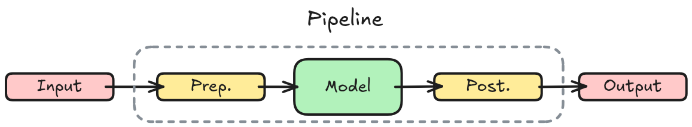

## Pipeline

The [`Pipeline`](/docs/transformers/v5.5.0/en/main_classes/pipelines#transformers.Pipeline) is a simple but powerful **inference API** that is readily available for a variety of machine learning **tasks** with any **model** from the Hugging Face [Hub](https://hf.co/models). 

A pipeline wraps three things into one call:

1. **Pre-processing** – Tokenizing raw text (or processing an image/audio input).
2. **Model inference** – Running the fine-tuned model.
3. **Post-processing** – Converting raw logits/outputs into human-readable results (e.g., labels, extracted answers, or generated text).

{.r-stretch fig-align="center"}

You pass in raw data and get back a structured result without touching the underlying tensors.

## Example: Image Segmentation Pipeline

```py
from transformers import pipeline

segmenter = pipeline(
    task="image-segmentation",
    model="facebook/detr-resnet-50-panoptic"
)
image_url = "https://huggingface.co/datasets/Narsil/image_dummy/raw/main/parrots.png"
segments = pipeline(image_url)
```

## Example: Text Classifier

The following example shows a pipeline for [*Text Classification*](https://huggingface.co/models?pipeline_tag=text-classification&sort=trending):

```py
from transformers import pipeline

classifier = pipeline(
    task="sentiment-analysis",
    model="distilbert/distilbert-base-uncased-finetuned-sst-2-english"
)

# Batch inference
classifier([
    "I've been waiting for a HuggingFace course my whole life.",
    "I hate this so much!"
])
```

## Available pipelines for different modalities

The `pipeline()` function supports multiple modalities, allowing you to work with text, images, audio, and even multimodal tasks. In this course we’ll focus on text tasks, but it’s useful to understand the transformer architecture’s potential, so we’ll briefly outline it.

| Task | Modality | Output | Models | Datasets |
|---|---|---|---|---|
| [`audio-classification`](https://huggingface.co/docs/transformers/main_classes/pipelines#transformers.AudioClassificationPipeline) | Audio | Classify audio into categories | [🔗](https://huggingface.co/models?filter=audio-classification) | [🔗](https://huggingface.co/datasets?task_categories=audio-classification) |
| [`image-classification`](https://huggingface.co/docs/transformers/main_classes/pipelines#transformers.ImageClassificationPipeline) | Image | Predicted class for an image | [🔗](https://huggingface.co/models?filter=image-classification) | [🔗](https://huggingface.co/datasets?task_categories=image-classification) |
| [`object-detection`](https://huggingface.co/docs/transformers/main_classes/pipelines#transformers.ObjectDetectionPipeline) | Image | Locate and identify objects in images | [🔗](https://huggingface.co/models?filter=object-detection) | [🔗](https://huggingface.co/datasets?task_categories=object-detection) |

Refer to the [Pipelines](https://huggingface.co/docs/transformers/main/en/main_classes/pipelines) API reference for a complete list of available tasks. 


## Accelerator: `device=0` for GPU

- By default a [Pipeline](https://huggingface.co/docs/transformers/v5.5.0/en/main_classes/pipelines#transformers.Pipeline) runs on a CPU which is given by `device=-1`
- For GPU, set `device` to the associated CUDA device id. For example, `device=0` runs on the first GPU.

```py
pipe = pipeline(
    task="sentiment-analysis",
    device=0    # Run on GPU
)
```

## Accelerator using `accelerate` library

- [Accelerate](https://hf.co/docs/accelerate/index) is a library of **distributed training**.
- It loads and stores the model weights on the **fastest device first, and then moves the weights to other devices (CPU, hard drive) as needed**.

Ensure to have [Accelerate](https://hf.co/docs/accelerate/basic_tutorials/install) installed first:

```sh
pip install -U accelerate
```

Then you can use it with `device_map="auto"` (or `device="mps"` on Apple silicon):

```py
pipe = pipeline(
    task="sentiment-analysis",
    device_map="auto"    # Use Accelerate 
)
```

## Pipeline Parameters

[Pipelines](https://huggingface.co/docs/transformers/main_classes/pipelines#pipelines) can be configured:

1. **Control Outputs**: with task-specific parameters.
2. **Optimize Processing**: Pipeline supports GPUs, Apple Silicon, and half-precision weights to accelerate inference and save memory.

## ASR Parameters

Example of ASR task parameters:

```python
pipe_asr = pipeline("automatic-speech-recognition", model="openai/whisper-tiny")

output = pipe_asr(
    "https://huggingface.co/datasets/Narsil/asr_dummy/resolve/main/mlk.flac",
    return_timestamps="word", # Returns precise start/end times for every word
    chunk_length_s=30,        # Splits long audio into 30-second segments for processing
    stride_length_s=5         # Adds 5 seconds of overlap between segments to prevent cutting words
)
```

## Text Generation Parameters

```py
from transformers import pipeline

generator = pipeline("text-generation", model="HuggingFaceTB/SmolLM2-360M")
output = generator(
    "In this course, we will teach you how to",
    max_new_tokens=30,
    num_return_sequences=2,
)
```

## Batch Inference

Batch inference is disabled by default since  hardware, data, and the model itself can affect whether it improves speed or not. In the example below, when there are 4 inputs and `batch_size=2` , Pipeline passes a batch of 2 inputs, **twice**.

```py
pipe = pipeline(
    task="text-generation", model="HuggingFaceTB/SmolLM2-360M",
    batch_size=2 # Batch Inference
)
pipe([
    "the secret to baking a really good cake is",
    "a baguette is",
    "paris is the",
    "hotdogs are"
])
```
Output:

```text
[[{'generated_text': 'the secret to baking a really good cake is to use a good cake mix.\n\ni’'}],
 [{'generated_text': 'a baguette is'}],
 [{'generated_text': 'paris is the most beautiful city in the world.\n\ni’ve been to paris 3'}],
 [{'generated_text': 'hotdogs are a staple of the american diet. they are a great source of protein and can'}]]
```

## Batch Inference: rules of thumb

- If you are using CPU, don’t batch.
- If you are latency constrained (live product doing inference), don’t batch.
- The larger the GPU the more likely batching is going to be more interesting.
- Handle OOM errors.

Read more at: [Pipeline batching](https://huggingface.co/docs/transformers/main_classes/pipelines#pipeline-batching).
