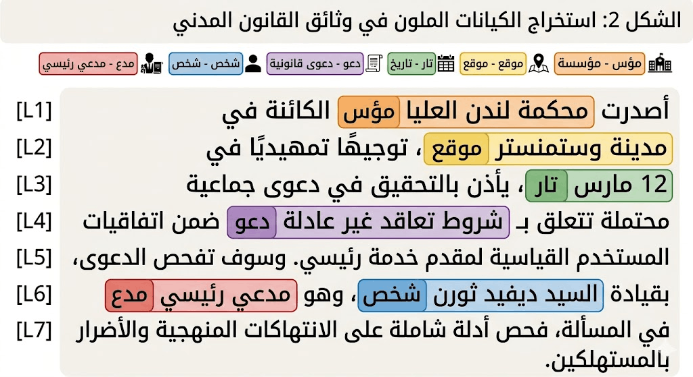

## Natural Language Processing (NLP)

NLP bridges the gap between computers and human language. It combines elements of:

1. computer science, 
2. linguistics, 
3. artificial intelligence

Recent success in NLP has been driven by **Deep Learning approach** which is based on [massive datasets](https://github.com/niderhoff/nlp-datasets) and models that can learn from data.

## NLU & NLG

**Natural Language Understanding (NLU)**: extract meaning, intention, emotion, importance, and correlation between words/texts/speech.

- Examples: Classification, NER, and ASR

**Natural Language Generation (NLG)**: generate the most likely sequence given previous sequence.

- Examples: Question Answering, Summarization, Translation, and Coding.

{fig-align="center" .r-stretch}

## NLU Tasks

Foundational discriminative tasks in natural language understanding (NLU):

| Task | Modality | Output | Models | Datasets |
|---|---|---|---|---|
| [`text-classification`](https://huggingface.co/docs/transformers/main_classes/pipelines#transformers.TextClassificationPipeline) | Text | Label and confidence score | [🔗](https://huggingface.co/models?filter=text-classification) | [🔗](https://huggingface.co/datasets?task_categories=text-classification) |
| [`token-classification`](https://huggingface.co/docs/transformers/main_classes/pipelines#transformers.TokenClassificationPipeline) | Text | Tokens with entity tags (e.g., PER, LOC) | [🔗](https://huggingface.co/models?filter=token-classification) | [🔗](https://huggingface.co/datasets?task_categories=token-classification) |
| [`question-answering`](https://huggingface.co/docs/transformers/main_classes/pipelines#transformers.QuestionAnsweringPipeline) | Text | Extracted answer span from a context | [🔗](https://huggingface.co/models?filter=question-answering) | [🔗](https://huggingface.co/datasets?task_categories=question-answering) |
| [`zero-shot-classification`](https://huggingface.co/docs/transformers/main_classes/pipelines#transformers.ZeroShotClassificationPipeline) | Text | Labels matched without task-specific training | [🔗](https://huggingface.co/models?filter=zero-shot-classification) | [🔗](https://huggingface.co/datasets?task_categories=zero-shot-classification) |

## NLG Tasks

| Task | Modality | Output | Models | Datasets |
|---|---|---|---|---|
| [`summarization`](https://huggingface.co/docs/transformers/main_classes/pipelines#transformers.SummarizationPipeline) | Text | Condensed version of the input text | [🔗](https://huggingface.co/models?filter=summarization) | [🔗](https://huggingface.co/datasets?task_categories=summarization) |
| [`translation`](https://huggingface.co/docs/transformers/main_classes/pipelines#transformers.TranslationPipeline) | Text | Translated text in the target language | [🔗](https://huggingface.co/models?filter=translation) | [🔗](https://huggingface.co/datasets?task_categories=translation) |
| [`text-generation`](https://huggingface.co/docs/transformers/main_classes/pipelines#transformers.TextGenerationPipeline) | Text | AI-generated continuation | [🔗](https://huggingface.co/models?filter=text-generation) | [🔗](https://huggingface.co/datasets?task_categories=text-generation) |
| [`text-to-speech`](https://huggingface.co/docs/transformers/main_classes/pipelines#transformers.TextToSpeechPipeline) | Audio | Convert text to spoken audio | [🔗](https://huggingface.co/models?filter=text-to-speech) | [🔗](https://huggingface.co/datasets?task_categories=text-to-speech) |
| [`automatic-speech-recognition`](https://huggingface.co/docs/transformers/main_classes/pipelines#transformers.AutomaticSpeechRecognitionPipeline) | Audio | Transcribed text from audio | [🔗](https://huggingface.co/models?filter=automatic-speech-recognition) | [🔗](https://huggingface.co/datasets?task_categories=automatic-speech-recognition) |
| [`image-to-text`](https://huggingface.co/docs/transformers/main_classes/pipelines#transformers.ImageToTextPipeline) | Image | Generate text descriptions of images | [🔗](https://huggingface.co/models?filter=image-to-text) | [🔗](https://huggingface.co/datasets?task_categories=image-to-text) |
| [`image-text-to-text`](https://huggingface.co/docs/transformers/main_classes/pipelines#transformers.ImageTextToTextPipeline) | Multimodal | Respond to an image based on a text prompt | [🔗](https://huggingface.co/models?filter=image-text-to-text) | [🔗](https://huggingface.co/datasets?task_categories=image-text-to-text) |

## Machine Translation (MT)

Automatically converting text from one language into another. This is a challenging task because languages have different grammatical structures, vocabularies, and idioms.

- Translating **subtitles** for movies and TV shows
- Translating **posts** for marketing
- Translating **legal documents** for international business
- Translating **medical records** for healthcare providers

> Example: [NAMAA-T5-Saudi2English](https://huggingface.co/NAMAA-Space/NAMAA-MT-Saudi2English) fine-tuned on Saudi dialectal data (Najdi, Hijazi, Southern, Northern, and Eastern varieties) built on top of mBERT-initialized T5 architecture and aims to improve translation quality for informal and region-specific Arabic commonly used across Saudi Arabia.

## Example: ASCAT: Arabic Scientific Corpus for Advanced Translation

[ASCAT-Arabic-Scientific-Translation](https://huggingface.co/datasets/NAMAA-Space/ASCAT-Arabic-Scientific-Translation).

- Domains: Physics, Mathematics, Computer Science, Quantum Mechanics, Artificial Intelligence
- Size: 500 full scientific abstracts
- Total English Tokens: 67,293
- Total Arabic Tokens: 60,026
- Arabic Vocabulary Size: 17,604 unique words

## Spelling Correction

[NAMAA-Space/SaudiSpell-AraT5](https://huggingface.co/NAMAA-Space/SaudiSpell-AraT5) Unlike generic Arabic correctors, this model is engineered to handle the specific orthographic and phonetic nuances of **Najdi**, **Hijazi**, and **Standard Saudi** dialects alongside Modern Standard Arabic (MSA). Trained on **3 Million sentences**.

## Named-entity Recognition (NER)

**Named entity recognition (NER)** aims to extract entities in a piece of text into predefined categories such as: **personal names**, **organizations**, **locations**, and **quantities**.

{fig-align="center" .r-stretch}

Example: [GLiNER](https://huggingface.co/NAMAA-Space/gliner_arabic-v2.1).

Applications:

- Building knowledge graphs for Arabic content.
- Enhancing search and recommendation systems with entity-aware features.

## Information Retrieval (IR)

**Information Retrieval (IR)** is the process of finding relevant information from a collection of documents.

- **Search engines** crawl, index, and find documents based on user queries.
- **Chat models** uses Retriveal to Augment their Generation (RAG) to provide up-to-date and factual answers.

See: [`intfloat` (Liang Wang)'s collections](https://huggingface.co/intfloat) for **embedding** and **reranker** models.

## Text Classification

**Text Classification** is the process of assigning a category or label to a piece of text.

**Spam Detection** (Spam / Not Spam) in emails and messages:

> "Congratulations! You've won a $1000 Walmart gift card. Click here to claim your prize."

**Sentiment Analysis** identifies the emotional tone of text.

* **Positive:** "This coffee is amazing!"
* **Negative:** "My order arrived cold and late."
* **Neutral:** "The store opens at 8 AM."

**Content Moderation** essential part of any online community.

- **Fake reviews** (تقييمات مزيفة)
- **Fake news** (أخبار مزيفة)
- **Fake accounts** (حسابات مزيفة)
- **Inappropriate content** (محتوى غير لائق)

## Optical Character Recognition (OCR)

Optical Character Recognition (OCR) converts images of text into searchable, editable data. Here is where it is used most effectively:

1. **Traffic:** Reading license plates for automated toll collection and parking garage access.
2. **Digitization:**
    - Converting physical books, legal files, and historical archives into searchable digital databases.
    - Instantly extracting text from invoices, receipts, and tax forms to eliminate manual typing.
3. **Live Translation:** Enabling apps to translate foreign street signs or menus by simply pointing a smartphone camera at them.

Example: [QARI-OCR](https://huggingface.co/NAMAA-Space/Qari-OCR-v0.3-VL-2B-Instruct) Structural Arabic Document Understanding.

## Automatic Speech Recognition (ASR)

Convert spoken language into text or actionable commands.

- **Transcription:**
  - **phone calls** for customer service and sales
  - **meetings** for note-taking and documentation
  - **lectures** for students and researchers
  - **podcasts** for SEO and accessibility
  - **interviews** for journalists and researchers
- **Dictation:** for people to speak their notes directly into text documents.
- **Voice Assistants:** Powering smart devices (like Siri or Google Assistant) to answer questions, set reminders, and control smart homes.

> Example: [NAMAA-Space/EgypTalk-ASR-v2](https://huggingface.co/NAMAA-Space/EgypTalk-ASR-v2) trained on over 200 hours of high-quality, manually curated audio data collected and prepared by the NAMAA team. It is built upon NVIDIA’s FastConformer Hybrid Large architecture and fine-tuned for Egyptian Arabic, enabling highly accurate transcription in casual, formal, and mixed dialect settings.

## Text to Speech (TTS)

Convert text into speech.

> Example: [NAMAA-Saudi-TTS](https://huggingface.co/spaces/omarelshehy/NAMAA-Saudi-Voice) refined to generate natural Saudi dialect speech, targeting everyday conversational usage rather than Modern Standard Arabic (MSA).
