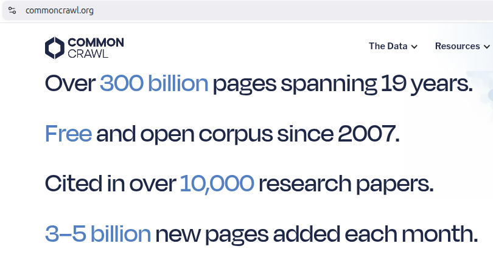

## Large Language Models (LLMs)

**Large Language Models (LLMs)** are a powerful subset of deep neural NLP models characterized by:

1. massive size (billions of parameters)
2. extensive training data (trillions of tokens)
3. ability to perform a wide range of language tasks

## Model Compression

- We use both **Half-precision** and [Quantization](https://huggingface.co/docs/transformers/quantization/overview) to reduce memory requirement.
- We also need to use a GPU `device="auto"`

Install [`bitsandbytes`](https://hf.co/docs/bitsandbytes/installation):

```sh
pip install -U bitsandbytes
```

Load LLM fot `text-generation` task via pipeline:

```py
pipe = pipeline(
    "text-generation",
    model="mistralai/Mistral-7B-v0.1",        
    dtype=torch.bfloat16,    # Half-precision (reduce memory)
    device_map="auto",       # Automatic Resource Allocation
    model_kwargs={
        # 8-bit Quantization (compress model)
        "quantization_config": BitsAndBytesConfig(load_in_8bit=True)
    },
)
```

## Small Language Models

**SLMs** are LLMs with far fewer parameters and lower compute requirements

- Crucial step toward efficient, accessible, and cost-effective AI.
- Practical solutions for businesses, developers, and researchers looking for powerful AI without the heavy computational burden of LLMs.

The following examples are SLMs ranging from **1-4 billion parameters**:

- [**Llama3.2-1B**](https://huggingface.co/meta-llama/Llama-3.2-1B) – A Meta-developed _1-billion-parameter_ variant optimized for edge devices.
- [**Qwen2.5-1.5B**](https://huggingface.co/Qwen/Qwen2.5-1.5B-Instruct) – A model from Alibaba designed for multilingual applications with _1.5 billion parameters_.
- [**DeepSeeek-R1-1.5B**](https://huggingface.co/deepseek-ai/DeepSeek-R1-Distill-Qwen-1.5B) - DeepSeek's first-generation of reasoning model distilled from Qwen2.5 with _1.5 billion parameters_.
- [**SmolLM2-1.7B**](https://huggingface.co/HuggingFaceTB/SmolLM2-1.7B) – From HuggingFaceTB, a state-of-the-art "small" (_1.7 billion-parameter_) language model trained on specialized open datasets (FineMath, Stack-Edu, and SmolTalk).
- [**Phi-3.5-Mini-3.8B**](https://huggingface.co/microsoft/Phi-3.5-mini-instruct) – Microsoft's tiny-but-might open model with _3.8 billion-parameters_ optimized for reasoning and code generation.
- [**Gemma3-4B**](https://huggingface.co/google/gemma-3-4b-it) - Developed by Google DeepMind, this light but powerful _4 billion-parameter_ model is multilingual and multimodal.

## Benefits of Small Language Models

- **Low Compute Requirements** – Can run on consumer laptops, edge devices, and mobile phones.
- **Lower Energy Consumption** – Efficient models reduce power usage, making them environmentally friendly.
- **Faster Inference** – Smaller models generate responses quickly, ideal for real-time applications.
- **On-Device AI** – No need for an internet connection or cloud services, enhancing privacy and security.
- **Cheaper Deployment** – Lower hardware and cloud costs make AI more accessible to startups and developers.
- **Customizability**: Easily fine-tuned for domain-specific tasks (e.g., legal document analysis).

## How Are They Made Small?

The process of shrinking a language model involves several techniques aimed at reducing its size without compromising too much on performance:

1. **Knowledge Distillation**: Training a smaller "student" model using knowledge transferred from a larger "teacher" model.
2. **Pruning**: Removing redundant or less important parameters within the neural network architecture.
3. **Quantization**: Reducing the precision of numerical values used in calculations (e.g. converting floating-point numbers to integers).

## LLM for Specific Tasks

```py
from transformers import pipeline

# use the same API for 3 different tasks
checkpoint = "HuggingFaceTB/SmolLM2-360M"

answerer = pipeline("question-answering", model=checkpoint)
classifier = pipeline("sentiment-analysis", model=checkpoint)
generator = pipeline("text-generation", model=checkpoint)
```

## How LLMs are Trained?

Three stages of training:

1. Pretraining (Unsupervised)
2. Supervised Fine-tuning (SFT)
3. Reinforcement Learning from Human Feedback (RLHF)

This is the standard pipeline for building a modern Large Language Model (LLM).

## Three stages of LLM training

{fig-align="center" .r-stretch}

## 1. Pretraining (The Knowledge Base)

::: {.incremental}
* **Goal:** Learn language, facts, and reasoning from the internet.
* **Method:** **Unsupervised Learning**. The model predicts the next word in a sequence (Self-Supervised).
* **Scale:** Massive datasets (trillions of tokens) and high compute.
* **Outcome:** A "Base Model" that is a world-class autocompleter but bad at following instructions.
:::

{fig-align="center" .r-stretch}

## 2. Supervised Fine-tuning (SFT)

::: {.incremental}
* **Goal:** Teach the model how to act like an assistant and follow specific formats.
* **Method:** **Supervised Learning**. Humans write high-quality "Prompt-Response" pairs.
* **Scale:** Small, curated datasets (thousands to tens of thousands of examples).
* **Outcome:** An "Instruct Model" that understands commands but may still produce "hallucinations" or unsafe content.
:::

::: {.fragment}
{fig-align="center" .r-stretch}

> [FLAN T5 | Google](https://arxiv.org/abs/2210.11416): "We finetune various language models on 1.8K tasks phrased as instructions, and evaluate them on unseen tasks".
:::

## 3. Reinforcement Learning from Human Feedback (RLHF)

::: {.incremental}
* **Goal:** Align the model with human values (helpfulness, honesty, safety).
* **Method:**
    1.  **Preference Labeling:** Humans rank multiple model outputs from best to worst.
    2.  **Reward Modeling:** A separate model learns these preferences.
    3.  **Optimization:** The LLM is updated (often via PPO or DPO) to maximize the "reward" score.
* **Outcome:** A "Chat Model".
:::

::: {.fragment}
{fig-align="center" .r-stretch}
:::

## Transfer Learning

**Transfer learning** is reusing a trained model on a new, related problem. Advantages are:

- **Time**: Training takes days instead of months.
- **Data**: You only need thousands of specialized examples instead of trillions of general ones.
- **Cost**: Less time spent on training on less data means less compute and thus less cost.

## Example: QARI-OCR

[QARI-OCR](https://huggingface.co/NAMAA-Space/Qari-OCR-v0.3-VL-2B-Instruct) is a **Vision-language Model (VLM)** fine-tuned from `Qwen2-VL-2B-Instruct` to process Arabic documents. Key Features:

- 📐 **Layout-Aware Recognition**: Preserves document structure with HTML/Markdown tags
- 🔤 **Full Diacritics Support**: Accurate recognition of tashkeel (Arabic diacritical marks)
- 📝 **Multi-Font Handling**: Trained on 12 diverse Arabic fonts (14px-100px)
- 🎯 **Structure-First Design**: Optimized for documents with headers, body text, and complex layouts
- ⚡ **Efficient Training**: Only 11 hours on single GPU with 10k samples
- 🖼️ **Robust Performance**: Handles low-resolution and degraded images

## QARI-OCR Model Performance

| Metric                         | Score       |
| ------------------------------ | ----------- |
| **Character Error Rate (CER)** | 0.300       |
| **Word Error Rate (WER)**      | 0.485       |
| **BLEU Score**                 | 0.545       |
| **Training Time**              | 11 hours    |
| **CO₂ Emissions**              | 1.88 kg eq. |

## QARI-OCR Training Details

- **Base Model**: Qwen2-VL-2B-Instruct
- **Training Data**: 10,000 synthetic Arabic documents with HTML markup
- **Optimization**: 4-bit LoRA adapters (rank=16)
- **Hardware**: Single NVIDIA A6000 GPU (48GB)
- **Framework**: Unsloth + Hugging Face TRL

# How to train?

1. HuggingFace
2. Unsloth

## HunggingFace Transformers Task Recipes

::: {.columns}
::: {.column}
{.r-stretch}
:::
::: {.column}
[Example: ASR](https://huggingface.co/docs/transformers/tasks/asr).
:::
:::
<!-- end columns -->


## Unsloth Studio (beta)

{fig-align="center" .r-stretch}

## Unsloth

**Unsloth** is an open-source framework for running and training models.

[⭐ Fine-tuning for Beginners](https://unsloth.ai/docs/get-started/fine-tuning-for-beginners):

::: {.columns}
::: {.column}
* [Fine-tuning Guide](https://unsloth.ai/docs/get-started/fine-tuning-llms-guide)
    * Step-by-step on how to fine-tune!
    * Learn the core basics of training.
* [What model should I use?](https://unsloth.ai/docs/get-started/fine-tuning-llms-guide/what-model-should-i-use)
    * Instruct or Base Model?
    * How big should my dataset be?
* [Is Fine-tuning right for me?](https://unsloth.ai/docs/get-started/fine-tuning-for-beginners/faq-+-is-fine-tuning-right-for-me)
    * What can fine-tuning do for me?
    * RAG vs. Fine-tuning?
:::
::: {.column}
* [Datasets Guide](https://unsloth.ai/docs/get-started/fine-tuning-llms-guide/datasets-guide)
    * How do I structure/prepare my dataset?
    * How do I collect data?
* [Inference & Deployment](https://unsloth.ai/docs/basics/inference-and-deployment)
    * How do I save my model locally?
    * How do I run my model via Ollama or vLLM?
* [Unsloth Requirements](https://unsloth.ai/docs/get-started/fine-tuning-for-beginners/unsloth-requirements)
    * Does Unsloth work on my GPU?
    * How much VRAM will I need?
:::
:::
<!-- end columns -->
