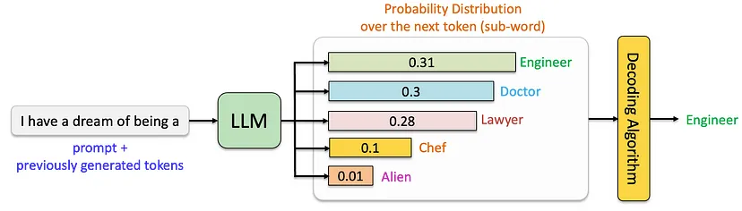
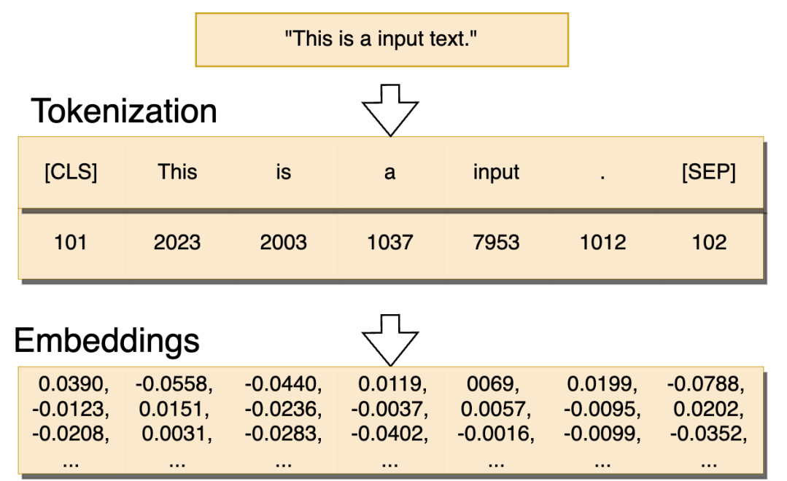
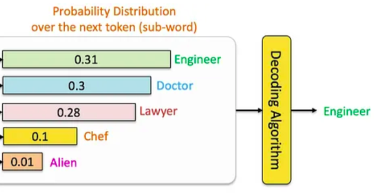
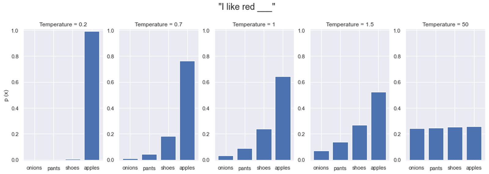

## How LLMs actually generate text?

- Understanding the mechanism gives us control over it
- Having control means we can optimize to our own metrics

Generation of text in LLMs works in two phases:

{.r-stretch fig-align="center"}

::: {.columns}

::: {.column .fragment}

1. **Prefill**
   1. Tokenization
   2. Embedding

:::

::: {.column .fragment}
1. **Decode**
   1. Probability
   2. Decoding

:::

:::

## Phase 1: Prefill

Like reading the entire text word-for-word each time, before starting to write the next word. It involves:

1. **Tokenization**: identify input as segmented parts.
2. **Embedding**: map to corrresponding vectors.

{.r-stretch fig-align="center"}

## The Tokenizer Playground

You can [experiment with different tokenizers](https://agents-course-the-tokenizer-playground.static.hf.space) (first step in this phase) in the interactive playground below:

<iframe
	src="https://agents-course-the-tokenizer-playground.static.hf.space"
	frameborder="0"
	width="850"
	height="450"
></iframe>

## The Role of Attention

When predicting the next word, not every word in a sentence carries equal weight - for example, in the sentence *"The capital of France is ..."*, the words "France" and "capital" are crucial for determining that "Paris" should come next. This ability to focus on relevant information is what we call attention.

{fig-align="center"}

This involves many computationally intensive operations.

## Context Length

- The model should handle the 10,000th token just as reliably as the 100th.
- However, in practice, this assumption does not hold. We observe that model performance varies significantly as input length changes, even on simple tasks.

{fig-align="center" .r-stretch}

Figure shows 18 LLMs, including the state-of-the-art GPT-4.1, Claude 4, Gemini 2.5, and Qwen3 models. Our results reveal that models do not use their context uniformly; instead, their performance grows increasingly unreliable as input length grows. -- ([July 14, 2025 Context Rot | Chroma](https://www.trychroma.com/research/context-rot))

## Phase 2: Decode

- The model generates one token.
- It is sampled from a probability distribution over all token in the vocabulary.
- That token may be: a space, a comma, a digit, a character, a word, or a subword.
- It could be a special token **EOS** (end of sequence) to stop generation.

{.r-stretch fig-align="center"}

## Greedy Sampling

You can [interact with the basic decoding process](https://agents-course-decoding-visualizer.hf.space) yourself with SmolLM2 in this Space (remember, it decodes until reaching an **EOS** token which is  **<|im_end|>** for this model):

<iframe
	src="https://agents-course-decoding-visualizer.hf.space"
	frameborder="0"
	width="850"
	height="450"
></iframe>

## Frequency Penalty

- A scaling penalty that increases based on how often a token has been used.
- The more a word appears, the less likely it is to be chosen again.

{fig-align="center" .r-stretch}

## Temperature

- **Temperature Scaling**:
    - higher settings (>1.0) make choices more random and creative
    - lower settings (<1.0) make them more focused and deterministic

{.r-stretch fig-align="center"}

## Token Selection

::: {.incremental}
1. **Logits**: unprocessed probability distribution over all tokens in the vocabulary
2. **Top-k Filtering**: An alternative approach where we only consider the `k` most likely next words
3. **Top-p (Nucleus) Sampling**: Instead of considering all possible words, we only look at the most likely ones that add up to our chosen probability threshold (e.g., top 90%)
:::

::: {.fragment}
{.r-stretch fig-align="center"}
:::

## Beam Search Sampling

**Beam Search explores multiple possible paths simultaneously**. Then select the sequence with the highest overall probability.

You can [explore beam search visually here](https://agents-course-beam-search-visualizer.hf.space):

<iframe
	src="https://agents-course-beam-search-visualizer.hf.space"
	frameborder="0"
	width="850"
	height="450"
></iframe>

This approach often produces more coherent and grammatically correct text, though it requires more computational resources than simpler methods.

## Libraries for LLM Generation Decoding

* [Outlines](https://github.com/dottxt-ai/outlines): Constrained (JSON) generation.
* [Optimum](https://github.com/huggingface/optimum): Hardware-specific optimization.
* [SynCode](https://github.com/uiuc-focal-lab/syncode): Grammar-guided generation.
* [logits-processor-zoo](https://github.com/NVIDIA/logits-processor-zoo): Advanced generation control.
