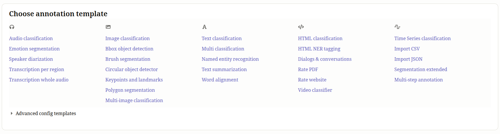

## Label Studio

Please read, watch, and follow the links to get the most out of this piece.

> [LabelStudio](https://labelstud.io/) is the open source platform for data labeling, AI evaluation, and human-in-the-loop workflows.

**Alternatives** have been considered, but they're either too bulky (appealing to enterprise; like Kili), or lacking features (like Argilla) or seem a bit dated and pricey (like: Prodigy).

Why LabelStudio? It supports annotating any type of data, it is open source, and easy to setup and use, and is feature rich, unlike competitors.

To apply the steps in the following video, please open a fresh folder with nothing else in it (and it is not part of any other project):

1. use `uv venv -p 3.12` to create an environment
2. and initialize a project with `uv init` instead of using `conda`
3. then install with: `uv install label-studio`

<iframe width="560" height="315" src="https://www.youtube.com/embed/oHKzVhyIj-o?si=zoTgMt-1BNsFqh5Z" title="YouTube video player" frameborder="0" allow="accelerometer; autoplay; clipboard-write; encrypted-media; gyroscope; picture-in-picture; web-share" referrerpolicy="strict-origin-when-cross-origin" allowfullscreen></iframe>

- To collaborate on the same project without hosting, you can use [`ngrok`](https://ngrok.com/). It allows your localhost to be connected to via public URL, for other team members to connect to.
- See [here to connect to HuggingFace](https://labelstud.io/tutorials/how_to_connect_hugging_face_with_label_studio_sdk) which means three things:
    1. HF → LS: Load datasets from Hugging Face into Label Studio for annotation
    2. LS → HF: Export labeled data from Label Studio for model training
    3. HF → LS: Connect Hugging Face models as ML backends for pre-annotations and active learning
- See [LabelStudio Integrations](https://labelstud.io/integrations/) from data sources to AI models accelerating your annotation workflow.

