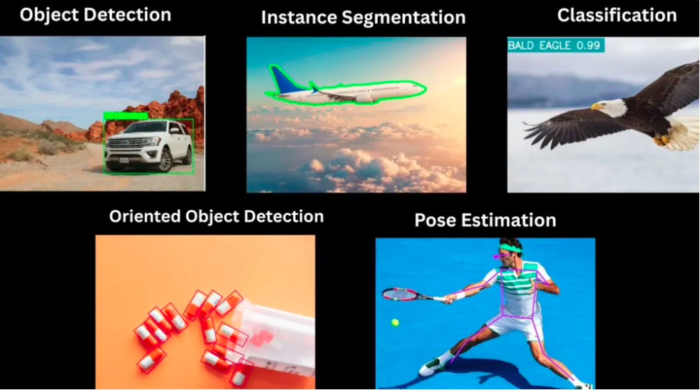
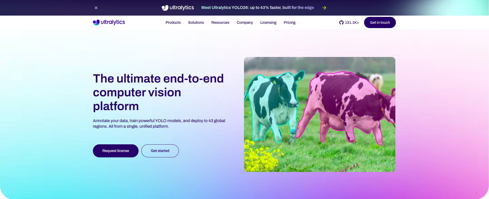
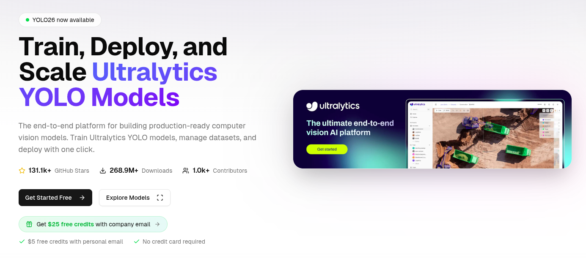
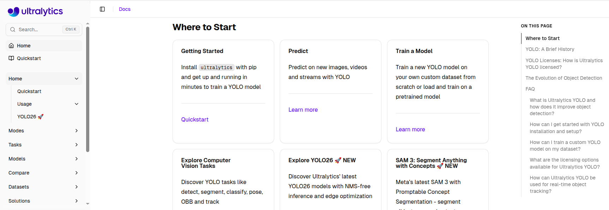
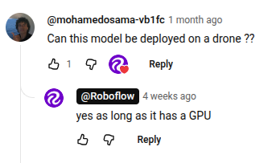
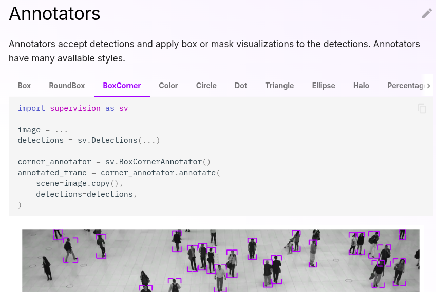

## YOLO

[YOLO26](https://docs.ultralytics.com/models/yolo26) is the latest evolution in the YOLO series of real-time object detectors, engineered from the ground up for **edge and low-power devices**. It introduces a streamlined design that removes unnecessary complexity while integrating targeted innovations to deliver faster, lighter, and more accessible deployment.

Supported tasks:

- [Object Detection](https://docs.ultralytics.com/tasks/detect)
- [Instance Segmentation](https://docs.ultralytics.com/tasks/segment)
- [Image Classification](https://docs.ultralytics.com/tasks/classify)
- [Pose Estimation](https://docs.ultralytics.com/tasks/pose)
- [Oriented Object Detection (OBB)](https://docs.ultralytics.com/tasks/obb)

All [Models](https://docs.ultralytics.com/models) are automatically downloaded from the latest Ultralytics [release](https://github.com/ultralytics/assets/releases) upon first use.

## YOLOE: Real-Time Seeing Anything

[YOLOE (Real-Time Seeing Anything)](https://arxiv.org/html/2503.07465v1) is a new advancement in zero-shot, promptable YOLO models, designed for **open-vocabulary** detection and segmentation. Unlike previous YOLO models limited to fixed categories, YOLOE uses text, image, or internal vocabulary prompts, enabling real-time detection of any object class. Built upon YOLOv10 and inspired by [YOLO-World](https://docs.ultralytics.com/models/yolo-world), YOLOE achieves **state-of-the-art zero-shot performance** with minimal impact on speed and accuracy.

## What is Ultralytics?

**Ultralytics** is an AI startup best known for developing the modern **YOLO (You Only Look Once)** series of open-source computer vision models. They maintain the `ultralytics` Python package, simplifying the process of training, evaluating, and exporting models to hardware-accelerated formats.

The video below illustrates **NAS**: Neural Architecture Search, an automatic hyper-parameter tuning method for deep neural networks, and employed by Roboflow when you train models on their platform:



## Why Three Websites?

In the software and AI industry, companies almost always divide their web presence into these three distinct areas. Both in general and for Ultralytics specifically:

1. The `www.` $\rightarrow$ **The Storefront:** High-level marketing, features, pricing, and sales.
2. The `platform.` $\rightarrow$ **The Workspace:** The cloud-based app (GUI) where you log in to manage data, train models, and click buttons.
3. The `docs.` $\rightarrow$ **The Manual:** Technical guides, code snippets, and API references for developers

### 1. [www.ultralytics.com](https://www.ultralytics.com)

* **What it is:** The marketing storefront.
* **Purpose in General:** To pitch the product, explain the company's value, and drive new user sign-ups or enterprise sales.
* **What you do there:** Read about high-level features, check pricing, read the company blog, look at case studies, or contact sales.
* **Target Audience:** Prospective customers, decision-makers, and curious visitors.

### 2. [platform.ultralytics.com](https://platform.ultralytics.com/)

* **What it is:** The actual web application or cloud workspace (for Ultralytics, this routes to "Ultralytics HUB").
* **Purpose in General:** This is where the actual work gets done. It requires an account and a login. It is the graphical user interface (GUI) for the company's cloud services.
* **What you do there:** Upload datasets, click buttons to train models in the cloud, monitor active training runs, manage team access, and export finished models.
* **Target Audience:** Registered users, data scientists, and project managers.

### 3. [docs.ultralytics.com](https://docs.ultralytics.com/)

* **What it is:** The technical manual.
* **Purpose in General:** To explain exactly how to install, write code for, and troubleshoot the software.
* **What you do there:** Copy and paste code snippets, read API endpoint references, follow step-by-step programming tutorials, and figure out why an error code is happening.
* **Target Audience:** Software engineers and developers who are actively writing code.

## Related Libraries

- While [Ultralytics](https://platform.ultralytics.com/) focuses heavily on creating the best model architectures and the underlying training engine.
    - Roboflow App: Upload data, annotate images, train and deploy models. [Get your API key](https://docs.roboflow.com/api-reference/authentication).
        - [Universe](https://universe.roboflow.com/): Browse and use community datasets and models. Pass any Universe `model_id` directly to Inference.
- [Inference](https://inference.roboflow.com/): application workflows, deployment and serving.
- [Supervision](https://supervision.roboflow.com/latest/):
    - Post-process results: decode predictions, plot bounding boxes, track objects, slice images for small object detection.
    - Unified `Detections` object that works with YOLO, SAM, Grounding DINO, Transformers, and 20+ model frameworks
- [Trackers](https://trackers.roboflow.com/latest/): Clean, modular implementations of leading trackers.

## Inference

[Inference](https://inference.roboflow.com/start/overview/) is an open-source computer vision deployment hub by Roboflow. 

### Reference Overview

Inference has several components that work together to serve computer vision models. The diagram below shows how they fit together.

- **[inference-sdk](https://inference.roboflow.com/inference_helpers/inference_sdk/)** - Lightweight Python client for communicating with the Inference Server.
- **[inference-cli](https://inference.roboflow.com/inference_helpers/inference_cli/)** - Command-line tool for managing the Inference Server and running common tasks.
- **[Inference Server](https://inference.roboflow.com/quickstart/docker/)** - HTTP server (Docker) that wraps the `inference` package as a REST API.
- **[inference](https://inference.roboflow.com/using_inference/about/)** - Core Python package for model loading, inference, and Workflows execution.

### Features

- **[Model Serving](https://inference.roboflow.com/quickstart/run_a_model)** - Object detection, classification, segmentation, keypoint detection, OCR, VQA, and more. Supports [pre-trained](https://inference.roboflow.com/quickstart/aliases), [fine-tuned](https://roboflow.com/train), and [foundation](https://inference.roboflow.com/foundation/about) models.
- **[Video Streaming](https://inference.roboflow.com/workflows/video_processing/overview)** - Efficient `InferencePipeline` for consuming camera feeds, RTSP streams, and video files with automatic frame management and state tracking.
- **[Speed](https://inference.roboflow.com/understand/features#speed)** - Automatic parallelization, hardware acceleration, dynamic batching, and optional TensorRT quantization.
- **[Extensibility](https://inference.roboflow.com/understand/features#extensibility)** - Open source (Apache 2.0). Add custom models, Workflow blocks, and backends.

### Deploy Anywhere[¶](https://inference.roboflow.com/start/overview/#deploy-anywhere)

||[Serverless](https://docs.roboflow.com/deploy/serverless-hosted-api-v2)|[Dedicated](https://docs.roboflow.com/deploy/dedicated-deployments)|[Self-Hosted](https://inference.roboflow.com/install/)|
|---|---|---|---|
|Fine-Tuned & Pre-Trained Models|✅|✅|✅|
|Workflows|✅|✅|✅|
|Foundation Models||✅|✅|
|Video Streaming||✅|✅|
|Dynamic Python Blocks||✅|✅|
|Runs Offline|||✅|
|Billing|Per-Call|Hourly|Free + [metered](https://roboflow.com/pricing)|

- **Serverless** - Pay-per-Inference, scales to zero. Doesn't support large [foundation models](https://inference.roboflow.com/foundation/about).
- **Dedicated** - Single-tenant VMs with optional GPU. Supports larger foundation models (SAM 2, Florence-2, PaliGemma). Billed hourly.
- **Self-Hosted** - Run on your own hardware. [Install guide →](https://inference.roboflow.com/install/)
- **Bring Your Own Cloud** - Self-host on [AWS, Azure, or GCP](https://inference.roboflow.com/install/cloud/) for enterprise compliance.

See: [What Devices Can I Use?](https://inference.roboflow.com/quickstart/devices/).

### Inference: Alternatives

[Alternatives](https://inference.roboflow.com/understand/alternatives/) include:

- Inference Servers
    - NVIDIA Triton Inference Server
    - Lightning LitServe
    - TensorFlow Serving
    - TorchServe
    - FastAPI or Flask
- Workflow Builders
    - ComfyUI
    - Node-RED
- Edge Deployment
    - Edge Impulse
    - NVIDIA DeepStream

## Run a model with Inference

Let's run a computer vision model with Inference. There are two ways to do this:

1. the [inference Python package](https://inference.roboflow.com/using_inference/about/) which loads and runs models directly in your process, or 
2. the [inference-sdk](https://inference.roboflow.com/inference_helpers/inference_sdk/) which sends requests to an [Inference Server](https://inference.roboflow.com/quickstart/docker/) over HTTP.

See: [Run a model](https://inference.roboflow.com/quickstart/run_a_model/)

### GPU on a Drone?

## Inference as a Microservice

The most common way to use Inference is as a small part of a larger system. It's producing a `response` that is consumed by downstream code. This response sometimes represents:

1. the prediction from a model (for example, a set of `Detections` containing objects' categorization, location, and size in an image)
2. or the result of post-processing logic (like the pass/fail state of an inspection)
3. or an aggregation (like the count of unique objects seen over the past hour)
4. or a visualization

### Image Input

For image workloads, the input is passed in as a parameter and the response is returned synchronously.

Example use-cases:

- 🏷️ Tagging of user-uploaded images to a website
- ⚙️ Determining if a machine is setup correctly before allowing it to turn on
- 💊 Counting the number of pills in an image
- 🔌 Detecting mismatched wiring in a finished circuit board
- 📐 Inspecting a manufactured good to ensure it matches the spec
- ✨ Validating that an object is defect and blemish free

### Video Input

In the case of video streams, a visual agent (called [an `InferencePipeline`](https://inference.roboflow.com/workflows/video_processing/overview.md)) is started and runs in a loop until terminated. Responses are polled or subscribed to by the client application for display or processing.

Example use-cases:

- 👤 Blurring faces in a video

## Inference as an Appliance

Inference can also be treated as an autonomous agent that continuously consumes and processes a video stream and performs downstream actions (like:

1. updating a database
2. sending notifications
3. firing webhooks
4. or signaling hardware.

In this paradigm, the full logic of the system is defined in a **Workflow** and the output is pushed to external systems.

Example appliance use-cases:

- 🛑 Stopping a conveyor belt if a jam has occurred
- 🛣️ Collecting highway traffic analytics
- 📹 Flagging suspicious activity in a security camera feed
- 🚚 Updating an inventory system as vehicles enter or leave a yard
- 🚨 Sounding an alarm when a scrap heap overflows
- ⏱️ Cataloguing retail customers’ wait time over the course of a day

## Inference Pipeline

- The Inference Pipeline interface is made for streaming and is likely the best route to go for real time use cases.
- It is an asynchronous interface that can consume many different video sources including:
    1. local devices (like webcams)
    2. RTSP video streams
    3. video files
    - ..etc.

..With this interface, you define:

1. the **source** (of a video stream) and
2. [**sinks**](https://inference.roboflow.com/using_inference/inference_pipeline/#sinks)

### How the [`InferencePipeline`](https://inference.roboflow.com/using_inference/inference_pipeline/#how-the-inferencepipeline-works) works?

The `InferencePipeline` is designed for robust, multi-source video processing, delegating tasks to dedicated threads to maximize throughput and stability.

1. **Video Multiplexer**
	- **Concurrency:** Spawns a separate consumer thread for each video source.
		    
        - For **Stored videos**, it just processes every frame until it is done.

        - For **Live streams**: buffers accumulate frames if the compute budget is strained, ensuring the model can either:  

            1. process all frames without dropping any.
            2. just the process the most recent ones.

        - **Auto-recovery:** video sources will be automatically re-connected once connectivity is lost during processing. That is meant to prevent failures in production environment when the pipeline can run long hours and need to gracefully handle sources downtimes.
        
2. **Video Sources Manager**: Collects incoming data into a **Frames Batch** based on a `batch_collection_timeout`.
	- If a source fails to provide a frame within the timeout, a smaller batch is passed forward.
	- Any missing frames (and their subsequent predictions) are safely padded with `None` before reaching the prediction stage.
    
3. **Execution Threads**:
        
    - **`on_video_frame(...)`:** Runs on its own dedicated thread, serving as the execution environment for your AI model.
        
    - **`on_prediction(...)`:** Handles downstream tasks (like visualization) on a separate thread. Controlled by the `sink_mode` parameter, it can process incoming data in either:  
        1. `SEQUENTIAL` mode: one element at a time or
        2. `BATCH` mode: all batch elements simultaneously.

See [the documentation page: Inference pipeline](https://inference.roboflow.com/using_inference/inference_pipeline/) for more details.

For post-processing, see section: [Custom Sink Tutorial](https://inference.roboflow.com/using_inference/inference_pipeline/#custom-sink-tutorial) on that same page.

## Supervision

[Supervision](https://supervision.roboflow.com/latest/) is an open-source Python library by Roboflow for building computer vision applications. It provides a unified `Detections` object that works with:

1. YOLO
2. [Transformers](https://huggingface.co/docs/transformers)
3. SAM
4. Grounding DINO
- ..and 20+ model frameworks

With Supervision you can:

1. annotate images and video with bounding boxes, masks, and labels;
2. track objects across frames with persistent IDs;
3. count and filter detections inside polygon zones;
4. load and convert datasets between YOLO, COCO, and Pascal VOC formats;
5. ..and benchmark model performance with mAP and confusion matrices.

Trusted by researchers (cited in 4,000+ papers) and practitioners (38,000+ GitHub stars, 1M+ monthly PyPI downloads), Supervision is the standard toolkit for production computer vision workflows.

## Supervision: Annotators

**Annotators**: Draw the detections with one of [20 annotators](https://supervision.roboflow.com/latest/detection/annotators/). Click the tabs to see the different annotators and their code:

See: [Supervision Cheat Sheet](https://roboflow.github.io/cheatsheet-supervision/) which contains less than 50% of the features. See [docs for all features](https://supervision.roboflow.com/latest/).

## Trackers

[Trackers](https://trackers.roboflow.com/latest/) is a package for clean, modular implementations of leading trackers.

### Bikers and Bikes



### MOT17

Pedestrian tracking with crowded scenes and frequent occlusions. Strongly tests re-identification and identity stability.



### SportsMOT

Sports broadcast tracking with fast motion, camera pans, and similar-looking targets. Tests association under speed and appearance ambiguity.



### SoccerNet-tracking

Long sequences with dense interactions and partial occlusions. Tests long-term ID consistency.



## When to Use Each Tracker?

|**Tracker**|**Best Use Case**|**Key Features & Advantages**|
|---|---|---|
|**SORT**|High-speed requirements, unoccluded scenes, and edge devices with tight compute budgets.|Uses a Kalman filter and Hungarian matching. Extremely fast, acts as a great baseline, and is easy to debug.|
|**ByteTrack**|Default choice for most apps; scenes with noisy or variable-confidence outputs (sports, aerial, retail).|Recovers low-confidence detections via two-stage association. Reduces missed tracks and ID switches with almost no extra compute.|
|**OC-SORT**|Erratic motion, non-linear paths, and fast turns or camera pans.|Uses an observation-centric re-update mechanism and direction consistency cost to resist drift from linear motion assumptions.|
|**BoT-SORT**|Strong camera ego-motion (drones, handheld, sports broadcasts) where identity stability is critical.|Extends ByteTrack by adding Camera Motion Compensation (CMC) and confidence-aware association to minimize ID switches.|

Source: [When to Use Each Tracker](https://trackers.roboflow.com/latest/trackers/comparison/#when-to-use-each-tracker).
