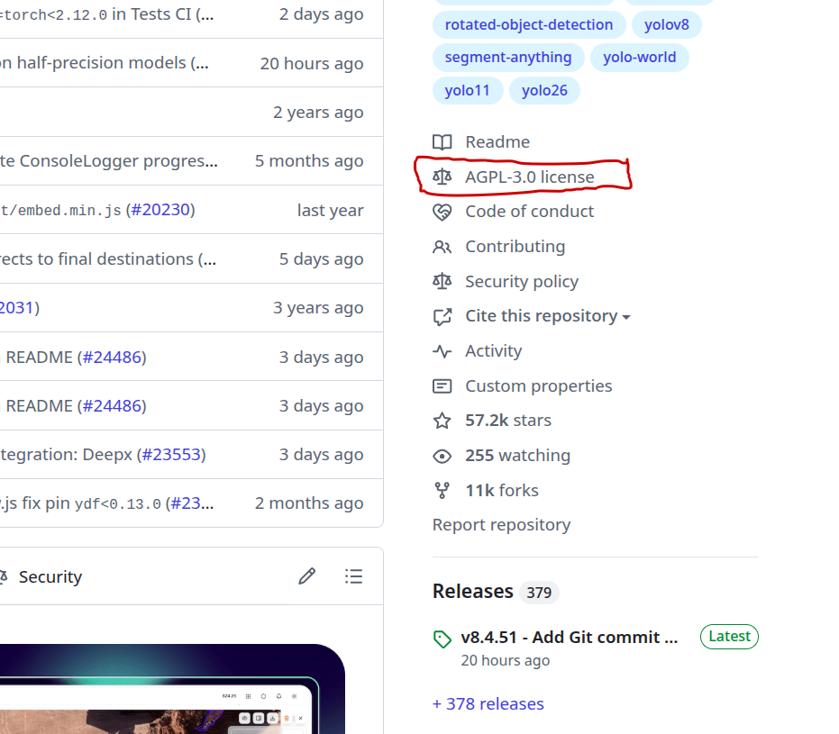
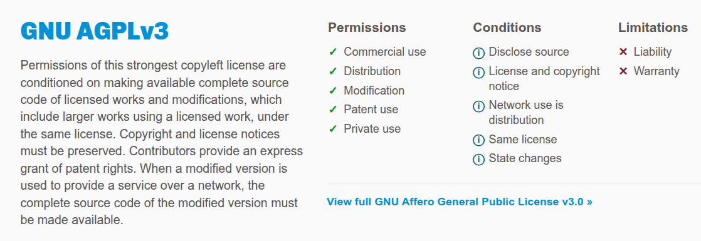

## Understanding Open Source Software Licenses

An open source license protects contributors and users. Businesses and savvy developers won’t touch a project without this protection.

](../assets/ultralytics/open_source_license.png)

## Can I use Ultralytics?

Always checkout the license of the software you use:

What does **`AGPL-3.0` License** that mean? Let's pull up the License Terms that define exactly:

1. what a user can do (Permissions)
2. must do (Conditions)
3. and cannot do (Limitations)

.. with the software.

It means, if you use the **Python package** (`pip install ultralytics`). And, you use this option for a commercial product, your code must remain completely open-source (under the AGPL-3.0 license), unless you buy a commercial license directly from Ultralytics.

See [Licenses](https://choosealicense.com/licenses/) for more details and other open source licenses.

## Ultralytics 2nd License (Commercial)

Ultralytics offers two licensing options to suit different needs:

- **AGPL-3.0 License**: This [OSI-approved](https://opensource.org/license/agpl-3.0) open-source license is perfect for students, researchers, and enthusiasts. It encourages open collaboration and knowledge sharing. See the [LICENSE](https://github.com/ultralytics/ultralytics/blob/main/LICENSE) file for full details.
- **Ultralytics Enterprise License**: Designed for commercial use, this license allows for the seamless integration of Ultralytics software and AI models into commercial products and services, bypassing the open-source requirements of AGPL-3.0. If your use case involves commercial deployment, please contact us via [Ultralytics Licensing](https://www.ultralytics.com/license).

See: [📜 License](https://github.com/ultralytics/ultralytics#-license).

## Roboflow: the commercial licensor

Ultralytics models (like YOLOv8, YOLO11, and YOLO26) are open-source but use a strict AGPL-3.0 license, which forces companies to open-source their own code if they use it. **Roboflow is an authorized commercial licensor** of these models. If a business deploys a YOLO model via Roboflow, they bypass the open-source restriction and can keep their proprietary code private.

## What about Models from Hugging Face?

Hugging Face is simply a repository (like GitHub). The models hosted there have wildly different licenses:

- Some are completely free for commercial use (Apache 2.0, MIT)
- but many others are strictly non-commercial (CC-BY-NC)
- or "infectious" (AGPL-3.0)
