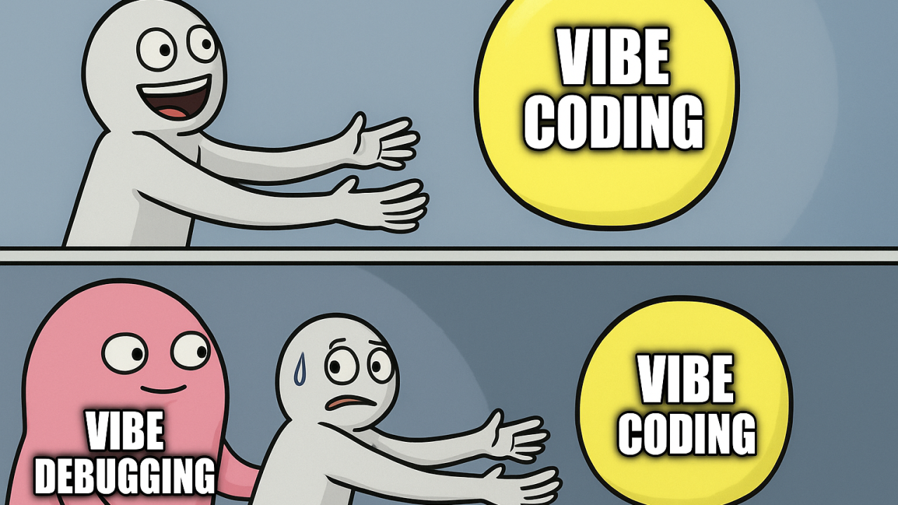
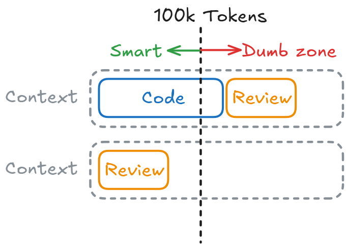
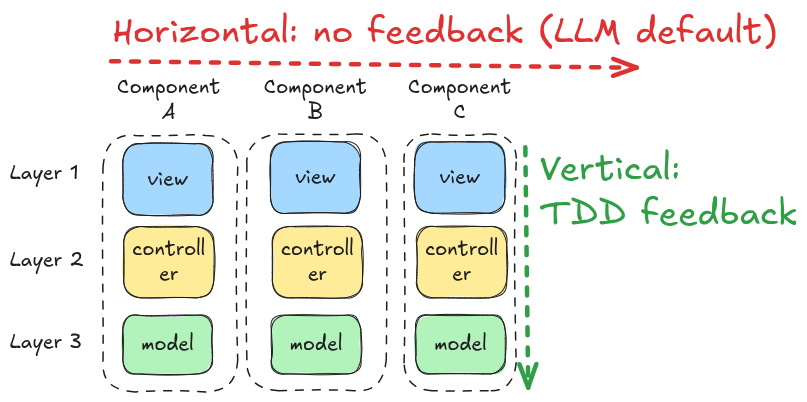

##

{.r-stretch fig-align="center"}

##

{.r-stretch fig-align="center"}

## Coding Agents

::: {.columns}

::: {.column}

An agent is an AI system that autonomously plans and executes coding tasks. You give the agent a high-level goal, and it breaks the goal down into steps, executes those steps with [tools](https://code.visualstudio.com/docs/copilot/concepts/tools), and self-corrects when it hits errors.


:::

::: {.column}


:::

:::


## Examples of Coding Agents

- [**Cursor**](https://cursor.com/)
- [**Antigravity**](https://antigravity.google/)
- [**GitHub Copilot**](https://code.visualstudio.com/docs/copilot/overview)
- Claude Code (most expensive)
- [Cline](https://cline.bot/) (on-prem)

## Agent loop

The agent loop typically involves three high-level stages:

1. **Understand.** The agent reads files, searches the codebase, and looks up documentation to understand what needs to change.
2. **Act.** The agent modifies code, runs terminal commands, installs dependencies, or calls external services through [tools](https://code.visualstudio.com/docs/copilot/concepts/tools).
3. **Validate.** The agent runs tests, checks for compiler errors, and reviews its own changes. If something is wrong, it continues iterating.

{.r-stretch fig-align="center"}

## Agent types

Agents run in different environments depending on when you need results and how much oversight you want. The two key dimensions are:

1. _where_ the agent runs (your machine or the cloud) and
2. _how_ you interact with it (interactively or autonomously in the background)

{.r-stretch fig-align="center"}

## System Prompt

- A `AGENTS.md` file placed at the root, is automatically injected into every chat session. Use when:

- You work with multiple AI coding agents and want a single set of instructions recognized by all of them
- You want subfolder-level instructions that apply to specific parts of a monorepo

See: [Tips for writing effective instructions](https://code.visualstudio.com/docs/copilot/customization/custom-instructions#_tips-for-writing-effective-instructions).

---

### Example: `AGENTS.md` file

```md
Welcome, Agent. You are assisting with an AI development repository utilizing `uv`, LangChain, HuggingFace, ChromaDB, and Chainlit. Follow these constraints strictly.

## 1. Environment & Commands

This project uses **`uv`** for dependency and environment management. Do not use standard `pip` or `poetry`.

* **Run a script:** `uv run python path/to/script.py`
* **Run Chainlit frontend:** `uv run chainlit run app.py`
* **Add a dependency:** `uv add <package>`
* **Environment Variables:** All secrets (OpenAI API keys, HF tokens) reside in `.env`. Never hardcode them. Use `os.getenv()` or `pydantic-settings`.

---

## 2. Tech Stack Context

* **Orchestration:** LangChain handles chains, tools, and agents.
* **Local Models:** HuggingFace `transformers` is used for local embeddings/inference. Always specify device mapping (e.g., `device_map="auto"` or explicit CPU/CUDA checks).
* **Audio STT:** Whisper calls use the OpenAI API client or LangChain's wrapper.
* **Vector Database:** ChromaDB handles embeddings.
* Default persistence directory: `./data/chromatadb`
* Always ensure clients are initialized using `PersistentClient`.


* **Frontend:** Chainlit drives the UI. Use Chainlit decorators (`@cl.on_chat_start`, `@cl.on_message`) appropriately. Do not mix UI logic inside core LangChain logic.

---

## 3. Scripts vs. Notebooks Protocol

### Python Scripts (`.py`)

* Contains production, reusable logic, UI definitions, and ingestion pipelines.
* Must include type hints and basic docstrings.

### Jupyter Notebooks (`.ipynb`)

* Used strictly for prototyping, data exploration, and prompt engineering experiments.
* **Rule:** When updating a notebook, modify the cells programmatically or rewrite the file safely. **Always clear outputs** before committing unless explicitly told otherwise to avoid git bloat.

---

## 4. Operational Guardrails

* **No Hallucinated Imports:** Verify LangChain imports carefully, as paths change frequently between versions (e.g., `langchain_core` vs `langchain_community`).
* **Idempotency:** Vector DB ingestion scripts must check if data already exists before duplicating vectors.
* **Graceful Failures:** Wrap Whisper API calls and HF model loading in `try/except` blocks with meaningful logging. Do not crash the Chainlit UI on an API failure.
```

## Up-to-date Code Docs

[Context7 Platform](https://github.com/mcp/upstash/context7).

### ❌ Without Context7

LLMs rely on outdated or generic information about the libraries you use. You get:

- ❌ Code examples are outdated and based on year-old training data
- ❌ Hallucinated APIs that don't even exist
- ❌ Generic answers for old package versions

### ✅ With Context7

Context7 pulls up-to-date, version-specific documentation and code examples straight from the source — and places them directly into your prompt.

## Planning

**Vibe Coding**: jumping straight into code generation; can lead to incomplete implementations or wrong architectural decisions.

The plan agent uses a 4-phase iterative workflow:

1. **Discovery**: research the task using read-only tools and codebase analysis.
2. **Alignment**: ask clarifying questions to resolve ambiguities.
3. **Design**: draft a structured implementation plan.
4. **Refinement**: iterate on the plan based on your feedback.

The Plan agent does not make code changes until the plan is reviewed and approved. Once approved, you can hand off the plan to the default agent or save it for further refinement.

Just type: `/plan` to switch to planning mode.

## [Customize planning](https://code.visualstudio.com/docs/copilot/agents/planning#_customize-planning)

You can tailor the planning process to fit your team's workflow:

- **Create a custom planning agent.** Define a [custom agent](https://code.visualstudio.com/docs/copilot/customization/custom-agents) with specific instructions for your planning process, such as enforcing architectural guidelines or requiring specific planning deliverables.
    
- **Choose models for planning and implementation.** Use the chat.planAgent.defaultModel setting to select a default model for the plan agent, and github.copilot.chat.implementAgent.model for the implementation step.
    
- **Add extra tools to the plan agent (experimental).** Use the github.copilot.chat.planAgent.additionalTools setting to give the plan agent access to additional tools during the research and planning phases. For example, use an MCP server to connect to internal data sources or tools.

## Subagents

The built-in [Plan agent](https://code.visualstudio.com/docs/copilot/concepts/agents#_planning) uses subagents to perform research and analysis before creating an implementation plan. Each subagent works autonomously and returns only its findings.

Key characteristics of subagents:

- **Context isolation**: each subagent runs in its own context window. It doesn't inherit the main agent's conversation history or instructions. It receives only the task prompt.
- **Synchronous execution**: the main agent waits for subagent results before continuing, because subagent findings typically inform the next step.
- **Parallel execution**: VS Code can spawn multiple subagents in parallel for tasks like analyzing security, performance, and accessibility simultaneously.
- **Focused results**: only the final result is returned to the main agent, keeping the main context focused and reducing token usage.

---

### Why Context Isolation is Important?

- **Session Lifecycle:**
  1. System Prompt (Minimal)
  2. Exploratory Phase
  3. Implementation
  4. Testing & Feedback
- *Tip: Monitor exact token usage.*

Keep tasks small and delegate to subagents to avoid the "Dumb Zone":

- **Smart Zone:** Starts fresh, unburdened attention relationships.
- **Dumb Zone:** Context > 100k tokens degrades performance quadratically.

{.r-stretch fig-align="center"}

Compacting (summarizing context) is of no use. Instead, clear it.

## Skills

- A skill is a prompt retrieved on-demand.
- Unlike `AGENTS.md` which is preprended at the start of each session.
- Examples:
    - **[tdd](https://github.com/mattpocock/skills/blob/main/skills/engineering/tdd/SKILL.md)** — Test-driven development with a red-green-refactor loop. Builds features or fixes bugs one vertical slice at a time.
    - **[diagnose](https://github.com/mattpocock/skills/blob/main/skills/engineering/diagnose/SKILL.md)** — Disciplined diagnosis loop for hard bugs and performance regressions: reproduce → minimise → hypothesise → instrument → fix → regression-test.

---

### Example Skill: `caveman/SKILL.md`

- Cuts token usage ~75%
- Try it:

```md
---
name: caveman
description: >
  Ultra-compressed communication mode. Cuts token usage ~75%.
  Triggered by: "caveman mode", "talk like caveman", "less tokens", "be brief".
---

Respond terse. Smart caveman. Technical accuracy stays. Fluff dies.

## Persistence
ACTIVE EVERY RESPONSE once triggered. Off only via "stop caveman" or "normal mode".

## Rules
*   **Drop:** articles (a/an/the), filler, pleasantries, hedging, conjunctions.
*   **Keep:** Exact technical terms (`uv`, `LCEL`, `PersistentClient`), exact code blocks, quoted errors.
*   **Format:** Fragments OK. Short synonyms (req, env, fn). Arrows for causality (X -> Y). 
*   **Pattern:** `[thing] [action] [reason]. [next step].`

### Stack-Specific Examples

**"Why is ChromaDB losing data on restart?"**
> Memory client used. Switch `PersistentClient`. Path: `./data/chromatadb`.

**"How to add a new package?"**
> `uv add [package]`. No `pip`.

**"Chainlit UI blocks during HuggingFace load."**
> Sync load blocks thread. Use `@cl.on_chat_start` or load HF `device_map="auto"` before UI start.

**"Whisper API failed and crashed UI."**
> Missing `try/except`. Wrap API call. Log error. Keep Chainlit alive.
```

## Modular Design

Modules: break down code into units; but:

- Shallow modules have wide interface and little functionality; consider deepning it.
- Balance depth such that code surface area is easily navigable by humans and AI alike.

{.r-stretch fig-align="center"}

## Layered Design

- LLMs like coding horizontally; this means you cannot test until all code is done from L1 to L3.
- Structure Todos into vertical slices; so the agent can get immediate feedback using TDD.

{.r-stretch fig-align="center"}

## Task Dependencies

The skill: `to-issues` breaks down the PRD into issues, and notes down the dependencies to allow parallel work.

{.r-stretch fig-align="center"}


## AI Skills for Real Engineers (by Matt Pocock)

- Overview: [My 7 Phases Of AI Development](https://www.aihero.dev/my-7-phases-of-ai-development).
  - Specific: [5 Agent Skills I Use Every Day](https://www.aihero.dev/5-agent-skills-i-use-every-day).
  - Skills Repo: [mattpocock/skills](https://github.com/mattpocock/skills): Skills for Real Engineers.
    - Detailed walkthrough: [AI Skills for Real Engineers](https://www.aihero.dev/grill-with-docs).

Live Demo: 



## Summary

- Let the AI ask the questions.
- Spend most time on alignment and planning (10 - 40 minutes sessions).
    - Global docs (ADR / CONTEXT.md)
    - Current conversation -> PRD
    - PRD -> many tasks with dependencies
- Be intentional with architecture.
- Use TDD to give immediate feedback loops to agents.
- Apply principles from 20-year-old software engineering books to AI.
