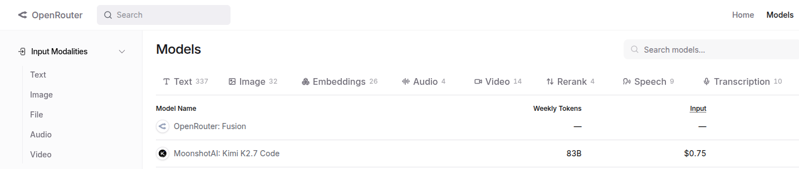

# Large Language Models

## What is an LLM?

Current Agentic workflows are driven by LLMs. So we'll need to understand how they work, to build systems, debug their issues, and optimize their performance.

Remember that **Artificial Intelligence** is a field of Computer Science, studying how to automate decision making.

> An alternative path to autonomy proposed by the turning award winner who held the cheif scientist position at meta Yann LeCun's World Models (JEPA). See: [Yann LeCun's $1B Bet Against LLMs [Part 1]](https://youtu.be/kYkIdXwW2AE?si=Yx5U4p1Z3qux14j6) for more details.

## Lanuage Models

**Language Model (LM)**; generate text, which were later then used to **perform tasks** by mimicing what people would write in response to a given textual input:

| **Example**             | **Industry Term**                    | **Typical Evaluation Benchmark** |
| ---------------------------- | ------------------------------------ | -------------------------------- |
| Question -> answer           | **Open-Book / Closed-Book QA**       | MMLU, TriviaQA                   |
| Document -> translated       | **Machine Translation**              | WMT                              |
| Text -> PII in it            | **Named Entity Recognition (NER)**   | CoNLL-2003                       |
| Feature request -> code      | **Program Synthesis / Code Gen**     | HumanEval, MBPP                  |
| Grade a piece given rubric   | **LLM-as-a-Judge / Reward Modeling** | MT-Bench                         |
| Edit piece based on feedback | **Iterative Refinement**             | GSM8K                            |

For a more comprehensive listing, see: [BIG-bench](https://github.com/google/BIG-bench/blob/main/bigbench/benchmark_tasks/README.md) by Google (214 tasks in total).

Note that tasks have their own tests to estimate the generalization performance of an LLM.

### Large and Small Language Models

**Large Language Models (LLMs)** are a powerful subset of deep neural NLP models characterized by:

1. massive size (billions of parameters)
2. extensive training data (trillions of tokens)
3. ability to perform a wide range of language tasks

**Small Language Models (SLMs)** are LLMs with far fewer parameters and lower compute requirements, energy consumption, and inference speed, allowing a set of use-cases that are impossible with large models:

- **Cheaper Deployment** – Lower hardware and cloud costs make AI more accessible to startups and developers.
- **Customizability**: Easily fine-tuned for domain-specific tasks (e.g., legal document analysis).
- **On-Device AI** – No need for an internet connection or cloud services, enhancing privacy and security.

## Multi-modal Models

A _modality_ means a medium or a way in which something exists or is done.

We use our 5 sense organs to recieve sensory inputs in multiple ways (modalities):

1. 👀 eyes to see
2. 👂️ ears to hear
3. 🤝 skin to touch
4. 👃 nose to smell
5. 👅 tongue to taste

### Examples of Multimodal Tasks and Models

Specailized models have been developed to support mapping between modalities:

1. Audio + Text ("hearing" 👂️):
      - [Automatic Speech Recognition](https://huggingface.co/tasks/automatic-speech-recognition) (or Speech to Text): Virtual Speech Assistants, Caption Generation.
      - [Text to Speech](https://huggingface.co/tasks/text-to-speech): Voice assistants, Announcement Systems.
2. Vision + Text ("seeing" 👀):
      - [Visual Question Answering or VQA](https://huggingface.co/tasks/visual-question-answering): Aiding visually impaired persons, efficient image retrieval, video search, Video Question Answering, Document VQA.
      - [Image to Text](https://huggingface.co/tasks/image-to-text): Image Captioning, Optical Character Recognition (OCR), Pix2Struct.
      - [Text to Image](https://huggingface.co/tasks/text-to-image): Image Generation.
      - [Text to Video](https://huggingface.co/tasks/text-to-video): Text-to-video editing, Text-to-video search, Video Translation, Text-driven Video Prediction.

Today's LLMs moved beyond language as well. Sometimes called **VLMs (Vision-language models)** and sometimes called **Multi-modal Models (MMMs)**. Searchin through [OpenRouter Models](https://openrouter.ai/models) you can find the left-pane (and the top buttons) to filter for specific modalities.

The following are open-source small language models:

* **[Llama](https://openrouter.ai/meta-llama/llama-4-scout)** (Meta) – Distinguished by its massive capacity, offering an "industry-leading context window of 10M" to process extensive multimodal inputs (text and image) simultaneously.
* **[Qwen](https://openrouter.ai/qwen/qwen3.7-plus)** (Alibaba) – Bridges the gap between edge deployment and long-form processing by introducing "native 128K context support" in a lightweight footprint.
* **[DeepSeek](https://openrouter.ai/provider/deepseek)** (DeepSeek) – Differentiated primarily by disruptive cost-efficiency, with analysts noting it prices "output tokens roughly 34 times below GPT-5.5" while maintaining high performance.
* **[Phi](https://openrouter.ai/microsoft/phi-4)** (Microsoft) – Stands out for training data efficiency, achieving strong reasoning and vision capabilities using "just 200 billion tokens... compared to more than 1 trillion" used by competitors.
* **[Gemma 4](https://openrouter.ai/google/gemma-4-26b-a4b-it:free)** (Google DeepMind) – Focuses on reliable, general-purpose utility over experimental features, which has allowed it to rank "third among open models on the Arena AI leaderboard."
