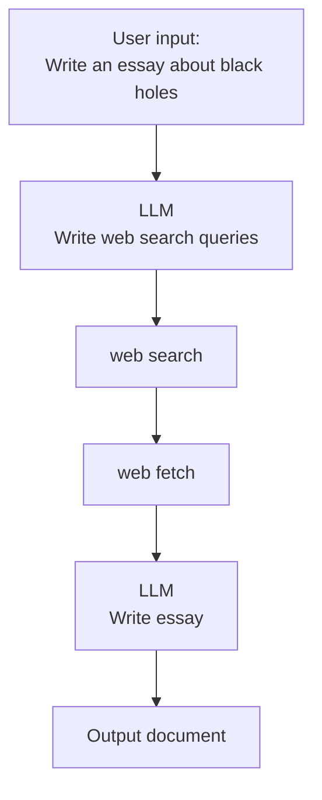
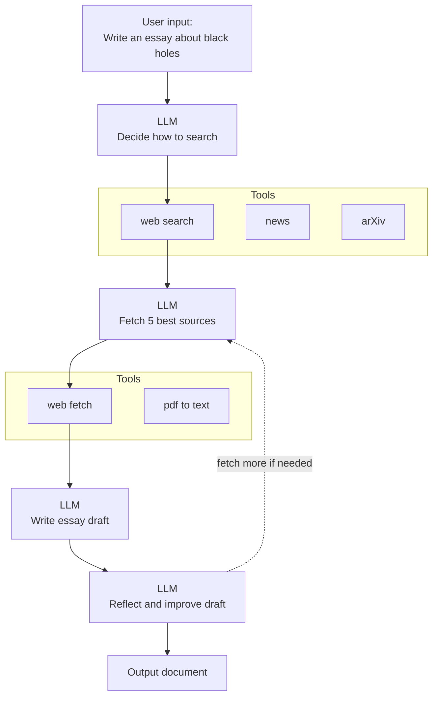
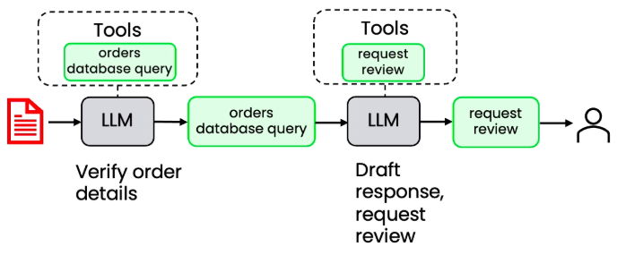

# Agentic Workflows

Today's **AI Agents** are programs where LLM outputs control the workflow.

**Agentic Workflows** is where autonomy of the system is at the level of dealing not just with structured data, but with messy unstructured data like language, voice, and images, to inform automatic decision-making. This is growingly done in less supervised manner; and hence, more and more **autonomous**.

### Degrees of Autonomy

Any system leveraging LLMs will integrate the LLM outputs into code. The influence of the LLM’s input on the code workflow is the level of agency of LLMs in the system. Agentic programs are the gateway to the outside world for LLMs.

#### Less autonomous workflow

#### More autonomous workflow

Building on the less autonomous version, the LLM chooses among available tools at each decision point rather than following a fixed pipeline:

#### The autonomy spectrum

Agentic AI can be less or more autonomous. Systems fall somewhere on a spectrum:

| Less autonomous | Semi-autonomous | Highly autonomous |
| --- | --- | --- |
| All steps are predetermined. | The agent can make some decisions and choose which tools to use. | The agent makes many decisions autonomously. |
| All tool use is hard-coded. | All tools are predefined. | The agent can create new tools on the fly to solve problems. |
| The autonomy is limited to text generation. | | |

The best agentic systems are the simplest: simplify the workflow as much as you can.

Giving an LLM some agency in your workflow introduces some risk of errors. Whenever possible, logic should be based on deterministic functions rather than agentic decisions.

## What building blocks do you have?

When building agentic workflows, think of yourself as having a number of **building blocks**.

| Building block | Examples | Use cases |
| --- | --- | --- |
| **Models** | LLMs | Text generation, tool use, information extraction |
| | Other AI models | PDF-to-text, text-to-speech, image analysis |
| **Tools** | API | Web search, get real-time data, send email, check calendar, ... |
| | Information retrieval | Databases, Retrieval Augmented Generation (RAG) |
| | Code execution | Basic calculator, data analysis |

- LLMs are good at generating text, deciding what to call, and extracting information.
- For some highly specialized tasks, you might also use other AI models, such as an AI model for converting a PDF to text, for text-to-speech, or for image analysis.
- In addition to AI models, you also have access to software tools, including different APIs that you can call to do web search, get real-time weather data, send emails, check calendar, and so on.
- You might also have tools to retrieve information—to pull up data from a database, or to implement RAG (retrieval augmented generation), where you can look up a large text database and find the most relevant text.
- Or you might have tools to execute code—a tool that lets an LLM write code and then run the code on your computer to do a huge range of things.

## Where to put the blocks?

A lot of the work when building an agent workflow is **looking at the work that the person or business is doing** and then trying to figure out: with these building blocks, how can you sequence them together in order to carry out the tasks that you want your system to carry out?

## Example: Essay-writing Agentic Workflow

Breaking down essay writing into steps:

| Direct generation | 3-step workflow | 5-step workflow |
| --- | --- | --- |
| 1. Write an essay on topic X | 1. Write an essay outline on topic X | 1. Write an essay outline on topic X |
| | 2. Search web | 2. Search web |
| | 3. Write the essay | 3. Write the first draft |
| | | 4. Consider what parts need revision |
| | | 5. Revise your draft |
| _Not good enough..._ | _Still not good enough..._ | |

We don't just write an essay. Rather, first we come up with an outline, search and read what has been written about it, gather information, then write a draft, revise it, and improve it until we reach the final version.

## Responding to customer order inquiries

What do we humans do?

1. extracting key details (e.g., sender, order number) from the incoming email using an LLM;
2. retrieving relevant shipping and order history via a database query function
3. generating and transmitting a resolution email via an API call.

## Invoice processing

Again, what do we do?

1. extracting required financial entities (e.g., biller name, amount due, date) from parsed document text;
2. invoking a function to update the corresponding database records with the extracted data.

