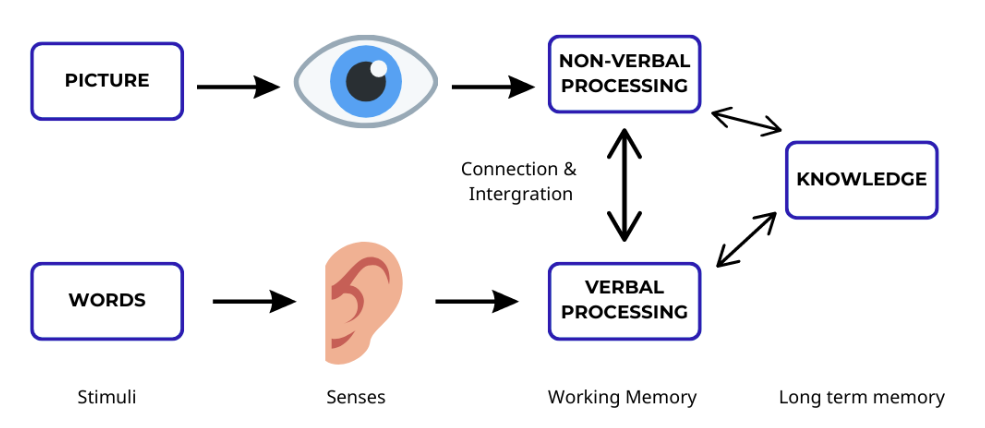
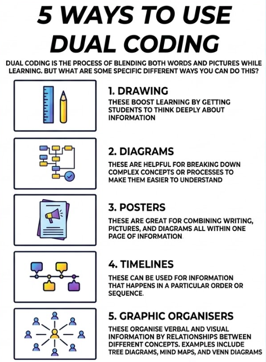

# Step-by-step

## Overview

> **Dual coding theory** is a theory of cognition that suggests that the mind processes information along two different channels; verbal and nonverbal. It was first hypothesized by [Allan Paivio](https://en.wikipedia.org/wiki/Allan_Paivio "Allan Paivio") of the [University of Western Ontario](https://en.wikipedia.org/wiki/University_of_Western_Ontario "University of Western Ontario") in the late 1960s[[2]](https://en.wikipedia.org/wiki/Dual-coding_theory#cite_note-2). In developing this theory, Paivio used the idea that the formation of [mental imagery](https://en.wikipedia.org/wiki/Mental_imagery "Mental imagery") aids learning through the [picture superiority effect](https://en.wikipedia.org/wiki/Picture_superiority_effect "Picture superiority effect").[[3]](https://en.wikipedia.org/wiki/Dual-coding_theory#cite_note-Reed,_Stephen_K.-2012-3)

While a picture is worth a thousand words, today's LLMs are still boring text generators.

**Goal**: explain step-by-step processes efficiently with [dual modes](https://en.wikipedia.org/wiki/Dual-coding_theory): text and graphics.

### 5 Ways to use dual coding

## Applications

### Instruction Manuals

Given a sequence of details steps of a process, the model is able to generate a sequence of images + associated texts that help in understanding this process.

Three examples are shown below:

{height=400}

##  Resources that may help

- [Today / Instructions](https://www.pinterest.com/pin/81346337011921135/)
- [How to Make an Instruction Manual: A Step-by-Step Guide](https://manual.to/how-to-make-an-instruction-manual-a-step-by-step-guide/)
- [Gestalt Laws of Perceptual Organization](https://www.verywellmind.com/gestalt-laws-of-perceptual-organization-2795835) are demonstrated in the figure below: