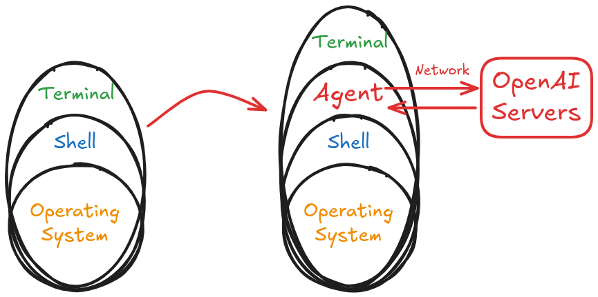
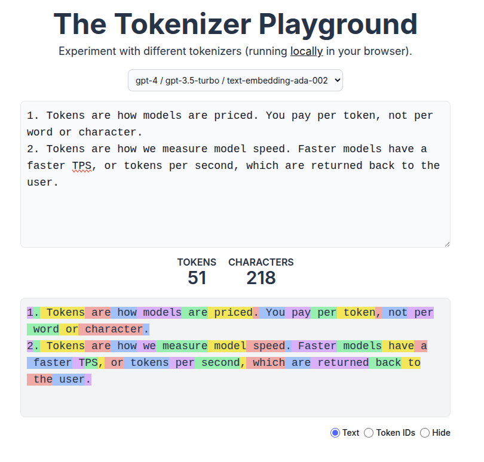
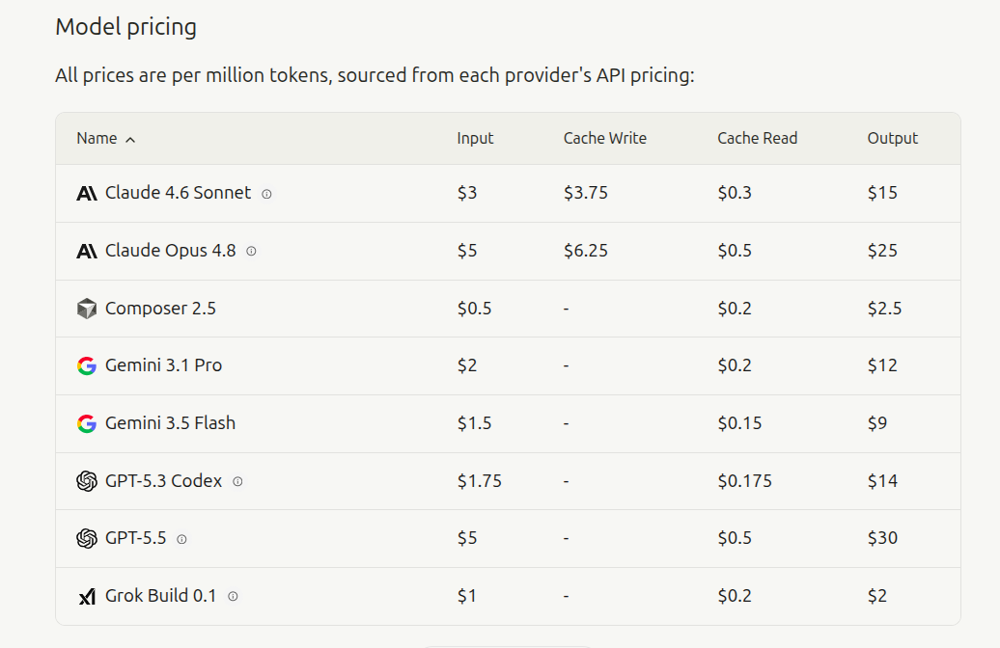
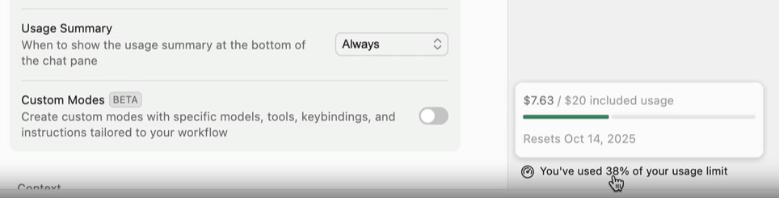
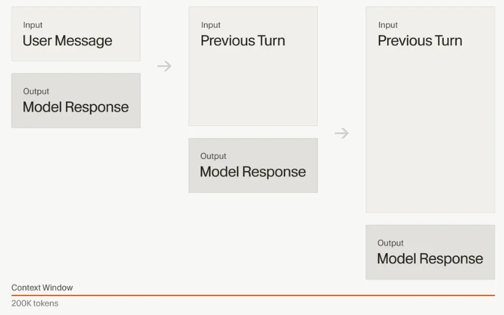

# Agentic Engineering

## Coding Agents

An agent is an AI system that autonomously plans and executes coding tasks. You give the agent a high-level goal, and it breaks the goal down into steps, executes those steps with [tools](https://code.visualstudio.com/docs/copilot/concepts/tools), and self-corrects when it hits errors.

### Examples of Coding Agents

* [Aider](https://aider.chat/)
* [Cursor Agent](https://cursor.com/)
* [Claude Code](https://claude.com/product/claude-code)
* [Cline](https://cline.bot/)
* [OpenCode](https://opencode.ai/)

## The User-Agent Interface

### Left: Direct Execution

1.   The Terminal acts as a transparent interface, routing raw string input directly to the Shell.
2.   Execution requires the user to manually construct precise, structurally valid system commands and flags.
3.   The Shell returns raw execution streams (stdout/stderr) directly to the Terminal, requiring manual human analysis for error resolution.

### Right: Agent as Man-in-the-Middle

1.   An Agent layer is inserted directly between the Terminal and the Shell, intercepting the standard I/O pipeline.
2.   The Agent captures natural language objectives and local system context, packaging and transmitting them via network requests to external **OpenAI Servers**.
3.   The remote language model processes the payload, translates the intent into executable shell syntax, and transmits the command back to the local Agent.
4.   The Agent executes the proxy commands in the local Shell and intercepts the output streams; it routes subsequent errors or stack traces back to the OpenAI Servers for autonomous debugging and recursive correction before yielding a final summary to the user.

See [Agent Security](https://cursor.com/docs/agent/security) for more details.

## Tokens & Pricing & Performance

- Just like how your computer doesn't actually understand the letter "A" but instead works with binary code (1s and 0s)
- AI models don't work directly with words like "hello" or "world" either. Instead, they break everything down into smaller chunks called **tokens**.

See: [The Tokenizer Playground](https://huggingface.co/spaces/Xenova/the-tokenizer-playground)

So why does this matter? Two reasons:

1. **Tokens are how models are priced.** You pay per token, not per word or character.
2. **Tokens are how we measure model speed.** Faster models have a faster TPS, or tokens per second, which are returned back to the user.

### Pricing

AI models charge based on two types of tokens:

1. **Input tokens**, which include everything you send to the model like your prompt and the previous conversation.
2. **Output tokens**, which include everything the model generates back to you.

Output tokens typically **cost 2-4x more than input tokens**, because generating new content requires more computational work than just processing what you sent.

Set _Usage Summary_ to: `"Always"`

### Context limits

- Every AI model also has a different context limit, where it will no longer accept further messages in the conversation.
- At some point, even before the limit, performance degrades
- A bigger issue: 
  - The longer the conversation the more you pay (message history is appended as input)

## Hallucinations

- **Hallucination** is when an AI model confidently generates information that seems plausible but is actually incorrect.
- It's like when someone tries to bluff their way through a conversation about a topic they don't really know.

For coding, this might mean:

#### Making function calls and config settings

- Inventing plausible-sounding **API methods that don't actually exist**
- **Mixing up syntax** between different programming libraries or frameworks
- **Creating configuration options** that seem reasonable but aren't real

#### Confidently suggest the wrong answer

**“You’re absolutely right!”** when in reality, you were no where near right.

### Why do models hallucinate?

Traditional software is **deterministic**:

1. Given some input,
2. if you run the program again,
3. you will **definitely** get the same output.

AI models are **probabilistic**:

1. Given some input,
2. if you run the program again,
3. you will **probably** get the same output.

|**Capability**|**Deterministic Software**|**LLM-based AI Models**|
|---|---|---|
|**Consistency**|100% reproducible (idempotent).|Variable; the same input can yield different outputs.|
|**Exact Arithmetic**|Flawless precision.|Guesses the next token; often fails complex math.|
|**Auditability**|Verifiable via stack traces.|"Black box" execution; unexplainable logic leaps.|
|**State Management**|Perfect recall via databases.|Limited by context windows; prone to dropping data.|
|**Execution Efficiency**|Executes discrete algorithms in microseconds.|Massive compute overhead for basic logic tasks.|

- The key to working effectively with AI is developing a verification mindset. 
- Every response is just a suggestion not a final answer.

## Vibe Coding

**Vibe Coding** is the practice of letting an LLM generate code based on loose, high-level prompts without the human developer deeply understanding the underlying codebase.

While incredibly fast for spinning up initial prototypes, it breaks down quickly in production.

Relying on basic prompting means you are at the mercy of LLM non-determinism. A "vibe" that works today might break tomorrow with a minor model update.

The initial euphoria of effortlessly generating code is immediately haunted by a pink monster: Vibe Debugging. When the AI-generated code inevitably fails, the developer doesn't actually know how it works, leading to a painful, clueless cycle of guessing new prompts to fix it.

## Agentic Engineering

**Agentic Engineering** means integrating AI into your existing development workflow. When quality software is the goal, there is no substitute for a skilled engineer. It is about enhancing what we can accomplish through thoughtful collaboration.

Ultimately, Agentic Engineering moves us away from the chaotic guesswork of vibe coding and brings back structure and determinism to software development.

Even with hallucinations and limitations, AI models are still useful.

Throughout this course, we’ll suggest approaches you can take to improve the quality of the code generated and properly work with AI models.

