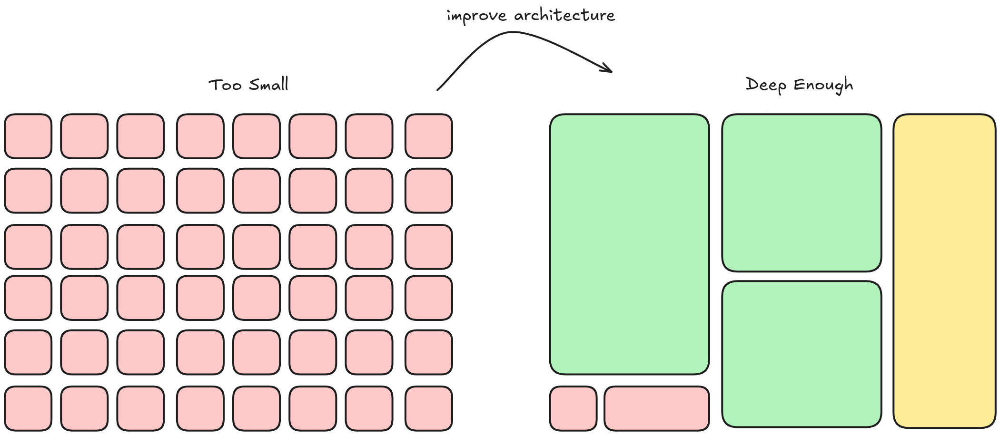
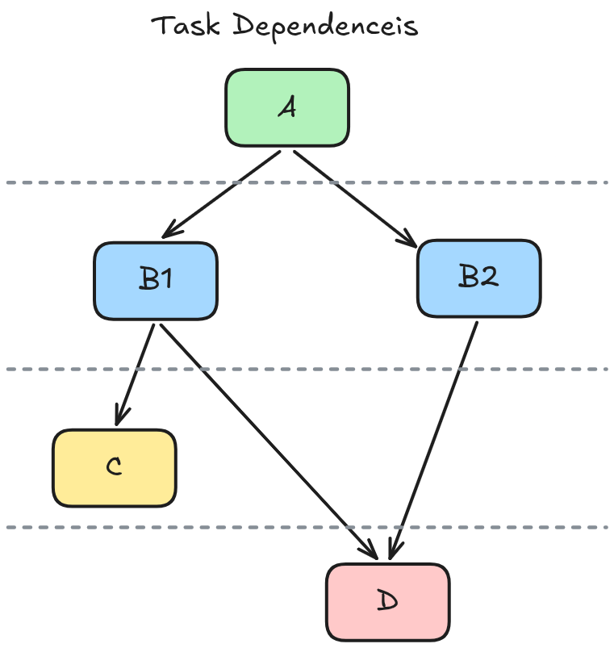

# Skills for Software Engineers

## AI Skills for Real Engineers (by Matt Pocock)

- Overview: [My 7 Phases Of AI Development](https://www.aihero.dev/my-7-phases-of-ai-development).
  - Specific: [5 Agent Skills I Use Every Day](https://www.aihero.dev/5-agent-skills-i-use-every-day).
  - Skills Repo: [mattpocock/skills](https://github.com/mattpocock/skills/tree/main/skills/engineering): Skills for Real Engineers.
    - Detailed walkthrough: [AI Skills for Real Engineers](https://www.aihero.dev/grill-with-docs).

Live Demo: https://youtu.be/-QFHIoCo-Ko?si=k-Hvbhhqgbaqq_Y0

## Layered Design

- LLMs like coding horizontally; this means you cannot test until all code is done from L1 to L3.
- Structure Todos into vertical slices; so the agent can get immediate feedback using TDD.

## Modular Design

Modules: break down code into units; but:

- Shallow modules have wide interface and little functionality; consider deepning it.
- Balance depth such that code surface area is easily navigable by humans and AI alike.

## Task Dependencies

The skill: `to-issues` breaks down the PRD into issues, and notes down the dependencies to allow parallel work.

## Summary

- Let the AI ask the questions.
- Spend most time on alignment and planning (10 - 40 minutes sessions).
    - Global docs (ADR / CONTEXT.md)
    - Current conversation -> PRD
    - PRD -> many tasks with dependencies
- Be intentional with architecture.
- Use TDD to give immediate feedback loops to agents.
- Apply principles from 20-year-old software engineering books to AI.