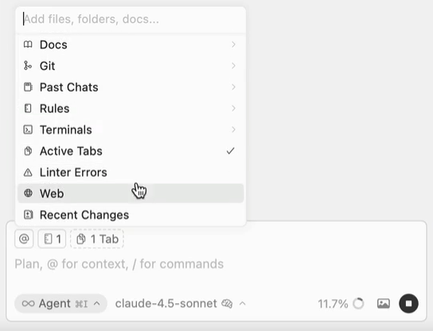

# Agentic Codebase

**How to Successfully Prompt Coding Agents?**


## What's an Agentic Codebase?

An **agentic codebase** refers to a software repository that is explicitly optimized for AI coding agents.

## Customize: `AGENTS.md` and `SKILL.md`

**Storing Prompts as Code for Coding Agents**

```text
./
├── README.md
├── package.json
├── AGENTS.md                  // Global rules
├── frontend/
│   ├── AGENTS.md              // Frontend scope
│   ├── src/
│   └── components/
├── backend/
│   ├── AGENTS.md              // Backend scope
│   ├── app/
│   └── controllers/
└── .agents/
    └── skills/                // On-demand context
        ├── deploy/SKILL.md          // Trigger: /deploy
        ├── test/SKILL.md            // Trigger: /test
        └── refactor/SKILL.md        // Trigger: /refactor

```

Explanation:

* **`./AGENTS.md` (Root):** The persistent baseline. Loaded on every single chat turn across the entire project. Used for non-negotiable architectural decisions, global dependencies, and base project workflows.
  * **`frontend/AGENTS.md` & `backend/AGENTS.md` (Scoped):** Path-specific context. The AI automatically loads these *only* when reading or writing files within that specific directory tree, preventing backend rules from muddying frontend context (and vice versa).
* **`.agents/skills/*` (Dynamic):** Modular, domain-specific instruction files. They sit completely dormant to save context window space.
  * **`deploy.md`, `test.md`, `refactor.md`:** These are only pulled into the AI's memory when you explicitly invoke their mapped slash commands (e.g., typing `/deploy` in the chat).

### Try: Caveman Prompt

Try putting this at the root `AGNETS.md` of your project, and observe how the behavior of the model changes:

```md
Ultra-compressed communication mode.

Respond terse like smart caveman. All technical substance stay. Only fluff die.

### Persistence

ACTIVE EVERY RESPONSE once triggered. No revert after many turns. No filler drift. Still active if unsure. Off only when user says "stop caveman" or "normal mode".

### Rules

Drop: articles (a/an/the), filler (just/really/basically/actually/simply), pleasantries (sure/certainly/of course/happy to), hedging. Fragments OK. Short synonyms (big not extensive, fix not "implement a solution for"). Abbreviate common terms (DB/auth/config/req/res/fn/impl). Strip conjunctions. Use arrows for causality (X -> Y). One word when one word enough.

Technical terms stay exact. Code blocks unchanged. Errors quoted exact.

Pattern: [thing] [action] [reason]. [next step].

Not: "Sure! I'd be happy to help you with that. The issue you're experiencing is likely caused by..." Yes: "Bug in auth middleware. Token expiry check use < not <=. Fix:"

### Auto-Clarity Exception

Drop caveman temporarily for: security warnings, irreversible action confirmations, multi-step sequences where fragment order risks misread, user asks to clarify or repeats question. Resume caveman after clear part done.
```

### Prompt Libraries

See: [this repo for other prompts to try](https://github.com/HassanAlgoz/prompts/tree/main)

## General Tips of Writing Prompt

Source: [Tips for writing effective instructions | VS Code](https://code.visualstudio.com/docs/copilot/customization/custom-instructions#_tips-for-writing-effective-instructions)

### Tip 1. Keep Instructions Short and Self-Contained

- Each instruction should be a single, simple statement.
- When you have several things to say, split them into several instructions instead of cramming everything into one sentence.
- Whitespace between instructions is ignored, so format them however reads best: one paragraph, separate lines, or separated by blank lines.

#### Bad

```md
Always use type hints and make sure to validate inputs and also wrap file reads
in try/except and remember to log errors and never use a bare `except` anywhere.
```

#### Good

```md
- Use type hints for all function signatures.
- Validate function inputs before use.
- Wrap file reads in try/except.
- Log caught errors with the `logging` module, not `print`.
- Never use a bare `except:`.
```

### Tip 2. Include the Reasoning Behind Rules

- State the rule, then explain *why* it exists.
- The rationale lets the AI make better decisions in edge cases the rule never explicitly covered.
- A rule without a reason is easy to misapply or ignore when the situation is slightly different.

#### Bad

```md
- Use `httpx` instead of `requests`.
```

#### Good

```md
- Use `httpx` instead of `requests` because httpx supports async calls and
  HTTP/2, which we rely on for our concurrent data-fetching jobs.
```

### Tip 3. Show Preferred and Avoided Patterns with Code

- The AI responds more effectively to concrete examples than to abstract rules.
- Pair an "avoid this" snippet with a "prefer this" snippet so the desired pattern is unambiguous.
- Examples remove guesswork about exactly which API or style you mean.

#### Bad

```md
- Read files the recommended way.
```

#### Good

````md
- Read text files with `pathlib`, not via `open()`/`close()`.

Avoid:

```python
f = open("data.txt")
content = f.read()
f.close()
```

Prefer:

```python
from pathlib import Path
content = Path("data.txt").read_text()
```
````

### Tip 4. Focus on Non-Obvious Rules

- Skip conventions that standard linters or formatters (like `black`, `ruff`, or `flake8`) already enforce.
- Spend your instruction budget on project-specific knowledge the agent cannot infer from tooling.
- Restating obvious formatting rules just dilutes the instructions that actually matter.

#### Bad

```md
- Put spaces after commas.
- Use 4 spaces for indentation, not tabs.
- Remove unused imports and trailing whitespace.
```

#### Good

```md
- Read configuration from `config/settings.py`, never from `os.environ` directly.
- New DB columns require an Alembic migration in `migrations/` plus a downgrade step.
```

### Tip 5. Include Relevant Context

Type `@` in the chat input to attach concrete context to the prompt. The most useful pulls in Plan Mode:



- `@file` / `@folder` — specific files or directories. Type `/` after a folder to navigate deeper.
- `@Docs` — search indexed library documentation. Add your own with `@Docs > Add new doc`.
- `@Past Chats` — reference an earlier conversation; useful when starting a fresh chat after a previous one drifted.
- `@Commit (Diff of Working State)` — uncommitted changes. `@Branch (Diff with Main)` — full branch diff.
- `@Terminals` — recent terminal output, great for *"fix this error"* prompts.
- `@Browser` — pages opened in Cursor's built-in browser.

You can also **paste images** directly (mockups, screenshots, Figma exports) and click the **microphone** icon to dictate.

### Tip 6. Be Cool

- Skip pleasantries, apologies, and emotional pleading — the agent is not swayed by politeness or urgency.
- State the task, its constraints, and the expected output as plain facts.
- Spend your words on substance: what to build, where it goes, and the rules it must follow.

#### Bad

```text
Please please I really need your help!! Could you maybe write some kind of
script to fix my data? It's super urgent and I'd be so grateful, thank you!!
```

### Tip 7. Use Pseudocode

- Write the procedure as numbered steps that mix plain language with programming constructs ([Pseudocode, Wikipedia](https://en.wikipedia.org/wiki/Pseudocode)).
- Lean on system-design verbs that map cleanly to code: `initialize`, `iterate`, `map`, `filter`, `validate`, `fetch`, `mutate`, `return`, `throw`, `catch`.
- Spelling out the control flow yourself (`for each ... if ... else ...`) gives fine-grained control over the specifics, instead of leaving them to the agent's guess.

#### Bad

```md
Check if the user is valid,
then save their profile data to the database
```

Why? Vague — it leaves the agent guessing what "valid" means, what data counts as a "profile," and how to handle failures.

#### Good

```md
1. VALIDATE: Incoming user object must have non-null 'email' (string) and 'age' (int > 18).
2. IF invalid: Throw ValidationError with the specific field name.
3. MAP: Extract 'email' and 'age' into a new ProfileRecord dictionary.
4. ASYNC WRITE: Insert ProfileRecord into the DB.
5. RETURN: True on success.
```

Why? Maps perfectly to specific code blocks: validation, error handling, data mapping, async DB call, and return state.
