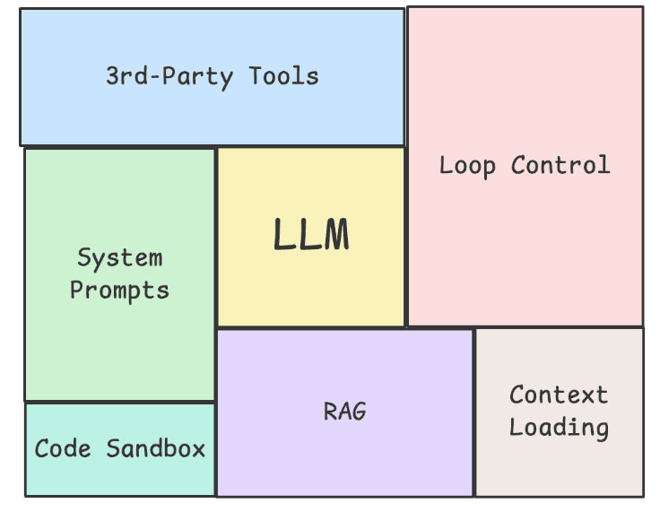
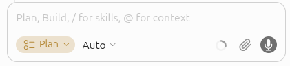
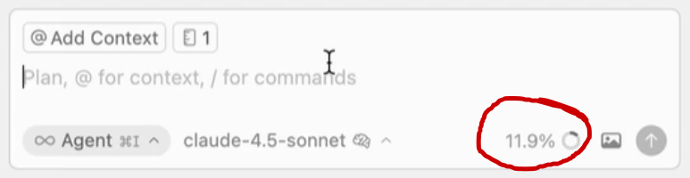
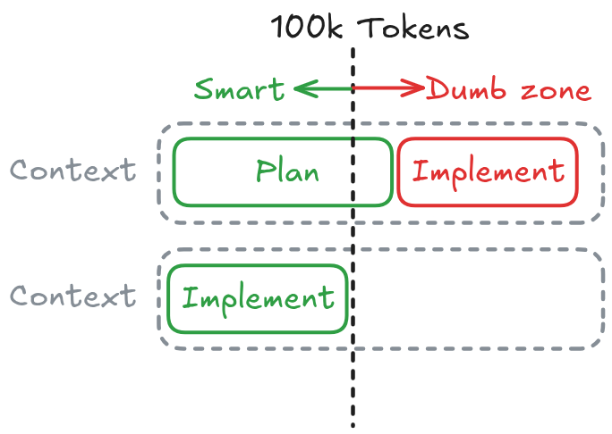
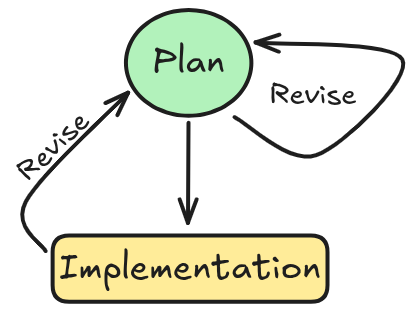
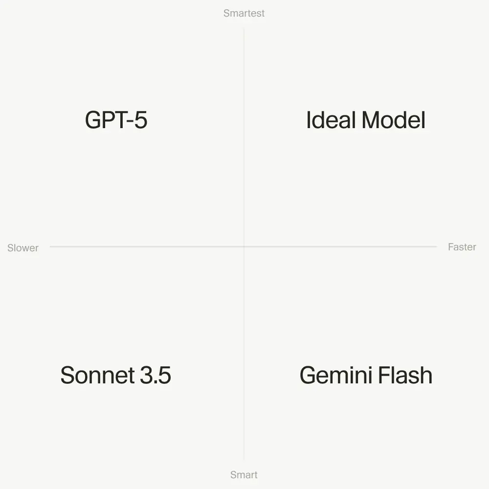

# Agent Modes

## What makes Agents different?

An agent is built on three basic components (MIT):

1. [**Model**](https://cursor.com/docs/models-and-pricing): The agent model you pick for the task (LLM)
2. **Instructions**:
   1. System Prompt: Base instructions written by the developers that guide the agent behavior
   2. User Prompt: Instructions written by users
3. **Tools**:
   1. Base tools: File editing, [codebase search](https://cursor.com/docs/agent/tools/search), [terminal execution](https://cursor.com/docs/agent/tools/terminal), [browser](https://cursor.com/docs/agent/tools/browser), and more (I/O)
   2. User tools: Installed by users later (e.g [context7](https://github.com/mcp/upstash/context7))

### Agent Harness

What separates coding agents apart is the [Agent Harness](https://addyosmani.com/blog/agent-harness-engineering/).



> "A harness is every piece of code, configuration, and execution logic that isn’t the model itself. A raw model is not an agent. It becomes one once a harness gives it state, tool execution, feedback loops, and enforceable constraints." -- addyosmani

Cursor's Coding Agent supports the use of **Modes**:

1. Ask Mode
2. Plan Mode (humans should spend most time here)
3. Agent Mode (execution)
4. Debug Mode

## 1. Ask Mode

Ask Mode is **read-only**: the agent can search and read your codebase, fetch documentation, and answer questions, but it cannot edit files, run terminal commands, or change anything in your workspace. Switch to Ask before you change anything — a common failure pattern with coding agents is asking for changes *before* understanding what already exists.

Under the hood, Ask uses the same search tools as Agent Mode:

- **Agentic search**: exact-string lookups with `grep`/`ripgrep`. Cursor's *Instant Grep* speeds this up significantly on large repos.
- **Semantic search**: meaning-based lookups powered by Cursor's codebase embeddings. Asking "where do we handle authentication?" can surface `middleware/session.ts` even when the literal word "authentication" isn't in the file.
- **Explore subagent**: a built-in subagent that searches in its own context window and returns only the findings, keeping your main conversation focused.

### Use Ask Mode when:

#### A. You're new to a codebase and want a guided tour.

Example 1:

```md
"How does authentication work in this codebase?
Could you point me to where the middleware is configured and any core auth logic?
List relevant files."
```

Example 2:

```md
How are frontend errors handled and reported in this project?

Show me the main error boundary or error handling utilities, and explain if any logging or monitoring is integrated.

List the relevant modules and highlight any custom logic for user error display.
```

#### B. You're about to make a change and need to know what already exists.

Example 1:

```md
I'm planning to update our notification system.

Can you show me where notifications are sent and managed in the backend?

List the relevant files and explain briefly how the flow works.
```

Example 2:

```md
Where is the project configuration stored?

List all main config files, and explain the structure or format (YAML, JSON, etc).

Highlight any environment-specific overrides or loading logic.
```

## 2. Plan Mode

### Motivation

- Agent starts making unrelated edits, touching files you didn't want, and losing focus.
- Plan Mode forces the agent to commit to a written, reviewable design *before* it touches any code.


Earlier course correction can save you a lot of frustration (and money).

How much time to spend on each phase?

1. **Understanding and planning**: ~80% — clarifying intent, exploring the codebase, writing and refining the plan.
2. **Execution**: ~5% — once the plan is right, agents are very fast.
3. **Review**: ~15% — verifying, revising the plan and re-executing, fixing edge cases, cleaning up.

### How Plan Mode works

Press `Shift+Tab` from the chat input to cycle modes until you reach Plan, or pick it from the mode dropdown. Cursor also suggests Plan Mode automatically when your prompt describes a complex task.



[How it works](https://cursor.com/docs/agent/plan-mode#how-it-works):

1. Agent asks clarifying questions to understand your requirements
2. Researches your codebase to gather relevant context
3. Creates a comprehensive implementation plan
4. You review and edit the plan through chat or markdown files


Click **Save to workspace** on the plan panel to move your plan into `.cursor/plans/` inside your project.

### Reviewing and editing the plan

You have two ways to refine a plan before clicking Build:

1. Edit the `Plan.md` file directly: you can tighten step descriptions, delete wrong assumptions, add file references.
2. Follow-up chat messages: The agent re-drafts the plan in response to your follow-ups.

You might want to collaborate on this, and clarify things with your teammates before moving on.

Especially for large changes, spend extra time creating a precise, well-scoped plan. The hard part is often figuring out **what** change should be made. 

## 3. Agent Mode: Execute the Reviewed Plan

**Agent Mode** is where the actual edits happen. It's the _execution mode_.

- LLMs tend to repeat existing patterns. But, you want to move on to a completely different mode: **Execution**.
- Their attention fades as context grows (context rot).

> Remember: AI performance degrades as the conversation grows longer.



It's best to have another agent handle execution. This ensures the next agent has full, focused access to your plan without context rot:

1. Open a new chat window with `Ctrl+N`
2. Instruct the model to: `implement the plan @Plan.md` (type `@file` and select your plan file) -- which we have saved before by clicking "**Save to Workspace**"



### When the run goes wrong

If the agent goes off track — wrong direction, unrelated edits, drifting scope — do not keep patching with follow-ups. Rather, **undo and revise the plan itself**:



1. **Stop the run** (`Esc` or the Stop button).
2. **Undo agent changes** — `Cmd/Ctrl+Z` in the chat to roll back the latest agent edits, or use Source Control to discard the diff. The Revert button in the bottom-right of a past chat message rolls files back to that point in the conversation.
3. **Re-open the plan** — Markdown file in the chat panel, or under `~/.cursor/plans/...` if you haven't clicked Save to workspace yet.
4. **Edit the plan** — tighten ambiguous tasks, drop wrong assumptions, add file references that were missing the first time.
5. **Run it again**.

## 4. Debug Mode

Reach **Debug Mode** the same way as the others: `Shift+Tab` to cycle, or the mode picker dropdown.

Debug Mode helps you find root causes and fix tricky bugs that are hard to reproduce or understand. Instead of immediately writing code, the agent generates hypotheses, adds log statements, and uses runtime information to pinpoint the exact issue before making a targeted fix.

### When to use Debug Mode

Debug Mode works best for: **Bugs you can reproduce but can't figure out**: when you know something is wrong but the cause isn't obvious from reading the code.

When standard Agent interactions struggle with a bug, Debug Mode provides a different approach using runtime evidence rather than guessing at fixes.

### How it works

1. **Explore and hypothesize**: the agent explores relevant files, builds context, and generates multiple hypotheses about potential root causes.
2. **Add instrumentation**: the agent adds log statements that send data to a local debug server running in a Cursor extension.
3. **Reproduce the bug**: Debug Mode asks you to reproduce the bug and provides specific steps. This keeps you in the loop and ensures the agent captures real runtime behavior.
4. **Analyze logs**: after reproduction, the agent reviews the collected logs to identify the actual root cause based on runtime evidence.
5. **Make a targeted fix**: the agent makes a focused fix that directly addresses the root cause, often just a few lines of code.
6. **Verify and clean up**: you can re-run the reproduction steps to verify the fix. Once confirmed, the agent removes all instrumentation.

### Tips for Debug Mode

- **Provide detailed context**: the more you describe the bug and how to reproduce it, the better the agent's instrumentation will be. Include error messages, stack traces, and specific steps.
- **Follow reproduction steps exactly**: execute the steps the agent provides to ensure logs capture the actual issue.
- **Reproduce multiple times if needed**: reproducing the bug multiple times may help the agent identify tricky problems like race conditions.
- **Be specific about expected vs. actual behavior**: help the agent understand what should happen versus what is happening.

## [Changing models](https://cursor.com/docs/agent/prompting#changing-models)

Use the model picker dropdown at the top of the chat input to switch models, or press `Ctrl /` to cycle through models. The change applies to the current conversation going forward. Set a default model in **Cursor Settings > Models**.



- **Faster models** work well for quick edits and routine tasks
- **More capable models** are better for complex reasoning and multi-file refactoring

You can switch models mid-conversation, for example when a faster model handled exploration but you need deeper reasoning for implementation. See [Models & Pricing](https://cursor.com/docs/models-and-pricing) for the full list.

## Where this is going?

Addy Osmani [wrote](https://addyosmani.com/blog/agent-harness-engineering/):

> "Look at the top coding agents side by side (Claude Code, Cursor, Codex, Aider, Cline) and they look more like each other than their underlying models do. The models are different. The harness patterns are converging. I don’t think that’s an accident. It’s the industry slowly finding the load-bearing pieces of scaffolding that turn a generative model into something that can ship."