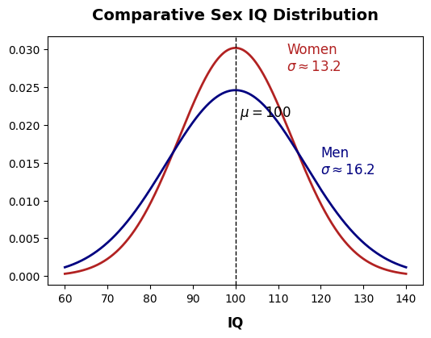
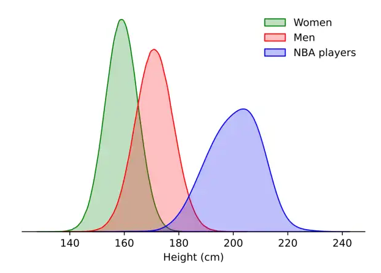
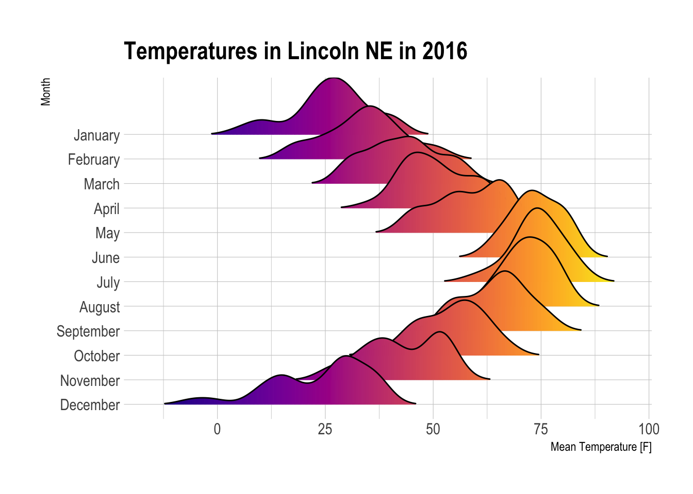

# Interpreting Distributions

Practice reading **frequency distributions** from plots. Use vocabulary from the lessons: **center** (mean, median, mode), **spread** (variance, standard deviation, range), **skewness**, **overlap**, and **shape** (normal, bimodal, and so on).

For multiple-choice questions, **select the single best answer** unless the prompt says **select all that apply**.

---

## Exercise 1 — Comparative Sex IQ Distribution

The plot below compares kernel density estimates of IQ for women and men. Both groups are labeled with approximate standard deviations; a dashed line marks the shared mean.

1. What do the two curves tell us about **center** (mean / median / mode)?

   - A) Men have a higher mean IQ than women; the blue curve is shifted right.
   - B) Women have a higher mean IQ than men; the red curve is shifted right.
   - C) Both distributions are centered at the same IQ value (approximately 100).
   - D) The plot does not show center; it only shows spread.

2. Which statement best describes **spread** (variability)?

   - A) Women’s IQ scores are more variable; their curve is wider and flatter.
   - B) Men’s IQ scores are more variable; their curve is wider and flatter (larger σ).
   - C) Both groups have the same standard deviation; only the colors differ.
   - D) Women’s distribution has the larger standard deviation because its peak is higher.

3. Why is the **peak** of the women’s (red) curve **taller** than the men’s (blue) curve, even though both represent full distributions?

   - A) There are more women than men in the dataset, so the red area must be larger.
   - B) Women’s IQs cluster at exactly one score, so all probability is at the peak.
   - C) The narrower (smaller-σ) distribution must rise higher so that the total area under the curve still equals 1.
   - D) Taller peaks always mean a higher mean IQ for that group.

4. For **extreme** IQ values (very low or very high, far from 100), which statement is best supported by the plot?

   - A) Women are more likely than men to appear at both tails because their curve is wider.
   - B) Men are more likely than women to appear at both tails because their distribution is wider.
   - C) Neither group appears in the tails; both curves end before IQ 70 and after IQ 130.
   - D) Only the group with the higher peak can produce extreme IQ scores.

5. Select **all** statements that are **true** about the **shape** of these distributions.

   - A) Both curves are approximately bell-shaped and symmetric around their centers.
   - B) Having the same mean proves the two groups have identical distributions.
   - C) Same mean with different spread means the groups can differ in how often extreme values occur.
   - D) The men’s distribution must be right-skewed because it is wider.

---

## Exercise 2 — Comparative NBA Player Heights

The plot compares height distributions (cm) for women, men, and NBA players.

6. Which ordering of **typical center** (where each curve peaks) is correct?

   - A) NBA < Women < Men
   - B) Women < Men < NBA
   - C) Men < Women < NBA
   - D) Women < NBA < Men

7. Which statement best describes **overlap** between groups?

   - A) All three distributions overlap almost completely across the full height range.
   - B) Women and men overlap substantially; NBA players overlap little with women and only partially with typical men.
   - C) NBA players and women overlap heavily around 160–180 cm.
   - D) Men and NBA players do not overlap at any height.

8. Which group shows the **greatest spread** (largest variability in height)?

   - A) Women — narrowest, tallest peak
   - B) Men — middle peak and width
   - C) NBA players — widest, shortest peak among the three
   - D) All three have identical spread because they are all bell-shaped

9. Suppose you meet a person who is **210 cm** tall. Based only on these distributions, which inference is most reasonable?

   - A) They are equally likely to be a woman, a man, or an NBA player.
   - B) They are far more likely to be an NBA player than a randomly chosen man or woman from these populations.
   - C) They must be a man, because men’s curve extends past 200 cm.
   - D) They must be a woman, because the green curve includes all heights below 180 cm.

10. Select **all** statements that are **true**.

    - A) All three distributions are roughly unimodal and bell-shaped.
    - B) The NBA distribution is centered near 200–205 cm, well above the general male population.
    - C) A height of 165 cm is typical for NBA players according to this plot.
    - D) Greater spread (width) corresponds to a lower peak height when comparing similar-shaped densities.

---

## Exercise 3 — Temperatures in Lincoln, NE (2016)

This **ridge plot** shows the distribution of **mean daily temperature** (°F) for each **month** in 2016. The **y-axis is time** (month); each horizontal “ridge” is one month’s temperature distribution.

11. What is the main **seasonal pattern** in the **center** of each month’s distribution as you move down the year?

    - A) Distributions stay at the same temperature all year; only color changes.
    - B) Centers shift from colder (left) in winter months to warmer (right) in summer, then back toward colder in late fall and winter.
    - C) Every month has the same center near 50 °F; only spread changes.
    - D) Summer months are colder than winter months; ridges move left in June and July.

12. Which pair of months is best described by the plot?

    - A) July and August are among the warmest (distributions farthest right); January and December are among the coldest (farthest left).
    - B) January is the hottest month; July is the coldest.
    - C) April and October have no overlap in temperature with any other month.
    - D) All twelve months have identical range and center.

13. Select **all** statements that are **true** about **shape** or **spread** in this ridge plot.

    - A) December’s ridge appears **bimodal** (two humps), suggesting more than one typical temperature regime that month.
    - B) Spread (width) of daily mean temperatures can differ from month to month — some ridges are wider or narrower than others.
    - C) The y-axis labels show that each ridge is a distribution of temperature for one month, not a single daily reading.
    - D) Every month’s distribution is perfectly symmetric with no skew.

---

## Exercise 4 — DataSaudi: Real-World Distributions

Open **[DataSaudi — Kingdom of Saudi Arabia](https://datasaudi.sa/en#population-pyramid)**. Use the left navigation: **Social Indicators → Population**.

Study **two** charts on that site (do not use screenshots from this exercise file — read the live charts). Write **general statements** about each distribution using lesson vocabulary (center, spread, skew, shape, comparison across groups).

### Plot A — Population Pyramid

Path: **Population → Population Pyramid** (view by gender if the site offers toggles).

Answer in your own words:

1. **Overall shape:** Is the age distribution symmetric, pyramid-shaped, or something else? Where is most of the population concentrated?
2. **By gender:** Where does the **male** distribution peak (which age range)? Where does the **female** distribution peak? How do the two sides compare?
3. **Spread / tails:** Which age groups are thin (few people) versus wide (many people)? Any notable imbalance between left and right of the pyramid?
4. **Interpretation:** In one or two sentences, what might the shape imply about the Kingdom’s population structure (e.g., youth, working age, gender balance)?

### Plot B — Births and Newborns

Path: **Population → Births and Newborns** (use **Saudi** mothers if the site lets you filter).

Answer in your own words:

1. **Center / mode:** At which **mother’s age group** do births peak? Is that the same as the “average” mother’s age in a strict sense?
2. **Shape:** Is the distribution roughly symmetric, **right-skewed**, or **left-skewed**? Describe the tail toward older mothers.
3. **Spread:** Over which age range do most births occur? Which age groups contribute very few births?
4. **Comparison:** How is this distribution different from the population pyramid in Plot A (what is being measured on the x-axis, and what question does each chart answer)?

---

*Submit your written answers for Exercise 4; your instructor may discuss acceptable variation in wording.*
