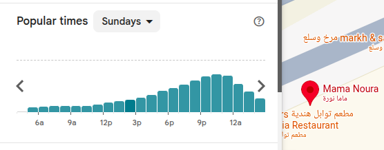

# Interpreting Distributions

Practice reading **frequency distributions** from plots. Use vocabulary from the lessons: **center** (mean, median, mode), **spread** (variance, standard deviation, range), **skewness**, **overlap**, and **shape** (normal, bimodal, and so on).

For multiple-choice questions, **select the single best answer** unless the prompt says **select all that apply**.

---

## Exercise 1 — Comparative Sex IQ Distribution

The plot below compares kernel density estimates of IQ for women and men. Both groups are labeled with approximate standard deviations; a dashed line marks the shared mean.

1. What do the two curves tell us about **center** (mean / median / mode)?

   - A) Men have a higher mean IQ than women.
   - B) Women have a higher mean IQ than men.
   - C) Both distributions are centered at the same IQ value (approximately 100).
   - D) The plot does not show center; it only shows spread.

2. Which statement best describes **spread** (variability)?

   - A) Women’s IQ scores have higher variance.
   - B) Men’s IQ scores have higher variance.
   - C) Both groups have the same standard deviation; only the colors differ.
   - D) Women sample is more than men, so it is not a fair comparison.

3. Why is the **peak** of the women’s (red) curve **taller** than the men’s (blue) curve, even though both represent full distributions?

   - A) There are more women than men in the dataset, so the red area must be larger.
   - B) There are more men than women in the dataset, as indicated by the larger blue area.
   - C) The narrower (smaller-σ) distribution must rise higher so that the total area under the curve still equals 1.
   - D) Taller peaks always mean a higher mean IQ for that group.

4. For **extreme** IQ values (very low or very high, far from 100), which statement is best supported by the plot?

   - A) Women are more likely than men to appear at both tails because their curve is wider.
   - B) Men are more likely than women to appear at both tails because their distribution is wider.
   - C) Neither group appears in the tails; both curves end before IQ 60 and after IQ 140.
   - D) Only the group with the higher peak can produce extreme IQ scores.

5. For the statement "men have higher IQ on average than women", how would the plot change?

   - A) The blue (men) curve would shift right, so its center would be higher than the red (women) curve.
   - B) The red (women) curve would become wider, while the blue (men) curve would become narrower.
   - C) The shared mean (dashed line) would move to the right of both peaks.
   - D) The red (women) curve’s peak would rise higher than the blue (men) curve’s peak, but centers stay the same.

---

## Exercise 2 — Comparative NBA Player Heights

The plot compares height distributions (cm) for women, men, and NBA players.

6. Which ordering of **typical center** (where each curve peaks) is correct?

   - A) NBA < Women < Men
   - B) Women < Men < NBA
   - C) Men < Women < NBA
   - D) Women < NBA < Men

7. Which statement best describes **overlap** between groups?

   - A) All three distributions overlap almost completely across the full height range.
   - B) Women and men overlap substantially; NBA players overlap little with women and only partially with typical men.
   - C) NBA players and women overlap heavily around 160–180 cm.
   - D) Men and NBA players do not overlap at any height.

8. Which group shows the **greatest spread** (largest variability in height)?

   - A) Women — narrowest, tallest peak
   - B) Men — middle peak and width
   - C) NBA players — widest, shortest peak among the three
   - D) All three have identical spread because they are all symmetric

9. Suppose you meet a person who is **210 cm** tall. Based only on these distributions, which inference is most reasonable?

   - A) They are equally likely to be a woman, a man, or an NBA player.
   - B) They are far more likely to be an NBA player than a randomly chosen man or woman from these populations.
   - C) They must be a man, because men’s curve extends past 200 cm.
   - D) They must be a woman, because the green curve includes all heights below 180 cm.

---

## Exercise 3 — Temperatures in Lincoln, NE (2016)

This **ridge plot** shows the distribution of **mean daily temperature** (°F) for each **month** in 2016. The **y-axis is time** (month); each horizontal “ridge” is one month’s temperature distribution.

11. What is the main **seasonal pattern** in the **center** of each month’s distribution as you move down the year?

    - A) Distributions stay at the same temperature all year; only color changes.
    - B) Centers shift from colder (left) in winter months to warmer (right) in summer, then back toward colder in late fall and winter.
    - C) Every month has the same center near 50 °F; only spread changes.
    - D) Summer months are colder than winter months; ridges move left in June and July.

12. Which pair of months is best described by the plot?

    - A) July and August are among the warmest (distributions farthest right); January and December are among the coldest (farthest left).
    - B) January is the hottest month; July is the coldest.
    - C) April and October have no overlap in temperature with any other month.
    - D) All twelve months have identical range and center.

---

## Exercise 4 — Popular Times at Mama Noura (Sundays)

The bar chart below is the **“Popular times”** distribution for the restaurant **Mama Noura** on **Sundays** (from Google Maps). The **x-axis is the hour of day** (6 a.m. → past midnight) and each **bar height** shows how **busy** the restaurant typically is at that hour (a frequency-style measure of when visits happen).

13. Where is the **center / mode** of this distribution (the busiest time)?

    - A) Early morning, around 6–9 a.m.
    - B) Midday, around 12 p.m.
    - C) Evening, around 9 p.m.
    - D) There is no peak; visits are spread uniformly across the day.

14. Which best describes the **shape / skewness** of the distribution?

    - A) Roughly symmetric (bell-shaped) around midday.
    - B) **Right-skewed:** a long tail toward the morning, with the bulk of visits before noon.
    - C) **Left-skewed:** a long, gentle tail rising from the morning hours, with visits concentrated near the evening peak and a steeper drop afterward.
    - D) **Bimodal:** two separate peaks of similar height (a lunch rush and a dinner rush).

15. Which statement best describes the **spread** of visit times?

    - A) Visits are spread evenly from 6 a.m. to midnight.
    - B) Most visits are concentrated in the **late afternoon to evening** (roughly 6 p.m.–midnight), with very few in the early morning.
    - C) Most visits occur **before noon**, then taper off.
    - D) The chart shows only the single busiest hour, not the spread.

16. You want to visit Mama Noura on a Sunday but **avoid the crowds**. Based only on this distribution, when should you go?

    - A) Around 9 p.m., where the bars are tallest.
    - B) In the morning (around 6–9 a.m.), where the bars are shortest.
    - C) At any time — the chart says nothing about how busy it is.
    - D) Exactly at midnight, because that is the peak.

---

## Exercise 5 — DataSaudi: Real-World Distributions

Open **[DataSaudi — Kingdom of Saudi Arabia](https://datasaudi.sa/en#population-pyramid)**.

Study **two** charts on that site (do not use screenshots from this exercise file — read the live charts). Write **general statements** about each distribution using lesson vocabulary (center, spread, skew, shape, comparison across groups).

### Plot A — Population Pyramid

Path: **Population → Population Pyramid** (view by gender if the site offers toggles).

Answer in your own words:

1. **Overall shape:** Is the age distribution symmetric, pyramid-shaped, or something else? Where is most of the population concentrated?
2. **By gender:** Where does the **male** distribution peak (which age range)? Where does the **female** distribution peak? How do the two sides compare?
3. **Spread / tails:** Which age groups are thin (few people) versus wide (many people)? Any notable imbalance between left and right of the pyramid?
4. **Interpretation:** In one or two sentences, what might the shape imply about the Kingdom’s population structure (e.g., youth, working age, gender balance)?

### Plot B — Births and Newborns

Path: [**Population → Births and Newborns**](https://datasaudi.sa/en#births-and-newborns).

Answer in your own words:

1. **Center / mode:** At which **mother’s age group** do births peak? Is that the same as the “average” mother’s age in a strict sense?
2. **Shape:** Is the distribution roughly symmetric, **right-skewed**, or **left-skewed**? Describe the tail toward older mothers.
3. **Spread:** Over which age range do most births occur? Which age groups contribute very few births?
4. **Comparison:** How is this distribution different from the population pyramid in Plot A (what is being measured on the x-axis, and what question does each chart answer)?

---

*Submit your written answers for Exercise 5; your instructor may discuss acceptable variation in wording.*
