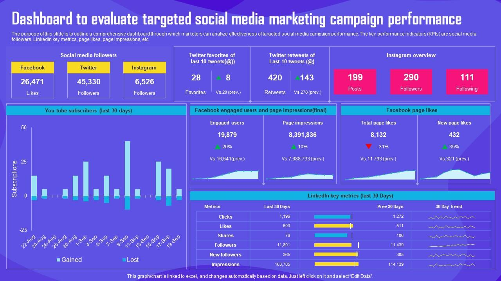
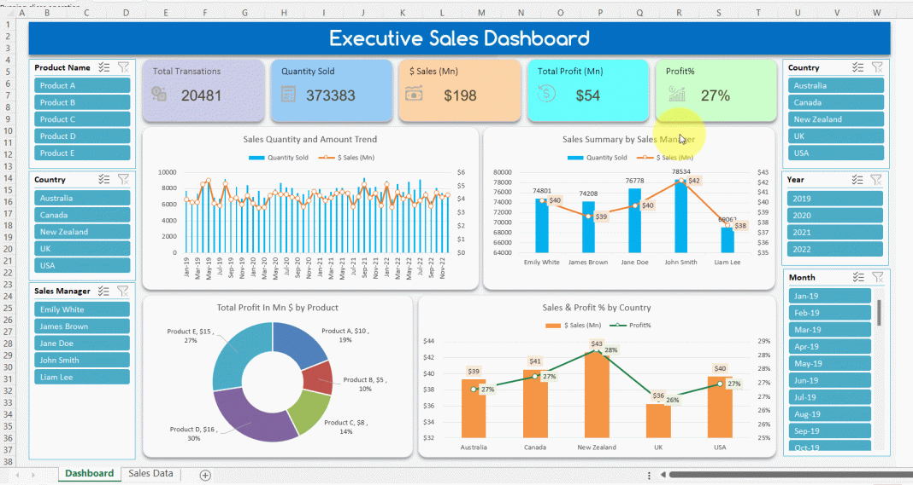
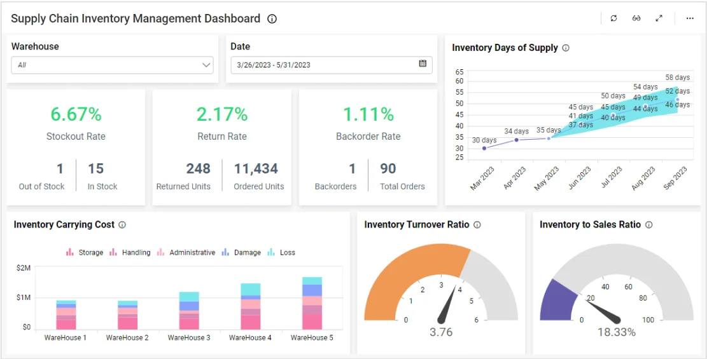

# Data Apps

## Overview

A **Data App**, is an interactive web interface that bridges the gap between complex data science and non-technical business users.

### Examples

#### Customer engagement dashboards

{height=400}

Customer engagement apps consolidate information about how customers interact with your organization and give sales and marketing teams a view of the customer journey to identify areas for improvement. Key performance indicators (KPIs) tracked often include customer satisfaction, engagement data such as number of active users over time, churn rates to track retention and activity logs showing trends in customer behavior.  

#### Sales performance tracking tools

{height=400}

Tracking the sales performance of certain products gives teams a clear picture of how well or poorly those products are selling by geography, time period and buyer persona. You can feed this data into predictive AI or other analytics tools to create sales forecasts, plan new product rollouts and ensure you have enough raw materials on hand to keep pace with market demand.  

#### Supply chain management platforms

{height=400}

Speaking of market demand, [supply chain management](https://www.snowflake.com/en/solutions/use-cases/powering-supply-chain-optimization-with-snowflake/) platforms can help you avoid product shortages by tracking raw material availability so you can more accurately forecast demand, adjust inventory levels and look for ways to streamline logistics or tap alternate suppliers.

### History

Before data apps, business intelligence (BI) went through several distinct phases. Interestingly, the truest early predecessor to the modern data app was the **Excel spreadsheet with macros**, which allowed users to input variables and locally manipulate data.

As enterprise data moved to the cloud, the evolution looked like this:

#### The IT Reporting Era (1980s - 1990s)

Data was locked in mainframe systems and data warehouses. If a business user needed an insight, they submitted a request to the IT department, who wrote a SQL query and delivered a static, often printed report days later.

#### The Dashboard Era (2000s - 2010s)

Tools like Tableau, Qlik, and PowerBI democratized data access, kicking off the "Self-Service BI" era. Users could explore data visually, but the experience was strictly **read-only**. If a dashboard showed inventory was low, you had to log into an entirely separate enterprise system to order more stock.

#### The Prototyping Era (2012 - 2017)

Data scientists were building complex machine learning models, but business teams couldn't use them because they lived in Jupyter Notebooks. Frameworks like **R Shiny** (2012) and [Plotly Dash](https://dash.plotly.com/) (2017) emerged, allowing data teams to wrap their models in web interfaces so others could interact with them via browsers.

#### The Modern Data App Era (2019 - Present)

Frameworks like [Streamlit](https://streamlit.io/) and [Hex](https://hex.tech/product/data-apps/) removed the need for front-end web development entirely. Data scientists can now build full-stack, read-write applications directly in Python.

These apps integrate seamlessly with cloud data platforms (like Snowflake or BigQuery), allowing end-users to run live simulations and trigger automated workflows from a single screen.

## Types of Data Apps

### Client-facing external data solutions

Service providers in a range of industries keep their customers in the know by providing data apps that aggregate external data for planning, forecasting and performance analysis. Investment firms use dashboards that compile historical market data, for example. Another use case is social media platforms providing advertisers with real-time analysis of online ad campaigns.

### Enterprise-level data platforms

An [enterprise data platform](https://www.snowflake.com/en/product/platform/) provides a system upon which companies can build, scale and deploy data applications to the right teams.

### Embedded data applications

For example, fitness trackers and smart watches pull metrics tracked by devices into dashboards so users can see their activity at a glance.
