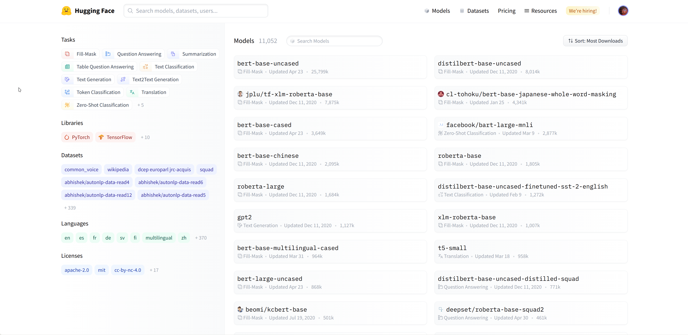
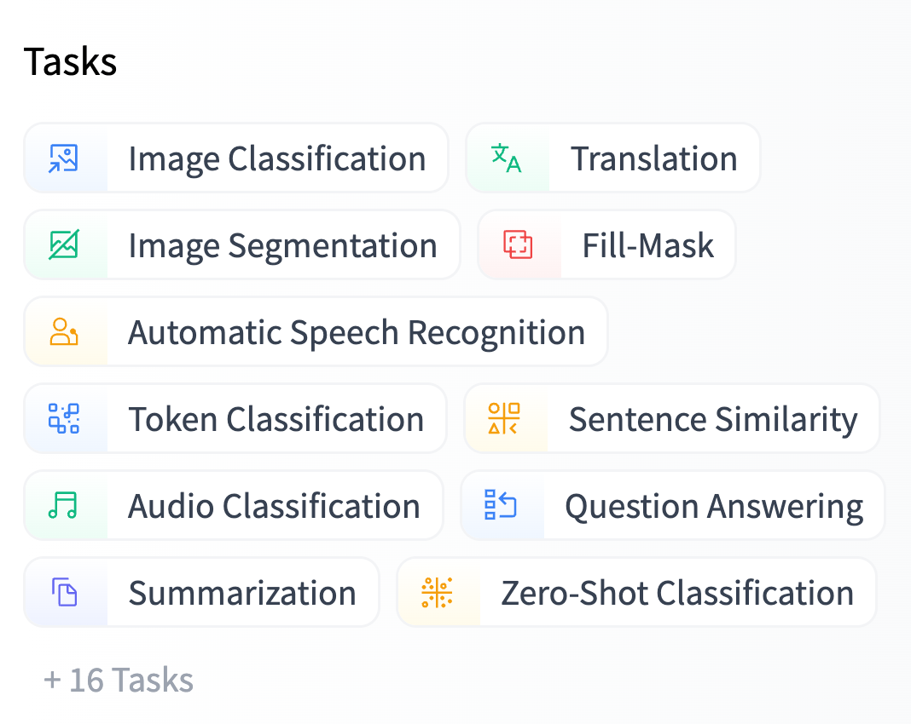
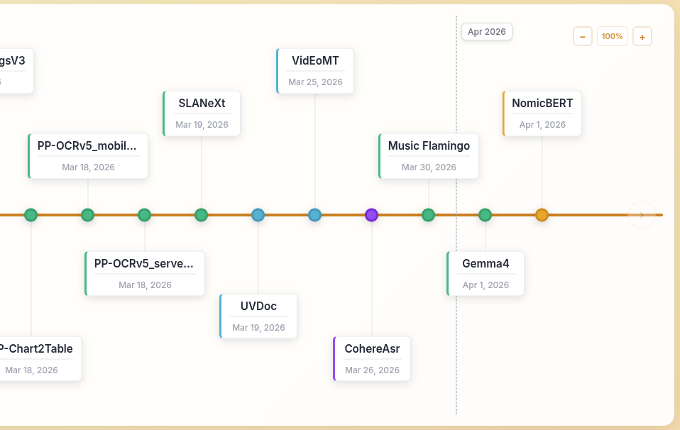
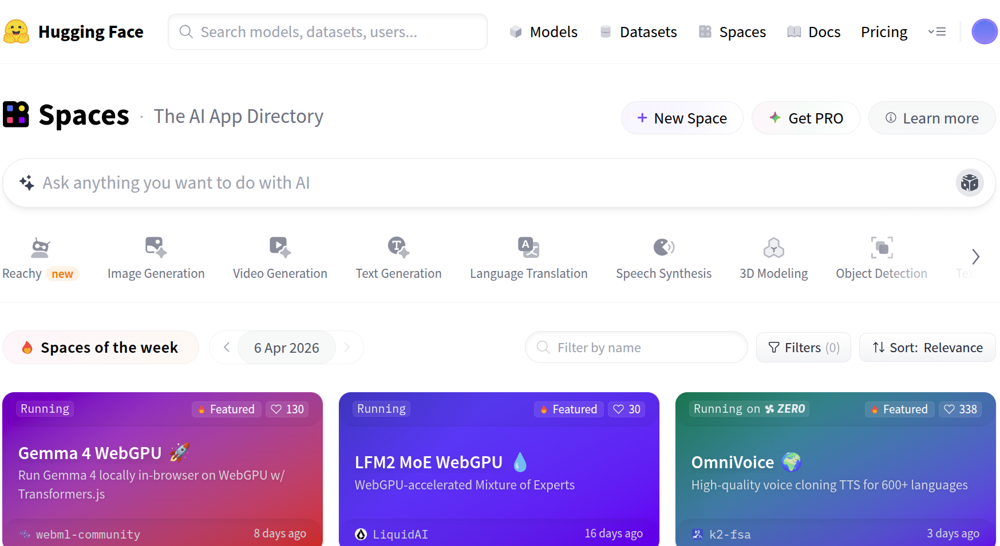

# Introduction to HuggingFace

## Overview

**Deep learning** studies representation learning algorithms to deal with high-volume low-signal data such as pixels, sound samples, or characters and words in text; also known as unstructured data.

Deep Learning courses often require knowledge of linear algebra, probability, and calculus since the focus is on matrices, computaional graphs, neural networks & backpropagation, optimizing with loss functions, and how to compose and implement deep learning architectures from these modules.

Since this is an _applied_ course, then, much like how we use libraries and frameworks built by other engineers, we will build on the results of those machine learning engineers who have built and made these models available with open licenses.

Instead of building up from PyTorch, TensorFlow, or other Deep Learning frameworks, **we will focus on _open-weight_ models** and how to _choose_, _use_, _fine-tune_, _save_, and _deploy_ them. A very popular Hub for such models is HuggingFace Hub. The 🤗 HuggingFace community created an ecosystem of tools for sharing deep learning [models](https://huggingface.co/models) and [`datasets`](https://huggingface.co/datasets) and using them.

## What are Open Weights?

[**Open Weights**](https://opensource.org/ai/open-weights) refer to the final weights and biases of a trained neural network. These values, once locked in, determine how the model interprets input data and generates outputs. When AI developers share these parameters under an [OSI Approved License](https://opensource.org/licenses), they empower others to fine-tune, adapt, or deploy the model for their own projects.

However, **Open Weights** differ significantly from [**Open Source AI**](https://opensource.org/ai/open-source-ai-definition), here is a table that sums it all up:

| **Feature**                   | **Open Weights**         | **Open Source AI** |
| ----------------------------- | ------------------------ | ------------------ |
| **Weights & Biases**          | Released                 | Released           |
| **Training Code**             | Not Shared               | Fully Shared       |
| **Intermediate Checkpoints**  | Withheld                 | Nice to have       |
| **Training dataset**          | Not Shared/Not disclosed | Released*          |
| **Training Data Composition** | Partially/Not Disclosed  | Fully Disclosed    |

See [Open Weights at opensource.org](https://opensource.org/ai/open-weights).

## What is 🤗 HuggingFace?

* **Central Platform**: Discover, use, and contribute state-of-the-art models and datasets.
* **Community Focus**: Sharing eliminates the need for individual training and simplifies usage.
* **Lots of Models**: Over +10,000 publicly available models.

{center}

## Open-weight models on 🤗 HuggingFace

[Tasks](https://huggingface.co/models), or pipeline types, describe the “shape” of each model’s API (inputs and outputs) and are used to determine which Inference API and widget we want to display for any given model.

We recommend using the task selector in the Hugging Face Hub interface in order to select the appropriate checkpoints:

{center}

## Discover Latest Models

The [Models Timeline](https://huggingface.co/spaces/yonigozlan/Transformers-Timeline) is an interactive chart of how architectures in Transformers have changed over time. You can scroll through models in order, spanning text, vision, audio, video, and multimodal use cases.

{fig-align="center" .r-stretch}

## Model Card

Information included in a model card:

- `provider/model-name`: [`openai/whisper-large-v3-turbo`](https://huggingface.co/openai/whisper-large-v3-turbo)
- **Downloads last month**: `7,799,476`
- **Model size**: `0.8B` params
- **Tensor type**: `F16` (size of each parameter)

**Description**:

> Whisper is a state-of-the-art model for automatic speech recognition (ASR) and speech translation, proposed in the paper Robust Speech Recognition via Large-Scale Weak Supervision by Alec Radford et al. from OpenAI. Trained on >5M hours of labeled data, Whisper demonstrates a strong ability to generalise to many datasets and domains in a zero-shot setting.

The description often tells you: **Inputs** (speech) and **Outputs** (text).

Scrolling down you find:

- **Usage** (how-to-use)
- [**Model details**](https://huggingface.co/openai/whisper-large-v3-turbo?inference_provider=hf-inference#model-details)
  - Variants (size, parameters, feature support)
  - [Fine-Tuning](https://huggingface.co/openai/whisper-large-v3-turbo?inference_provider=hf-inference#fine-tuning)

On the right side, you see: "Spaces using `openai/whisper-large-v3-turbo`" host deployed models with simple UI.

## Colab

- See this whisper notebook on colab: [YouTube Video Transcription with OpenAI's Whisper](https://colab.research.google.com/github/HassanAlgoz/AAI/blob/main/courses/Deep_Learning/lessons/youtube_whisper.ipynb)
- Select the T4 GPU (free) to download the model and run it on the video to be transcribed

## Spaces: Hosted Inference API

[Spaces](https://huggingface.co/spaces) is a directory for hosted AI Apps (demos) to discover and find inspiration.

You can [create you own space](https://huggingface.co/new-space).

Two types of spaces:

- **ZeroGPU**: a shared compute infrastructure utilizing Nvidia RTX Pro 6000 Blackwell GPUs. For these Spaces, the compute burden is offloaded to the user interacting with the application.
- **Other**: a dedicated, always-on GPU (e.g., Nvidia A10G, A100), the creator of the Space pays the hourly compute bill. (e.g., $1.50 per hour for an A10G), regardless of traffic.

{center}

## Explore Community Projects

Organizations and communities advancing Arabic NLP and AI:

* [HUMAIN](https://huggingface.co/humain-ai)
* [SDAIA-KFUPM Joint Research Center for Artificial Intelligence (KFUPM-JRCAI)](https://huggingface.co/KFUPM-JRCAI):
* [King Abdullah University of Science and Technology (KAUST)](https://huggingface.co/KAUST)
* [QCRI](https://huggingface.co/QCRI)
* [MBZUAI](https://huggingface.co/MBZUAI)
* [CAMeL Lab](https://huggingface.co/CAMeL-Lab)
* [Core42](https://huggingface.co/core42)
* [Tarteel AI](https://huggingface.co/tarteel-ai)
* [NAMAA Community](https://huggingface.co/NAMAA-Space)