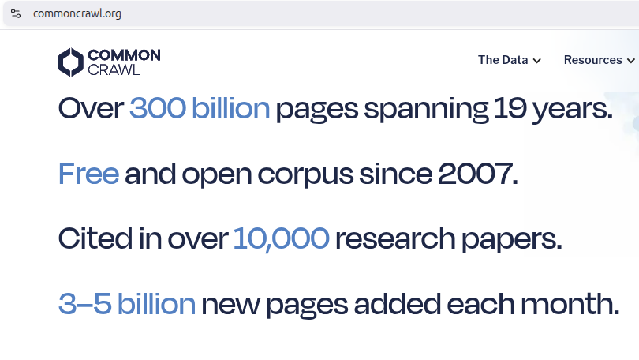

# Model Selection and Training

## Overview

Our goal is to have models with the following characteristics:

1. **Cheap** – Lower hardware and cloud costs make AI more accessible to startups and developers.
     - Can run on single GPU servers (or at least a simple distriubted setup)
     - Can run on consumer laptops, edge devices, and mobile phones.
     - Efficient: reduce power usage, making them environmentally friendly.
2. **Fast** – generate responses quickly, ideal for real-time applications.
3. **Customizable**: Easily fine-tuned for domain-specific tasks (e.g., legal document analysis) to achieve desired _performance_.
4. **Privacy and Security** – No need for an internet connection or external cloud services.

To get there, we need to know:

1. what makes _Language Models_ "Large" and Expensive
2. How can we customize them to our own data?
3. what makes them slow? and how can we make them fast?
4. How do we ensure we're not risking privacy or security while doing that?

## LLMs and Machine Learning

_Training_ / _fitting_ is a form of **Machine Learning**, where models update their parameters based on data to lower the error in predicting this data.

Tom Mitchell, a pioneering computer scientist, provided the most widely cited, formal definition of Machine Learning in his 1997 textbook, *Machine Learning*.

His exact definition is:

> "A computer program is said to learn from experience $E$ with respect to some class of tasks $T$ and performance measure $P$, if its performance at tasks in $T$, as measured by $P$, improves with experience $E$."

### Breaking Down the Variables

To understand how this applies in practice, here is what each variable represents using the classic example of an **email spam filter**:

**Task ($T$):** The specific problem the program is trying to solve.

- *Example:* Classifying incoming emails as "spam" or "not spam."

**Experience ($E$):** The data the program uses to learn.

- *Example:* A database of historical emails that users have already manually flagged as spam or safe.

**Performance Measure ($P$):** The metric used to evaluate how well the program is doing the task.

- *Example:* The percentage of new emails the system correctly filters without false positives.

Under Mitchell's definition, the spam filter is "learning" if analyzing more flagged emails ($E$) causes its accuracy rate ($P$) at sorting new emails ($T$) to go up.

### Large Language Models

**Large Language Models (LLMs)** are a type of deep neural models characterized by:

1. massive size (billions of parameters)
2. extensive training data (trillions of tokens)
3. ability to perform a wide range of language tasks

The third is the most interesting one. For each task, ML researchers come up with metrics to gague performance.

See [ghost613/LLM-Training-Time-and-Cost-Calculator](https://huggingface.co/spaces/ghost613/LLM-Training-Time-and-Cost-Calculator).

## Three Stages of Training LLMs from Scratch

### 1. Pre-training

**Unsupervised (self-supervised)**: the task is for the model to predict the next token in a sequence, auto-regressively for all the data we feed it.

**Goal**: build the first foundational representation layer of what language is; such that it can later be fine-tuned to any downstream task efficiently. 

**Scale:** Massive datasets (trillions of tokens) and high compute.

#### Outcome

A "Base Model" that is a world-class autocompleter. It has memorized the whole internet, token-for-token. It can spit out any article, book, chat conversations, consiparcy theories, any code snippet ever written on GitHub, **given the first few characters**.

**Shortcomings**:

1. Won't interact with user request to "write code" or to "answer a question" or to "summarize an article"
2. Contains both good and bad advice from the internet.

> Note: English speakers attach the prefix "pre-" (meaning _before_) to an action, accidentally implying that the action is happening _before_ it happens.

### 2. Supervised Fine-tuning (SFT)

**Supervised Learning**: the task is for the model to produce a certain "response text" given a "prompt text".

**Goal:** **Instruction following**: Model can be "prompted" with an instrctuion; e.g., "summarize this article", and it should auto-complete with a summary and stop at the end.

**Scale:** Small, human-curated datasets (thousands to tens of thousands of examples).

One example is the [BIG-bench](https://github.com/google/BIG-bench/blob/main/bigbench/benchmark_tasks/README.md) by Google; which contains 214 tasks. Things like:

|Name|Description|Keywords|
|---|---|---|
|[abstract_narrative_understanding](https://github.com/google/BIG-bench/blob/main/bigbench/benchmark_tasks/abstract_narrative_understanding)|Given a narrative, choose the most related proverb|[analogical reasoning](https://github.com/google/BIG-bench/blob/main/bigbench/benchmark_tasks/keywords_to_tasks.md#analogical-reasoning), [json](https://github.com/google/BIG-bench/blob/main/bigbench/benchmark_tasks/keywords_to_tasks.md#json), [multiple choice](https://github.com/google/BIG-bench/blob/main/bigbench/benchmark_tasks/keywords_to_tasks.md#multiple-choice), [narrative understanding](https://github.com/google/BIG-bench/blob/main/bigbench/benchmark_tasks/keywords_to_tasks.md#narrative-understanding), [social reasoning](https://github.com/google/BIG-bench/blob/main/bigbench/benchmark_tasks/keywords_to_tasks.md#social-reasoning)|
|[abstraction_and_reasoning_corpus](https://github.com/google/BIG-bench/blob/main/bigbench/benchmark_tasks/abstraction_and_reasoning_corpus)|Solve tasks from Abstraction and Reasoning Corpus|[free response](https://github.com/google/BIG-bench/blob/main/bigbench/benchmark_tasks/keywords_to_tasks.md#free-response), [many-shot](https://github.com/google/BIG-bench/blob/main/bigbench/benchmark_tasks/keywords_to_tasks.md#many-shot), [non-language](https://github.com/google/BIG-bench/blob/main/bigbench/benchmark_tasks/keywords_to_tasks.md#non-language), [numerical response](https://github.com/google/BIG-bench/blob/main/bigbench/benchmark_tasks/keywords_to_tasks.md#numerical-response), [programmatic](https://github.com/google/BIG-bench/blob/main/bigbench/benchmark_tasks/keywords_to_tasks.md#programmatic), [visual reasoning](https://github.com/google/BIG-bench/blob/main/bigbench/benchmark_tasks/keywords_to_tasks.md#visual-reasoning), [zero-shot](https://github.com/google/BIG-bench/blob/main/bigbench/benchmark_tasks/keywords_to_tasks.md#zero-shot)|
|[anachronisms](https://github.com/google/BIG-bench/blob/main/bigbench/benchmark_tasks/anachronisms)|Identify whether a given statement contains an anachronism|[common sense](https://github.com/google/BIG-bench/blob/main/bigbench/benchmark_tasks/keywords_to_tasks.md#common-sense), [implicit reasoning](https://github.com/google/BIG-bench/blob/main/bigbench/benchmark_tasks/keywords_to_tasks.md#implicit-reasoning), [json](https://github.com/google/BIG-bench/blob/main/bigbench/benchmark_tasks/keywords_to_tasks.md#json), [multiple choice](https://github.com/google/BIG-bench/blob/main/bigbench/benchmark_tasks/keywords_to_tasks.md#multiple-choice), [word sense disambiguation](https://github.com/google/BIG-bench/blob/main/bigbench/benchmark_tasks/keywords_to_tasks.md#word-sense-disambiguation)|
|[analogical_similarity](https://github.com/google/BIG-bench/blob/main/bigbench/benchmark_tasks/analogical_similarity)|Identify the type of analogy between two events|[analogical reasoning](https://github.com/google/BIG-bench/blob/main/bigbench/benchmark_tasks/keywords_to_tasks.md#analogical-reasoning), [json](https://github.com/google/BIG-bench/blob/main/bigbench/benchmark_tasks/keywords_to_tasks.md#json), [many-shot](https://github.com/google/BIG-bench/blob/main/bigbench/benchmark_tasks/keywords_to_tasks.md#many-shot), [multiple choice](https://github.com/google/BIG-bench/blob/main/bigbench/benchmark_tasks/keywords_to_tasks.md#multiple-choice)|
|[analytic_entailment](https://github.com/google/BIG-bench/blob/main/bigbench/benchmark_tasks/analytic_entailment)|Identify whether one sentence entails the next|[decomposition](https://github.com/google/BIG-bench/blob/main/bigbench/benchmark_tasks/keywords_to_tasks.md#decomposition), [fallacy](https://github.com/google/BIG-bench/blob/main/bigbench/benchmark_tasks/keywords_to_tasks.md#fallacy), [json](https://github.com/google/BIG-bench/blob/main/bigbench/benchmark_tasks/keywords_to_tasks.md#json), [logical reasoning](https://github.com/google/BIG-bench/blob/main/bigbench/benchmark_tasks/keywords_to_tasks.md#logical-reasoning), [multiple choice](https://github.com/google/BIG-bench/blob/main/bigbench/benchmark_tasks/keywords_to_tasks.md#multiple-choice), [negation](https://github.com/google/BIG-bench/blob/main/bigbench/benchmark_tasks/keywords_to_tasks.md#negation)|
|[arithmetic](https://github.com/google/BIG-bench/blob/main/bigbench/benchmark_tasks/arithmetic)|Perform the four basic arithmetic operations|[arithmetic](https://github.com/google/BIG-bench/blob/main/bigbench/benchmark_tasks/keywords_to_tasks.md#arithmetic), [free response](https://github.com/google/BIG-bench/blob/main/bigbench/benchmark_tasks/keywords_to_tasks.md#free-response), [json](https://github.com/google/BIG-bench/blob/main/bigbench/benchmark_tasks/keywords_to_tasks.md#json), [mathematics](https://github.com/google/BIG-bench/blob/main/bigbench/benchmark_tasks/keywords_to_tasks.md#mathematics), [multiple choice](https://github.com/google/BIG-bench/blob/main/bigbench/benchmark_tasks/keywords_to_tasks.md#multiple-choice), [numerical response](https://github.com/google/BIG-bench/blob/main/bigbench/benchmark_tasks/keywords_to_tasks.md#numerical-response)|

..etc.

#### Outcome

Here we clearly see Tom Michel's definition: "improve _performance_ $P$ on _tasks_: ${T_1, T_2, \dots, T_n}$ given these pairs (experience $E$)".

So, models don't automatically become better at everything. However, things learned from one task do transfer to other tasks. For example: learning translation, paraphrasing, may give the LLM the ability to perform across languages in a multi-lingual way, without having to be trained in that specific langauge for that specific task.

**Shortcomings**:

1. **Unhelpful**: the user asks the model to write code to do X, Y, and Z; so the model
   1. produces low quality code; because there is alot of it.
   2. produces code that doesn't compile.
2. **Safety**: give advice to people on high-stakes issues; like medical, legal, or relationship issues, that's actually wrongful and totally incorrect.
3. **Honesty**: where models keep inflating the ego of the user: "you are absolutely correct! what a brilliant idea!"

### 3. Alignment

Also known as **RLHF (Reinforcement Learning from Human Feedback)**.

**Goal:** Align the model with human values (helpfulness, honesty, safety, ..etc.).

**Outcome:** An assistant chat model (like ChatGPT).

More on this later in this article.

## Transfer Learning

**Transfer learning** is reusing a trained foundation model on a new, related problem.

Advantages include:

1. **Time**: Training takes days instead of months.
2. **Cost**: Less time spent on training on less data means less compute and thus less cost.
3. **Data**: You only need hundereds or thousands of specialized examples instead of trillions of general ones.

See LLM Training Time and Cost Calculators:

- https://www.spheron.network/tools/training-cost-calculator/
- https://huggingface.co/spaces/ghost613/LLM-Training-Time-and-Cost-Calculator

We first explore how to select the best model, then see what options of transfer learning are available

### Model Selection

[LM Arena Leaderboard](https://arena.ai/leaderboard/) shows rankings based on user preferences across: Agent, Chat, Code, Image, Video tasks. See for example: [Text-to-image](https://arena.ai/leaderboard/text-to-image).

[Open Universal Arabic ASR Leaderboard](https://huggingface.co/spaces/elmresearchcenter/open_universal_arabic_asr_leaderboard): A continuous benchmark evaluating open-source architectures (e.g., Whisper variants, Conformer-CTC, Seamless-M4T) across multiple datasets including MGB-2 and Common Voice. It ranks models by Word Error Rate (WER) and Character Error Rate (CER) against specific dialects (MSA, Egyptian, Hijazi, Najdi, Khaliji) and varied acoustic conditions.

- [Open Universal Arabic Quranic ASR Leaderboard](https://huggingface.co/spaces/deepdml/open_universal_arabic_quranic_asr_leaderboard) benchmarks multi-dialect Arabic Quranic ASR models on various multi-dialect datasets.

[SILMA AI Arabic TTS Benchmark](https://huggingface.co/spaces/silma-ai/arabic-tts-benchmark): A dedicated framework for side-by-side, blind auditory assessments of Arabic speech synthesis models. It bypasses flawed automated metrics in favor of direct human preference evaluation to establish a qualitative gold standard.  

[Massive Text Embedding Benchmark (MTEB / MMTEB)](https://huggingface.co/spaces/mteb/leaderboard): The definitive standard for evaluating embedding models across retrieval, clustering, classification, and semantic textual similarity (STS). To isolate Arabic performance, filter the Hugging Face MTEB leaderboard for the "Multilingual" (MMTEB) category or specifically for Arabic evaluation subsets. High-ranking open-weight models with proven Arabic capacity currently include the `Qwen3-Embedding` family and BAAI's `bge-m3`.

### A. Supervised Fine-Tuning (SFT)

**Supervised Fine-Tuning (SFT)** continues training a large pretrained model on a smaller dataset specific to a task or domain. Fine-tuning is identical to pretraining except you don’t start with random weights. It also requires far less compute, data, and time.

For example, fine-tuning on a dataset of coding examples helps the model get better at coding.

> This stage typically consumes less than 1% of the original pre-training compute.

See [SFT Guide in Transformers](https://huggingface.co/docs/transformers/training) for more details.

### B. Parameter-efficient fine-tuning (PEFT)

Researchers often employ **Parameter-efficient fine-tuning (PEFT)** methods, like _Lora (Low-Rank Adaptation)_ where it only fine-tunes a small number of extra model parameters (adapters) on top of a pretrained model.

- This reduces the memory and compute footprint so drastically that an `8B` or even `70B` parameter model can be fine-tuned on a single high-end consumer GPU or a small local node.
- Adapters are also lightweight, making them convenient to share, store, and load.

See [PEFT Guide in Transformers](https://huggingface.co/docs/transformers/peft) for more details.

### C. Reinforecement Learning

**Reinforcement Learning** is where an "agent" learns to make decisions by interacting with an environment and receiving **feedback** in the form of **rewards** or **penalties**.

- **Action:** What the model generates (e.g. a sentence).
    
- **Reward:** A signal indicating how **good** or **bad** the model's action was (e.g. did the response follow instructions? was it helpful?).
    
- **Environment:** The scenario or task the model is working on (e.g., answering a user’s question).
    

For example: answering math questions like: "What is 2+2?":

1. _Action_: repeated 4 times. Outcomes: We might get are: `4, 3, D, four`.
2. _Reward_: average of `+1, -1, -1, -1`
3. _Update_:
   - _GPRO_: adjusts model weights.
   - _GEPA_: adjusts the prompt (see [DSPy in the Agentic AI Course](../../Agentic_AI/lessons/05_dspy_setup.ipynb)).

> The total compute duration remains a tiny fraction of pre-training.

The core component is the **Reward Function**.

#### C.1. Rule-based Reward Functions

Designing **verifiable reward functions** can be tough, and so most examples are math or code:

1. **Maths** equations can be easily verified. Eg $2+2 = 4$.
    
2. **Code** output can be verified as having executed correctly or not.
    

An example of hard-to-verify task is **Email Automation Task**:

- Input: Inbound email
- Output: Outbound email (reply)
- **Reward Functions:**
    1. If the answer contains a required keyword → **+1**
    2. If the answer exactly matches the ideal response → **+1**
    3. If the response is too long → **-1**
    4. If the recipient's name is included → **+1**
    5. If a signature block (phone, email, address) is present → **+1**

#### C.2. Rubric-and-LLM-based Reward Functions

**Rubric-based scoring via an LLM**: Reward functions could also be LLMs with given rubrics and scoring for each item. This is very helpful when it is hard to write down what's wrong with a procedural step-by-step algorithm.

#### C.3. Human-Feedback-based Reward Functions

OpenAI popularized the concept of [RLHF](https://en.wikipedia.org/wiki/Reinforcement_learning_from_human_feedback) (Reinforcement Learning from Human Feedback), where we train an **"agent"** to produce outputs to a question (the **state**) that are rated more useful by human beings.

The thumbs up 👍️ and down 👎️ in ChatGPT for example can be used in the RLHF process.

The standard old-school method [PPO](https://en.wikipedia.org/wiki/Proximal_policy_optimization) was massive, slow, and required three different AI models running at the same time to work.

DeepSeek developed [GRPO](https://unsloth.ai/blog/grpo) (Group Relative Policy Optimization) to train their R1 reasoning models. Since then, OpenAI shifted to [reinforcement learning finetuning (RFT)](https://platform.openai.com/docs/guides/reinforcement-fine-tuning).

## Fine-tuning Recipes

- [Text-to-Speech (TTS) Fine-tuning Guide](https://unsloth.ai/docs/basics/text-to-speech-tts-fine-tuning)
  - [Whisper Large V3 (STT)](https://colab.research.google.com/github/unslothai/notebooks/blob/main/nb/Whisper.ipynb)
- [Fine-tuning Embedding Models with Unsloth Guide](https://unsloth.ai/docs/basics/embedding-finetuning)
- [Vision Fine-tuning](https://unsloth.ai/docs/basics/vision-fine-tuning)

Ready-made fine-tuning notebooks on various tasks. Pick one and modify it to your needs:

- [Official Hugging Face Notebooks 🤗](https://huggingface.co/docs/transformers/notebooks)
- [Community Notebooks](https://huggingface.co/docs/transformers/community)

[Unsloth](https://unsloth.ai/docs) has great guides for training models using different strategies.

- [Unsloth Notebooks](https://unsloth.ai/docs/get-started/unsloth-notebooks)

## Training Resources: Jobs on GPUs

[Hugging Face **Jobs**](https://huggingface.co/docs/hub/jobs) provide compute for AI and data workflows, allowing you to run workloads on Hugging Face infrastructure with a familiar UV & Docker-like interface. Jobs are ideal for fine-tuning AI models, running inference with GPUs, and data ingestion and processing.

You can use [Unsloth's Jobs](https://huggingface.co/datasets/unsloth/jobs) as well.

## Deployment: Inference Endpoints

[Inference Endpoints](https://huggingface.co/docs/inference-endpoints/index) is a managed service to deploy your AI model to production.

Instead of spending weeks configuring infrastructure, managing servers, and debugging deployment issues, you can focus on what matters most: your model and your users.

## Cloud Providers

For alternatives, see [Cloud Providers](cloud_providers.md).
