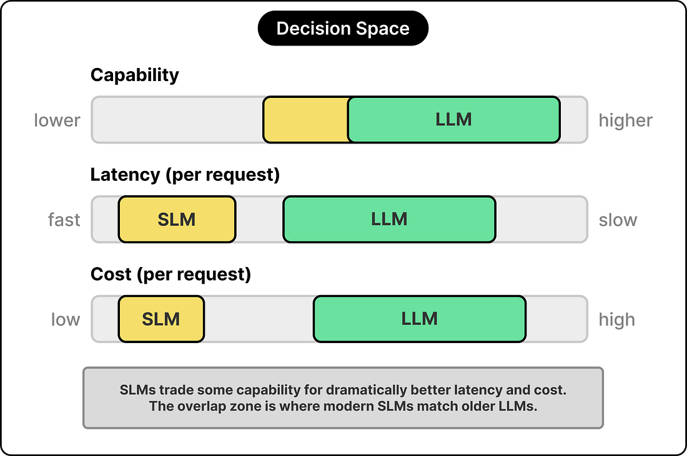
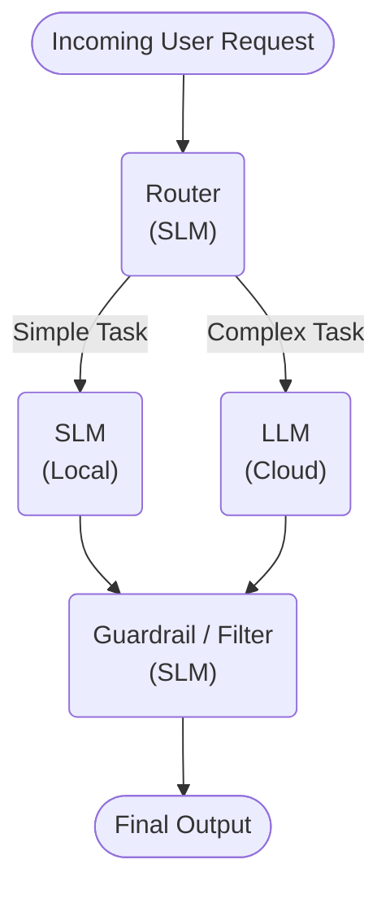

# Serving: Inference and Cloud Providers

## Inference Endpoints

[HuggingFace Inference Endpoints](https://huggingface.co/docs/inference-endpoints/index) is a managed service to deploy your AI model to production.

Instead of spending weeks configuring infrastructure, managing servers, and debugging deployment issues, you can focus on what matters most: your model and your users.

For alternatives, see the [list of Cloud Providers](cloud_providers.md).

## LLM vs SLM

The size of a model refers to its number of parameters, which are the learned weights adjusted during training. In 2026:

- A small model has between **half a billion and fourteen billion** parameters.
- A large model has **tens of billions to hundreds of billions** of parameters (and sometimes more).

Choosing between a Small Language Model (SLM) and a Large Language Model (LLM) comes down to balancing three primary tradeoffs:

* **Capability:** there is an overlap zone where SLMs match the performance of LLMs.
* **Latency (per request):** LLMs are significantly slower per request due to the massive amount of data they must process.
* **Cost (per request):** SLMs can often run on standard hardware. LLMs require expensive, specialized computing infrastructure per request.

Do not summon the costly, slow-moving titan to simply light a candle, nor ask the swift sprite to move a mountain. The art lies in choosing the mind that perfectly fits the burden.

## Best of Both: SLM + LLM

The most interesting design question in 2026 is rarely which model to use. The more useful question is how to compose multiple models into a system that uses each for what it does best. Three patterns appear in most production setups.

- **Routing**
- **Guardrails**
- **Speculative Deocoding**

### 1. Routing

A lightweight SLM acts as a gatekeeper. It evaluates the incoming user request.

1. If the request is simple (e.g., classification, simple translation), the SLM processes it (locally).
2. If it requires complex logic, it escalates the task to a (cloud-based) LLM.

This lowers both **latency and cost** during inference.

Routing to a larger more specialized set of models would increase task-specific performance **(qualty)**.

### 2. Guardrails

Using specialized SLMs strictly to filter inputs and outputs for safety, PII leaks, or formatting errors before and after sending data to a larger model.

For **privacy and security**; the local llms can mask requests going into external LLMs and unmask them from the response.

It also decreasees the **error rate** caused by formatting issues and such.

## 3. Speculative Decoding

> Using speculative execution and a novel sampling method, we can make exact decoding from the large models [(LLMs)] faster, by running them in parallel on the outputs of the approximation models [(SLMs)], potentially generating several tokens concurrently, and without changing the distribution. **Our method can accelerate existing off-the-shelf models without retraining or architecture changes**. -- Paper: [Fast Inference from Transformers via Speculative Decoding](https://arxiv.org/pdf/2211.17192)

- For an example see: [Speculative Decoding for 2x Faster Whisper Inference](https://huggingface.co/blog/whisper-speculative-decoding).
- For a general implementation see [Draft Models | vLLM](https://docs.vllm.ai/en/latest/features/speculative_decoding/draft_model/)

### The Rise of Inference Engineering

Speculative decoding is not the only optimization technique. In fact, **Inference Engineering** is the specialized discipline of optimizing, deploying, and scaling machine learning models so they can process live user requests (inference) as fast, reliably, and cost-effectively as possible.

Few years ago, inference engineering was a specialty practiced almost entirely inside frontier AI labs. Today, we have mature open-source libraries for serving LLMs more economically:

- [vLLM](https://docs.vllm.ai/en/latest/) is a fast and easy-to-use library for LLM inference and serving.
- [SGLang](https://docs.sglang.io/) is a high-performance serving framework for large language and multimodal models.
- [Modular](https://www.modular.com/): Inference reimagined, from Kernel to Cloud. One unified stack. 

> Behind each of these powerful tools is a distinct set of brilliant engineers and organizations, often originating from the same academic circles or major tech giants.
> 
> ### 1. vLLM
> 
> vLLM was born in academia but has rapidly transitioned into the foundation of enterprise AI serving.
> 
> * **The Original Organization:** vLLM was originally developed in 2023 at the **Sky Computing Lab at UC Berkeley**.
> * **The Key People:** The core architecture (and the famous PagedAttention paper) was authored by a team of researchers including **Simon Mo, Woosuk Kwon, Zhuohan Li, Hao Zhang, Joseph E. Gonzalez, and Ion Stoica** (who is also a co-founder of Databricks and Anyscale).
> * **The Current Custodians:** Because it became the industry standard so quickly, UC Berkeley donated vLLM to the Linux Foundation. It is now officially hosted and managed by the **PyTorch Foundation**.
> * **The Commercial Spin-off:** In early 2026, the original creators (led by Simon Mo as CEO and Kaichao You) launched a startup named **Inferact**, raising $150 million in seed funding to commercialize and build enterprise services around the vLLM ecosystem.
> 
> ### 2. SGLang
> 
> SGLang shares some DNA with vLLM (both have UC Berkeley roots), but it was driven by a slightly different collective focused on complex model evaluation and agentic generation.
> 
> * **The Original Organization:** SGLang was introduced by **LMSYS Org (Large Model Systems Organization)**. LMSYS is the same non-profit research group famous for creating "Chatbot Arena" (the premier leaderboard for evaluating LLMs) and the FastChat framework. The collaboration involved researchers from UC Berkeley, Stanford, UCSD, and others.
> * **The Key People:** The lead developer and driving force behind SGLang (and its core RadixAttention mechanism) is **Lianmin Zheng**, alongside co-authors like Liangsheng Yin, Ying Sheng, and several of the same UC Berkeley professors involved in vLLM (like Joseph Gonzalez and Ion Stoica).
> * **The Commercial Spin-off:** Just like the vLLM team, the SGLang creators recently moved to commercialize their work. In January 2026, contributors associated with the project spun out a startup called **RadixArk** (achieving a $400 million valuation) to build enterprise infrastructure around SGLang's agent-friendly architecture.
> 
> ### 3. Modular
> 
> Unlike vLLM and SGLang, which grew out of university labs trying to solve specific memory bottlenecks, Modular is a massive, top-down rewrite of the entire AI compiler stack built by some of the most famous systems engineers in the world.
> 
> * **The Organization:** **Modular Inc.** is a private tech startup founded in 2022. Interestingly, just days ago (late June 2026), it was announced that **Qualcomm** is acquiring Modular in an all-stock deal worth roughly $3.9 billion to challenge NVIDIA's software dominance.
> * **The Founders:**
>   * **Chris Lattner (Co-Founder & CEO):** A legendary figure in systems engineering. He is the original creator of **LLVM and Clang** (the compiler infrastructure that most modern software runs on) and the creator of Apple's **Swift** programming language. Before Modular, he drove massive AI infrastructure projects at Google (building MLIR) and Tesla.
>   * **Tim Davis (Co-Founder & President):** A brilliant product and systems leader who spent seven years at Google. He co-founded **TensorFlow Lite** (scaling it to billions of edge devices) and led the product direction for Google's ML infrastructure, including TPUs and XLA.
> 
> 
> * **Their Mission:** Lattner and Davis met at Google and bonded over their shared frustration with how fragmented and hardware-locked (specifically to NVIDIA's CUDA) the AI software ecosystem had become. They built Modular, the MAX engine, and the Mojo programming language to unify the stack so developers can write code once and run it at bare-metal speeds on any chip.
> 