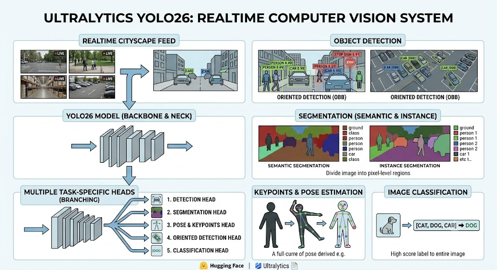

# Realtime Computer Vision

## Overview

[Ultralytics](https://www.ultralytics.com/) YOLO26 is a unified family of **real-time vision models** described in the [Ultralytics YOLO26 paper](https://arxiv.org/abs/2606.03748).

It introduces:

1. native end-to-end inference
2. a lighter detection head
3. an updated training recipe
4. and task-specific heads for:
   1. [detection](https://docs.ultralytics.com/tasks/detect)
   2. segmentation ([instance](https://docs.ultralytics.com/tasks/segment) and [semantic](https://docs.ultralytics.com/tasks/semantic))
   3. [pose/keypoints estimation](https://docs.ultralytics.com/tasks/pose)
   4. [oriented detection](https://docs.ultralytics.com/tasks/obb).
   5. [classification](https://docs.ultralytics.com/tasks/classify)

[YOLO26](https://docs.ultralytics.com/models/yolo26) is the latest evolution in the YOLO series of real-time object detectors, engineered from the ground up for **edge and low-power devices**. It introduces a streamlined design that removes unnecessary complexity while integrating targeted innovations to deliver faster, lighter, and more accessible deployment.

## Fine-tuning YOLO

- See the docs: [How to Fine-Tune YOLO on a Custom Dataset](https://docs.ultralytics.com/guides/finetuning-guide).
- Also see: [Machine Learning Best Practices and Tips for Model Training](https://docs.ultralytics.com/guides/model-training-tips).

## Machine Learning Best Practices and Tips for Model Training

TODO...

## Related Libraries

- While [Ultralytics](https://platform.ultralytics.com/) focuses heavily on creating the best model architectures and the underlying training engine.
    - Roboflow App: Upload data, annotate images, train and deploy models. [Get your API key](https://docs.roboflow.com/api-reference/authentication).
        - [Universe](https://universe.roboflow.com/): Browse and use community datasets and models (like HuggingFace Hub). Pass any Universe `model_id` directly to `Inference` (library).
- [Inference](https://inference.roboflow.com/): application workflows, deployment and serving.
- [Supervision](https://supervision.roboflow.com/latest/):
    - Post-process results: decode predictions, plot bounding boxes, track objects, slice images for small object detection.
    - Unified `Detections` object that works with YOLO, SAM, Grounding DINO, Transformers, and 20+ model frameworks
- [Trackers](https://trackers.roboflow.com/latest/): Clean, modular implementations of leading trackers.
