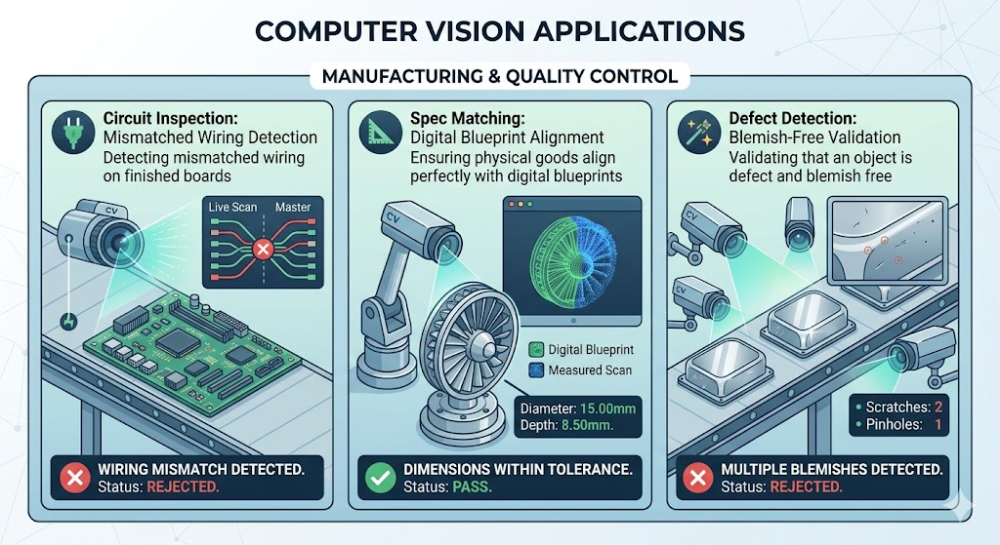

# Realtime Inference

## Overview

**Realtime** means something is happening _right now_, with no noticeable delay. When a system operates in real-time, it processes information and reacts to it almost exactly as the data is received.

It is the difference between having a live conversation with someone face-to-face (real-time) versus leaving them a voicemail to listen to later (delayed).

We need to answer three questions for any realtime inference system:

1. Where will it run? (in-process vs on a server)
2. What is the input? (image snapshot vs video stream)

## In-process vs on a Server

[Running a model](https://inference.roboflow.com/quickstart/run_a_model/) may be on one of two ways:

1. **Server**: the [inference-sdk](https://inference.roboflow.com/inference_helpers/inference_sdk/) which sends requests to an [Inference Server](https://inference.roboflow.com/quickstart/docker/) over HTTP.
2. **In-process**: the [inference Python package](https://inference.roboflow.com/using_inference/about/) which loads and runs models directly in your process .

### Inference Server

The most common way to use Inference is **as a small part of a larger system** (_Microservice_). It's producing a `response` object representing:

1. the prediction from a model (for example, a set of `Detections` containing objects' categorization, location, and size in an image)
2. or the result of post-processing logic (like the pass/fail state of an inspection)
3. or an aggregation (like the count of unique objects seen over the past hour)
4. or a visualization

The previously mentioned _Inference Workflows_ run on a server, but can be [Deployed Anywhere](https://inference.roboflow.com/start/overview/#features).

## Synchronous and Asynchronous Processing Flowcharts

The type of input (image snapshot vs video stream) affect how the system input/output mechanism is wired. Below we look at common patterns.

### 1. Image Snapshots

For image workloads, the input is passed in as a parameter and the response is returned **synchronously**.

#### Image Snapshot Use-cases

- 🏷️ Tagging of user-uploaded images to a website
- ⚙️ Determining if a machine is setup correctly before allowing it to turn on
- 💊 Counting the number of pills in an image

- 🔌 Detecting mismatched wiring in a finished circuit board
- 📐 Inspecting a manufactured good to ensure it matches the spec
- ✨ Validating that an object is defect and blemish free

### 2. Video Stream

In the case of video streams:

1. a visual agent (called [an `InferencePipeline`](https://inference.roboflow.com/workflows/video_processing/overview.md)) is started and runs in a loop until terminated.
2. responses are **polled or subscribed to** (async) by the client application for display or **processing**.

## From Processing to Action

Also known as Inference as an Appliance.

Inference can also be treated as an autonomous agent that continuously consumes and processes a video stream and **performs downstream actions** like:

1. updating a database
2. sending notifications
3. firing webhooks
4. or signaling hardware

In this paradigm, the full logic of the system is defined in a **Workflow** and the output is pushed to external systems.

### Video Stream Use-cases

- ⏱️ Cataloguing retail customers’ wait time over the course of a day
- 📹 Flagging suspicious activity in a security camera feed
- 🚚 Updating an inventory system as vehicles enter or leave a yard
- 🛣️ Collecting highway traffic analytics
- 🛑 Stopping a conveyor belt if a jam has occurred
- 🚨 Sounding an alarm when a scrap heap overflows

## Supervision

{height=80}

[Supervision](https://supervision.roboflow.com/latest/) is an open-source Python library by Roboflow for building computer vision applications. It provides a unified `Detections` object that works with: YOLO, [Transformers](https://huggingface.co/docs/transformers), SAM, Grounding DINO, and 20+ model frameworks.

Trusted by researchers (cited in 4,000+ papers) and practitioners (38,000+ GitHub stars, 1M+ monthly PyPI downloads), Supervision is the standard toolkit for production computer vision workflows.

With Supervision you can:

1. [Detect and Annotate Objects](https://supervision.roboflow.com/latest/how_to/detect_and_annotate/)
2. [Track Objects on Video](https://supervision.roboflow.com/latest/how_to/track_objects/)
3. [Count Objects in a Zone](https://supervision.roboflow.com/latest/how_to/count_in_zone/)
4. [Count Objects Crossing the Line](https://supervision.roboflow.com/latest/notebooks/count-objects-crossing-the-line/)
5. [Analyze Parking Occupancy](https://supervision.roboflow.com/latest/notebooks/occupancy_analytics/)

See: [Supervision Cheat Sheet](https://roboflow.github.io/cheatsheet-supervision/) for a summary or [the docs](https://supervision.roboflow.com/latest/) for the rest of the features.
