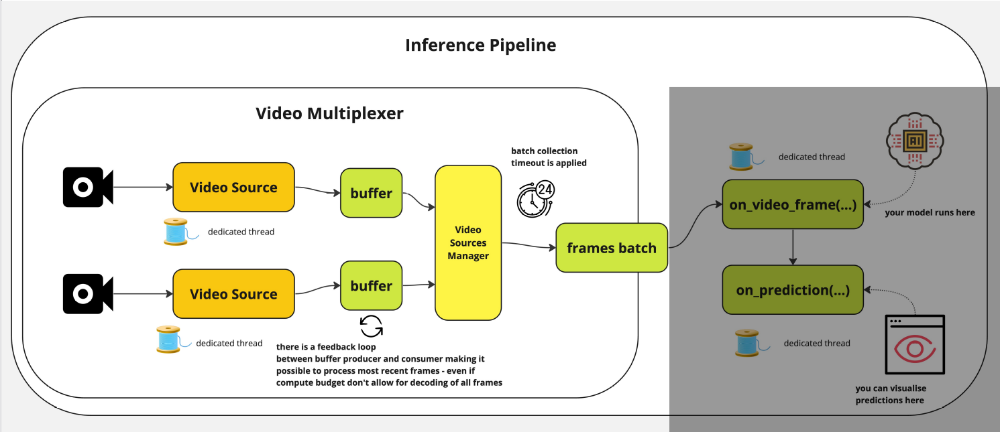

# Inference

[Inference](https://inference.roboflow.com/start/overview/) is an open-source computer vision deployment hub by Roboflow. It handles model serving, video stream management, pre/post-processing, and GPU/CPU optimization so you can focus on building your application.

It has several components that work together. The diagram below shows how they fit together:

- **[inference-sdk](https://inference.roboflow.com/inference_helpers/inference_sdk/)** - Lightweight Python client for communicating with the Inference Server.
- **[inference-cli](https://inference.roboflow.com/inference_helpers/inference_cli/)** - Command-line tool for managing the Inference Server and running common tasks.
- **[Inference Server](https://inference.roboflow.com/quickstart/docker/)** - HTTP server (Docker) that wraps the `inference` package as a REST API.
- **[inference](https://inference.roboflow.com/using_inference/about/)** - Core Python package for model loading, inference, and Workflows execution.

## Features

Featres of Inference; The core Python package:

- **[Model Serving](https://inference.roboflow.com/quickstart/run_a_model)** - Object detection, classification, segmentation, keypoint detection, OCR, VQA, and more. Supports [pre-trained](https://inference.roboflow.com/quickstart/aliases), [fine-tuned](https://roboflow.com/train), and [foundation](https://inference.roboflow.com/foundation/about) models.
- **[Video Streaming](https://inference.roboflow.com/workflows/video_processing/overview)** - Efficient `InferencePipeline` for consuming camera feeds, RTSP streams, and video files with automatic frame management and state tracking.
- **[Speed](https://inference.roboflow.com/understand/features#speed)** - Automatic parallelization, hardware acceleration, dynamic batching, and optional TensorRT quantization.
- **[Extensibility](https://inference.roboflow.com/understand/features#extensibility)** - Open source (Apache 2.0). Add custom models, Workflow blocks, and backends.

## Deploy Anywhere[¶](https://inference.roboflow.com/start/overview/#deploy-anywhere)

||[Serverless](https://docs.roboflow.com/deploy/serverless-hosted-api-v2)|[Dedicated](https://docs.roboflow.com/deploy/dedicated-deployments)|[Self-Hosted](https://inference.roboflow.com/install/)|
|---|---|---|---|
|Fine-Tuned & Pre-Trained Models|✅|✅|✅|
|Workflows|✅|✅|✅|
|Foundation Models||✅|✅|
|Video Streaming||✅|✅|
|Dynamic Python Blocks||✅|✅|
|Runs Offline|||✅|
|Billing|Per-Call|Hourly|Free + [metered](https://roboflow.com/pricing)|

- **Serverless** - Pay-per-Inference, scales to zero. Doesn't support large [foundation models](https://inference.roboflow.com/foundation/about).
- **Dedicated** - Single-tenant VMs with optional GPU. Supports larger foundation models (SAM 2, Florence-2, PaliGemma). Billed hourly.
- **Self-Hosted** - Run on your own hardware. [Install guide →](https://inference.roboflow.com/install/)
- **Bring Your Own Cloud** - Self-host on [AWS, Azure, or GCP](https://inference.roboflow.com/install/cloud/) for enterprise compliance.

See: [What Devices Can I Use?](https://inference.roboflow.com/quickstart/devices/).

## Inference: Alternatives

[Alternatives](https://inference.roboflow.com/understand/alternatives/) include:

- Inference Servers
    - NVIDIA Triton Inference Server
    - Lightning LitServe
    - TensorFlow Serving
    - TorchServe
    - FastAPI or Flask
- Workflow Builders
    - ComfyUI
    - Node-RED
- Edge Deployment
    - Edge Impulse
    - NVIDIA DeepStream

## Run a model with Inference

Let's run a computer vision model with Inference. There are two ways to do this:

1. the [inference Python package](https://inference.roboflow.com/using_inference/about/) which loads and runs models directly in your process, or 
2. the [inference-sdk](https://inference.roboflow.com/inference_helpers/inference_sdk/) which sends requests to an [Inference Server](https://inference.roboflow.com/quickstart/docker/) over HTTP.

See: [Run a model](https://inference.roboflow.com/quickstart/run_a_model/)

## Inference as a Microservice

- The most common way to use Inference is as a small part of a larger system.
- It's producing a `response` that is consumed by downstream code.
- This response sometimes represents:
    1. the prediction from a model (for example, a set of `Detections` containing objects' categorization, location, and size in an image)
    2. or the result of post-processing logic (like the pass/fail state of an inspection)
    3. or an aggregation (like the count of unique objects seen over the past hour)
    4. or a visualization

### Image Input

For image workloads, the input is passed in as a parameter and the response is returned synchronously.

{.r-stretch fig-align="center"}

#### Example use-cases

- 🏷️ Tagging of user-uploaded images to a website
- ⚙️ Determining if a machine is setup correctly before allowing it to turn on
- 💊 Counting the number of pills in an image

- 🔌 Detecting mismatched wiring in a finished circuit board
- 📐 Inspecting a manufactured good to ensure it matches the spec
- ✨ Validating that an object is defect and blemish free

### Video Input

In the case of video streams, a visual agent (called [an `InferencePipeline`](https://inference.roboflow.com/workflows/video_processing/overview.md)) is started and runs in a loop until terminated. Responses are polled or subscribed to by the client application for display or processing.

{.r-stretch fig-align="center"}

#### Example use-cases

- 👤 Blurring faces in a video

## Inference as an Appliance

Inference can also be treated as an autonomous agent that continuously consumes and processes a video stream and performs downstream actions like:

{.r-stretch fig-align="center"}

1. updating a database
2. sending notifications
3. firing webhooks
4. or signaling hardware

In this paradigm, the full logic of the system is defined in a **Workflow** and the output is pushed to external systems.

### Example appliance use-cases:

- ⏱️ Cataloguing retail customers’ wait time over the course of a day
- 📹 Flagging suspicious activity in a security camera feed
- 🚚 Updating an inventory system as vehicles enter or leave a yard
- 🛣️ Collecting highway traffic analytics
- 🛑 Stopping a conveyor belt if a jam has occurred
- 🚨 Sounding an alarm when a scrap heap overflows

## Inference Pipeline

- The Inference Pipeline interface is made for streaming and is likely the best route to go for real time use cases.
- It is an asynchronous interface that can consume many different video sources including:
    1. local devices (like webcams)
    2. RTSP video streams
    3. video files
    - ..etc.

..With this interface, you define:

1. the **source** (of a video stream) and
2. [**sinks**](https://inference.roboflow.com/using_inference/inference_pipeline/#sinks)

### How the [`InferencePipeline`](https://inference.roboflow.com/using_inference/inference_pipeline/#how-the-inferencepipeline-works) works?

The `InferencePipeline` is designed for robust, multi-source video processing, delegating tasks to dedicated threads to maximize throughput and stability.

### 1.1 Video Multiplexer: Reading and Buffering

- **Concurrency:** Spawns a separate consumer thread for each video source.
        
- For **Stored videos**, it just processes every frame until it is done.

- For **Live streams**: buffers accumulate frames if the compute budget is strained, ensuring the model can either:
    1. process all frames without dropping any.
    2. skip drops and just the process the most recent ones.
    
- **Auto-recovery:** video sources will be automatically re-connected once connectivity is lost during processing. That is meant to prevent failures in production environment when the pipeline can run long hours and need to gracefully handle sources downtimes.

### 1.2 Video Multiplexer: Batching

- Collects incoming data into a **frames batch** based on a `batch_collection_timeout`.
    - If a source fails to provide a frame within the timeout, a smaller batch is passed forward.
    - Any missing frames (and their subsequent predictions) are safely padded with `None` before reaching the prediction stage.

### 2. Processing

1. **`on_video_frame(...)`:** Runs on its own dedicated thread, serving as the execution environment for your AI model.
    
2. **`on_prediction(...)`:** Handles downstream tasks (like visualization) on a separate thread. Controlled by the `sink_mode` parameter, it can process incoming data in either:  
    - `SEQUENTIAL` mode: one element at a time or
    - `BATCH` mode: all batch elements simultaneously.

### Customizing the pipeline

See [the documentation page: Inference pipeline](https://inference.roboflow.com/using_inference/inference_pipeline/) for more details.

For post-processing, see section: [Custom Sink Tutorial](https://inference.roboflow.com/using_inference/inference_pipeline/#custom-sink-tutorial) on that same page.
