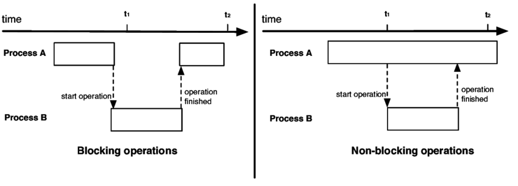

# Inference Pipeline

## Overview

### Video Streaming over the Network

**RSTP** (Real-Time Streaming Protocol) is a set of rules (a protocol) used to control the delivery of continuous audio or video over a network. It is the industry standard for streaming live video feeds. Actually sending the video frames over the internet is usually handled by a companion protocol called **RTP (Real-time Transport Protocol)**.

You will almost exclusively see RTSP used in the context of live IP (Internet Protocol) cameras. Examples include:

- CCTV and security cameras.
    
- Traffic monitoring cameras.
    
- Baby monitors.
    
- Industrial or factory floor surveillance.

### Problem

If you write a manual `while` loop, the program will run **synchronously**. This means your camera will wait for the model to finish predicting before it grabs the next frame. **For live video, this causes major issues**:

- **Bottlenecks:** Video decoding (I/O) and model inference (Compute) block each other.
    
- **Latency:** If your camera records at 30 FPS but your model only processes at 10 FPS, a manual loop will cause a massive backlog of frames. Your "live" feed will fall seconds or minutes behind reality.
    



Finally, **Fragility:** If the RSTP stream hiccups or drops packets, a standard `cv2` loop will often just crash.

### Solution

The [Inference Pipeline interface](https://inference.roboflow.com/using_inference/inference_pipeline/) is made for streaming and is likely the best route to go for real time use cases. It is an asynchronous interface that can consume many different video sources including local devices (like webcams), RTSP video streams, video files, etc. With this interface, you define the source of a video stream and sinks.

## Key Components

### 1. Video References (Inputs)

The pipeline can consume multiple types of video streams, which you specify when initializing it:

* **Device ID (Integer):** Captures video from local devices like a built-in webcam (typically `0`).
* **Video File (String):** Reads and processes a local video file frame-by-frame.
* **Video URL (String):** Processes a hosted video file directly without needing to download it first.
* **RTSP URL (String):** Consumes a live RTSP stream, fetching frames as fast as possible and processing the latest available frame.
* **Multiple Inputs:** You can pass a list of these inputs to process multiple streams simultaneously.

### 2. Models & Workflows (Processing)

* **Pre-trained / Fine-tuned Models:** You can pass a specific `model_id` (like `"rfdetr-large"`) alongside your Roboflow API key to automatically download and run inference.
* **Roboflow Workflows:** The pipeline supports complex multi-step processing (e.g., cropping an image, running object detection, and then running OCR) using `InferencePipeline.init_with_workflow()`.
* **Custom Logic:** You can inject a custom callable instead of a standard model if you want to run your own custom inference code on the incoming video frames.

### 3. Sinks (Outputs)

Sinks define what happens *after* the model makes a prediction. The pipeline triggers the sink for every processed frame.

* **Built-in Sinks:** Includes `render_boxes` (draws bounding boxes on the video using the Supervision library), `VideoFileSink` (saves annotated frames to a file), and `UDPSink` (broadcasts JSON predictions over a UDP port).
* **Custom Sinks:** You can write your own Python function to handle predictions (e.g., saving data to a database, sending an alert, or visualizing custom data).

## How to provide a custom inference logic to `InferencePipeline`

```python
# 1. SETTING THE STAGE (Imports and Setup)
import os
import json

# VideoFrame holds the actual picture (pixels) plus metadata, like the frame number.
from inference.core.interfaces.camera.entities import VideoFrame
from inference import InferencePipeline

# NEW IMPORTS FOR THE SINK:
# Type hinting helps keep our code safe. 
# 'Union' means "it could be A or B". 
# 'Optional' means "it could be valid data, OR it could be missing (None)".
from typing import Any, List, Union, Optional

TARGET_DIR = "./my_predictions"


# 2. BUILDING THE CUSTOM "BRAIN" (The Source/Processor)
class MyModel:
    
    def __init__(self, weights_path: str):
        # Load the heavy AI model once at startup.
        self._model = your_model_loader(weights_path)

    def infer(self, video_frames: List[VideoFrame]) -> List[Any]: 
        # Extract the raw images from the frames, feed them to the brain, 
        # and return a list of predictions.
        return self._model([v.image for v in video_frames])


# 3. HANDLING THE OUTPUT (The Sink - NOW UPGRADED!)
# This signature looks complex, but it's just telling Python:
# "I might receive a single prediction, OR a list of predictions (if processing batches/multiple cameras). 
# Also, sometimes a camera drops a frame, so a prediction might be missing entirely (Optional/None)."
def on_prediction(
    predictions: Union[dict, List[Optional[dict]]], 
    video_frame: Union[VideoFrame, List[Optional[VideoFrame]]]
) -> None:
    
    # 3a. Standardization 
    # If the pipeline only hands us a single dictionary (instead of a list), 
    # we wrap it in a list `[ ]`. This ensures the 'for' loop below ALWAYS works, 
    # whether we are processing 1 frame at a time or 10 frames at a time.
    if not isinstance(predictions, list):
        predictions = [predictions]
        video_frame = [video_frame]

    # 3b. The 'Zip' Loop
    # 'zip' acts exactly like a zipper on a jacket. It pairs up Prediction #1 with Frame #1, 
    # Prediction #2 with Frame #2, etc., so we can process them side-by-side.
    for prediction, frame in zip(predictions, video_frame):
        
        # 3c. The Empty Frame Check
        # In real-time video, networks hiccup and frames get dropped. If that happens, 
        # the pipeline hands us 'None'. 'continue' tells Python: "Skip the rest of this loop 
        # and just move to the next frame." This prevents our whole app from crashing!
        if prediction is None:
            continue
            
        # 3d. The Actual Processing (Saving the file)
        # If we passed the check above, we know we have valid data.
        file_path = os.path.join(TARGET_DIR, f"{frame.frame_id}.json")
        with open(file_path, "w") as f:
            json.dump(prediction, f)


# 4. PLUGGING IT ALL TOGETHER
my_model = MyModel("./my_model.pt")

pipeline = InferencePipeline.init_with_custom_logic(
    video_reference="./my_video.mp4",
    on_video_frame=my_model.infer, 
    
    # We now point the pipeline to our upgraded, robust sink function!
    on_prediction=on_prediction,    
)


# 5. FLIPPING THE SWITCH
# Turn on the background threads to start pulling video and running the model.
pipeline.start()

# Wait for all processing to finish before letting the Python script close.
pipeline.join()
```


## How it Works Under the Hood

The pipeline spins up a consumer thread for each video source. It uses a multiplexer to grab frames and handles synchronization.

* **Stream Resiliency:** If you are processing a live stream and the pipeline is running slower than the stream, it will intentionally drop older frames to ensure it is always processing the most recent data. Furthermore, if a live source disconnects, the pipeline will automatically attempt to reconnect to prevent production downtime.
* **Sink Modes:** Sinks can operate sequentially (one frame at a time), in batches (multiple frames/predictions at once), or adaptively based on the number of inputs.


Below we detail what happens at each of the three stages.

### 1. Video Multiplexer: Reading and Buffering


- **Concurrency:** Spawns a separate consumer thread for each video source.
        
- For **Stored videos**, it just processes every frame until it is done.

- For **Live streams**: buffers accumulate frames if the compute budget is strained, ensuring the model can either:
    1. process all frames without dropping any.
    2. skip drops and just the process the most recent ones.
    
- **Auto-recovery:** video sources will be automatically re-connected once connectivity is lost during processing. That is meant to prevent failures in production environment when the pipeline can run long hours and need to gracefully handle sources downtimes.


### 2. Video Multiplexer: Batching


- Collects incoming data into a **frames batch** based on a `batch_collection_timeout`.
    - If a source fails to provide a frame within the timeout, a smaller batch is passed forward.
    - Any missing frames (and their subsequent predictions) are safely padded with `None` before reaching the prediction stage.

### 3. Processing Frames


1. **`on_video_frame(...)`:** Runs on its own dedicated thread, serving as the execution environment for your AI model.
    
2. **`on_prediction(...)`:** Handles downstream tasks (like visualization) on a separate thread. Controlled by the `sink_mode` parameter, it can process incoming data in either:  
    - `SEQUENTIAL` mode: one element at a time or
    - `BATCH` mode: all batch elements simultaneously.

### Customizing the pipeline

See [the documentation page: Inference pipeline](https://inference.roboflow.com/using_inference/inference_pipeline/) for more details.

For post-processing, see section: [Custom Sink Tutorial](https://inference.roboflow.com/using_inference/inference_pipeline/#custom-sink-tutorial) on that same page.
