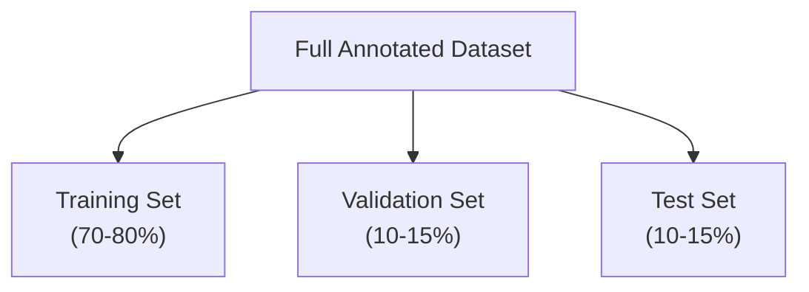

# Computer Vision Project Key Steps

Building a computer vision project means moving through a clear sequence of stages: defining your goals, collecting and annotating data, training and evaluating a model, and deploying and maintaining it in production. This guide walks through each step in order and explains why it matters, so you can plan and run your own project with confidence.

Computer vision techniques can be applied across various industries, from [autonomous driving](https://www.ultralytics.com/solutions/ai-in-automotive) to [medical imaging](https://www.ultralytics.com/solutions/ai-in-healthcare) to gain valuable insights.

## An Overview of a Computer Vision Project

Before discussing the details of each step involved in a computer vision project, let's look at the overall process. If you started a computer vision project today, you'd take the following steps:

1. Your first priority is to [understand your project's requirements](#step-1-defining-your-projects-goals).
2. Then, you [collect and accurately label](#step-2-data-collection-and-data-annotation) the images that will help train your model.
3. Next, you [clean and augment your data](#step-3-data-augmentation-and-splitting-your-dataset) to prepare it for model training.
4. Next is [training](#step-4-model-training)
5. Then, [testing](#step-5-model-testing)
6. Finally, you [deploy](#step-6-model-deployment) your model into the real world
7. And keep [monitoring](#step-7-monitoring-and-maintenance) it to maintain it based on new insights and feedback.

  

Now that we know what to expect, let's dive right into the steps and get your project moving forward.

## Step 1: Defining Your Project's Goals

The first step in any computer vision project is clearly defining the problem you're trying to solve. Knowing the end goal helps you start to build a solution. This is especially true when it comes to computer vision because your project's objective will directly affect which computer vision task you need to focus on.

Here are some examples of project objectives and the computer vision tasks that can be used to reach these objectives:

- **Objective:** To develop a system that can monitor and manage the flow of different vehicle types on highways, improving traffic management and safety.
    - **Computer Vision Task:** Object detection is ideal for traffic monitoring because it efficiently locates and identifies multiple vehicles. It is less computationally demanding than image segmentation, which provides unnecessary detail for this task, ensuring faster, real-time analysis.

- **Objective:** To develop a tool that assists radiologists by providing precise, pixel-level outlines of tumors in medical imaging scans.
    - **Computer Vision Task:** Image segmentation is suitable for medical imaging because it provides accurate and detailed boundaries of tumors that are crucial for assessing size, shape, and treatment planning.

- **Objective:** To create a digital system that categorizes various documents (e.g., invoices, receipts, legal paperwork) to improve organizational efficiency and document retrieval.
    - **Computer Vision Task:** [Image classification](https://www.ultralytics.com/glossary/image-classification) is ideal here as it handles one document at a time, without needing to consider the document's position in the image. This approach simplifies and accelerates the sorting process.

### Selecting the Right Model and Training Approach

After understanding the project objective and suitable computer vision tasks, an essential part of defining the project goal is [selecting the right model](https://docs.ultralytics.com/models) and training approach.

#### 1. Model-first or Data-first

Depending on the objective, you might choose to select the model first or after seeing what data you are able to collect in Step 2.

- For example, suppose your project is highly dependent on the availability of specific types of data. In that case, it may be more practical to gather and analyze the data first before selecting a model.
- On the other hand, if you have a clear understanding of the model requirements, you can choose the model first and then collect data that fits those specifications.

#### 2. Training from Scratch or Transfer Learning

Choosing between training from scratch or using [transfer learning](https://www.ultralytics.com/glossary/transfer-learning) affects how you prepare your data. 

- Training from scratch requires a diverse dataset to build the model's understanding from the ground up.
- Transfer learning, on the other hand, allows you to use a pretrained model and adapt it with a smaller, more specific dataset.

  

#### 3. Consider Deployment Target

Consider a model's [deployment target](https://docs.ultralytics.com/guides/model-deployment-options) to ensure compatibility and performance. For example, lightweight models are ideal for _edge computing_ thanks to their efficiency on resource-constrained devices.

To learn more, read our guide on [defining your project's goals and selecting the right model](https://docs.ultralytics.com/guides/defining-project-goals).

---

Before getting into the hands-on work of a computer vision project, it's important to have a clear understanding of these details. Double-check that you've considered the following before moving on to Step 2:

- Clearly define the **problem** you're trying to solve.
  - Determine the **end goal** of your project.
    - Identify the specific computer vision **task** needed (e.g., object detection, image classification, image segmentation).
  - Select the appropriate **model** for your task and **deployment needs**.
- Decide whether to train a model from **scratch** or use **transfer learning**.

## Step 2: Data Collection and Data Annotation

### A. Dataset Repositories

The quality of your computer vision models depends on the quality of your dataset. You can either collect images from the internet, take your own pictures, or use pre-existing datasets. Here are some great resources for downloading high-quality datasets: [Google Dataset Search Engine](https://datasetsearch.research.google.com/), [UC Irvine Machine Learning Repository](https://archive.ics.uci.edu/), and [Kaggle Datasets](https://www.kaggle.com/datasets).

### B. Built-in Datasets

Some libraries, like Ultralytics, provide [built-in support for various datasets](https://docs.ultralytics.com/datasets), making it easier to get started with high-quality data. These libraries often include utilities for using popular datasets seamlessly, which can save you a lot of time and effort in the initial stages of your project.

However, if you choose to collect images or take your own pictures, you'll need to annotate your data.

### C. Data Annotation

 [Data annotation](https://www.ultralytics.com/annotate) is the process of labeling your data to impart knowledge to your model. The type of data annotation you'll work with depends on your specific computer vision technique. Here are some examples:

- **Image Classification:** You'll label the entire image as a single class.
- **[Object Detection](https://www.ultralytics.com/glossary/object-detection):** You'll draw bounding boxes around each object in the image and label each box.
- **[Image Segmentation](https://www.ultralytics.com/glossary/image-segmentation):** You'll label each pixel in the image according to the object it belongs to, creating detailed object boundaries.

  

#### Data Annotation Editor

[Data collection and annotation](https://docs.ultralytics.com/guides/data-collection-and-annotation) can be a time-consuming manual effort. A dedicated annotation tool makes it faster: [Ultralytics Platform](https://platform.ultralytics.com) provides a built-in [annotation editor](https://docs.ultralytics.com/platform/data/annotation) with [SAM-powered smart annotation](https://www.ultralytics.com/annotate) for detection, segmentation, and OBB data, saving labels directly in YOLO format.

## Step 3: Data Augmentation and Splitting Your Dataset

After collecting and annotating your image data, it's important to first split your dataset into training, validation, and test sets before performing [data augmentation](https://www.ultralytics.com/glossary/data-augmentation). Splitting your dataset before augmentation is crucial to test and validate your model on original, unaltered data. It helps accurately assess how well the model generalizes to new, unseen data.

### 1. Dataset Splitting

Here's how to split your data:

- **Training Set:** It is the largest portion of your data, typically 70-80% of the total, used to train your model.
- **Validation Set:** Usually around 10-15% of your data; this set is used to tune hyperparameters and validate the model during training, helping to prevent [overfitting](https://www.ultralytics.com/glossary/overfitting).
- **Test Set:** The remaining 10-15% of your data is set aside as the test set. It is used to evaluate the model's performance on unseen data after training is complete.

### 2. Augmentation

After splitting your data, you can perform data augmentation by applying transformations like rotating, scaling, and flipping images to artificially increase the size of your dataset. Data augmentation makes your model more robust to variations and improves its performance on unseen images.

  

Libraries like [OpenCV](https://www.ultralytics.com/glossary/opencv), [Albumentations](https://docs.ultralytics.com/integrations/albumentations), and [TensorFlow](https://www.ultralytics.com/glossary/tensorflow) offer flexible augmentation functions that you can use.

Libraries, like Ultralytics, have [built-in augmentation settings](https://docs.ultralytics.com/modes/train) directly within its model training function, simplifying the process.

### 3. Analysis

To understand your data better, you can use tools like [Matplotlib](https://matplotlib.org/) or [Seaborn](https://seaborn.pydata.org/) to visualize the images and analyze their distribution and characteristics. Visualizing your data helps identify patterns, anomalies, and the effectiveness of your augmentation techniques.

The [Ultralytics Platform](https://platform.ultralytics.com/) `Charts` tab can surface many of these insights without any code by automatically generating:

1. split distribution and class counts
2. image-dimension histograms
3. and annotation-position heatmaps

---

By properly [understanding, splitting, and augmenting your data](https://docs.ultralytics.com/guides/preprocessing-annotated-data), you can develop a well-trained, validated, and tested model that performs well in real-world applications.

## Step 4: Model Training

Once your dataset is ready for training, you can focus on setting up the necessary environment, managing your datasets, and training your model.

### 1. Hardware and Software Dependencies 

First, you'll need to make sure your environment is configured correctly. Typically, this includes the following:

1. Installing essential libraries and frameworks like TensorFlow, [PyTorch](https://www.ultralytics.com/glossary/pytorch), or [Ultralytics](https://docs.ultralytics.com/quickstart).
2. If you are using a GPU, installing libraries like CUDA and cuDNN will help enable GPU acceleration and speed up the training process.

### 2. Start Training

Libraries like Ultralytics simplify the training process. You can [start training](https://docs.ultralytics.com/modes/train) by feeding data into the model with minimal code.

> Ultralytics handles weight adjustments, [backpropagation](https://www.ultralytics.com/glossary/backpropagation).

They also offer tools to monitor progress and adjust hyperparameters easily. After training, save the model and its weights with a few commands.

#### Hyperparameter Tuning

Ultralytics YOLO uses [genetic algorithms](https://en.wikipedia.org/wiki/Genetic_algorithm) to optimize hyperparameters. Genetic algorithms are inspired by the mechanism of natural selection and genetics.

### 3. Dataset Management

It's important to keep in mind that proper dataset management is vital for efficient training. Use version control for datasets to track changes and ensure reproducibility. Tools like [DVC (Data Version Control)](https://docs.ultralytics.com/integrations/dvc) can help manage large datasets.

## Step 5: Model Testing

- While **evaluation** uses a validation set to tune model hyperparameters;
- **testing** checks final performance on unseen data to estimate real-world results before deployment.

For a deeper understanding of model evaluation and fine-tuning techniques, check out the [model evaluation insights guide](https://docs.ultralytics.com/guides/model-evaluation-insights).

Also, address common problems such as overfitting, [underfitting](https://www.ultralytics.com/glossary/underfitting), and data leakage. Use techniques like [cross-validation](https://www.ultralytics.com/glossary/cross-validation) and [anomaly detection](https://www.ultralytics.com/glossary/anomaly-detection) to identify and fix these issues. For comprehensive testing strategies, refer to the [model testing guide](https://docs.ultralytics.com/guides/model-testing).

## Step 6: Model Deployment

Once your model has been thoroughly tested, it's time to deploy it. [Model deployment](https://www.ultralytics.com/glossary/model-deployment) involves making your model available for use in a production environment. Here are the steps to deploy a computer vision model:

- **Setting Up the Environment:** Configure the necessary infrastructure for your chosen deployment option, whether it's cloud-based (AWS, Google Cloud, Azure) or edge-based (local devices, IoT).
- **[Exporting the Model](https://docs.ultralytics.com/modes/export):** Export your model to the appropriate format (e.g., ONNX, TensorRT, CoreML for YOLO26) to ensure compatibility with your deployment platform.
- **Deploying the Model:** Deploy the model by setting up APIs or endpoints and integrating it with your application.
- **Ensuring Scalability:** Implement load balancers, auto-scaling groups, and monitoring tools to manage resources and handle increasing data and user requests.

For more detailed guidance on deployment strategies and best practices, check out our [model deployment practices guide](https://docs.ultralytics.com/guides/model-deployment-practices). [Ultralytics Platform](https://platform.ultralytics.com) also provides managed [deployment endpoints](https://docs.ultralytics.com/platform/deploy/endpoints) with auto-scaling across 43 global regions, handling infrastructure setup automatically.

## Step 7: Monitoring and Maintenance

**Monitoring** tools can help you track key performance indicators (KPIs) and detect anomalies or drops in accuracy.

**Model Drift** is a phenomenon where the model's performance declines over time due to changes in the input data.

**Periodically retrain** the model with updated data to maintain accuracy and relevance.

  

See: [Maintaining Your Computer Vision Models After Deployment](https://docs.ultralytics.com/guides/model-monitoring-and-maintenance).

## Engaging with the Community

Connecting with a community of computer vision enthusiasts can help you tackle any issues you face while working on your computer vision project with confidence. Here are some ways to learn, troubleshoot, and network effectively.

### Community Resources

- **GitHub Issues:** Check out the [YOLO26 GitHub repository](https://github.com/ultralytics/ultralytics/issues) and use the Issues tab to ask questions, report bugs, and suggest new features. The active community and maintainers are there to help with specific issues.
- **Ultralytics Discord Server:** Join the [Ultralytics Discord server](https://discord.com/invite/ultralytics) to interact with other users and developers, get support, and share insights.

### Official Documentation

- **Ultralytics YOLO26 Documentation:** Explore the [official YOLO26 documentation](https://docs.ultralytics.com/guides) for detailed guides with helpful tips on different computer vision tasks and projects.

Using these resources will help you overcome challenges and stay updated with the latest trends and best practices in the computer vision community.

## Next Steps

You now have a roadmap for every stage of a computer vision project, from defining goals to monitoring a deployed model. Put it into practice by [training your first YOLO model](https://docs.ultralytics.com/modes/train), or dive deeper into any single stage through the guides linked above. To run the full pipeline without writing code, explore the [Ultralytics Platform](https://platform.ultralytics.com).
