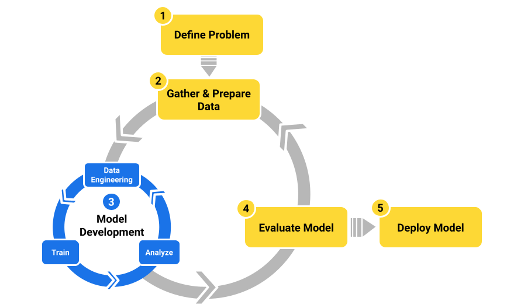

# Automated Machine Learning (AutoML)

In practice, building a machine learning model from prototype to production involves repetitive tasks and specialized skills. A simple exploratory ML workflow looks something like this:

**AutoML** is a process of automating certain tasks in a machine learning workflow. You can think of AutoML as a set of tools and technologies that make building machine learning models faster and more accessible to a wider group of users. Though automation can help throughout the ML workflow, the tasks that are often associated with AutoML are the ones included in the model development cycle shown in Figure 1. These repetitive tasks include:

- **Data Engineering**
  - Feature engineering.
  - Feature selection.
- **Training**
  - Identifying an appropriate ML algorithm.
  - Selecting the best hyperparameters.
- **Analysis**
  - Evaluating metrics generated during training based on test and validation datasets.

With AutoML, you can focus on your ML problem and data rather than on feature selection, tuning hyperparameters, and choosing the right algorithm.

To learn more about the concepts of AutoML, see:

- https://en.wikipedia.org/wiki/Automated_machine_learning
- https://developers.google.com/machine-learning/crash-course/automl
- https://learn.microsoft.com/en-us/azure/machine-learning/concept-automated-ml

## AutoGluon (recommended)

> [Fast and Accurate ML in 3 Lines of Code](https://auto.gluon.ai/stable/index.html).

Watch the tutorial video:

<iframe width="560" height="315" src="https://www.youtube.com/embed/9Epewstb7fY?si=NZkzgukUnODgM1NW" title="YouTube video player" frameborder="0" allow="accelerometer; autoplay; clipboard-write; encrypted-media; gyroscope; picture-in-picture; web-share" referrerpolicy="strict-origin-when-cross-origin" allowfullscreen></iframe>

### What Models To Use?

- One key part of this whole process is deciding which models to train and ensemble. Although ensembling, in general, is a very powerful technique; choosing the right models can be the difference between mediocre and excellent performance.
  
- To answer this question, we evaluated **1,310 models** on **200 distinct datasets** to compare the performance of different combinations of algorithms and hyperparameter configurations. The evaluation is available in this [repository](https://github.com/autogluon/tabrepo/tree/main).
  
- With the results of this extensive evaluation, we chose a set of pre-defined configurations to use in AutoGluon by default[[6]](https://auto.gluon.ai/stable/tutorials/tabular/how-it-works.html#id12) based on the desired performance (e.g. “best quality”, “medium quality”, etc.). These presets even define the order in which models should be trained to maximize the use of training time.

### How it Works?

AutoGluon is different (than other AutoML solutions) because it doesn’t rely on HPO (Hyper-parameter optimization) to achieve great performance. It’s based on three main principles:
    1. training a variety of **different models**
    2. using **bagging** when training those models
    3. **stack-ensembling** those models to combine their predictive power into a “super” model.

> See: [AutoGluon > How it Works](https://auto.gluon.ai/stable/tutorials/tabular/how-it-works.html)

## Alternative: AutoML with PyCaret

[**PyCaret**](https://pycaret.gitbook.io/docs) is an [open-source](https://github.com/pycaret/pycaret), low-code machine learning library in Python that automates machine learning workflows. It is an end-to-end machine learning and model management tool that speeds up the experiment cycle exponentially and makes you more productive.

In comparison with the other open-source machine learning libraries, PyCaret is an alternate low-code library that can be used to replace hundreds of lines of code with few words only. This makes experiments exponentially fast and efficient. PyCaret is essentially a Python wrapper around several machine learning libraries and frameworks such as [`scikit-learn`](https://scikit-learn.org/stable/), [`XGBoost`](https://xgboost.ai/), [`LightGBM`](https://lightgbm.readthedocs.io/en/stable/), [`CatBoost`](https://catboost.ai/), [`Optuna`](https://optuna.org/), [`Hyperopt`](https://hyperopt.github.io/hyperopt/), [`Ray`](https://www.ray.io/), and many more.

Watch the **detailed video tutorial** (1hr 30m):

<iframe width="560" height="315" src="https://www.youtube.com/embed/n2TuYlHqMII?si=74zZenqvQuyFyOgI" title="YouTube video player" frameborder="0" allow="accelerometer; autoplay; clipboard-write; encrypted-media; gyroscope; picture-in-picture; web-share" referrerpolicy="strict-origin-when-cross-origin" allowfullscreen></iframe>

Or this quick 13 minutes video (**PyCaret 2.3.6 NEW Features**) for a walkthrough:

<iframe width="560" height="315" src="https://www.youtube.com/embed/Qr6Hu2t2gwY?si=tL_gGtzJ0psQVhKM" title="YouTube video player" frameborder="0" allow="accelerometer; autoplay; clipboard-write; encrypted-media; gyroscope; picture-in-picture; web-share" referrerpolicy="strict-origin-when-cross-origin" allowfullscreen></iframe>

## Visual IDE for ML

### 1. Orange

{fig-align="center"}

[orangedatamining.com](https://orangedatamining.com/)

### 2. KNIME

{fig-align="center" .r-stretch}

[knime.com](https://www.knime.com/)
