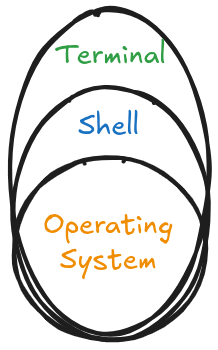

# Terminal

It is completely normal to feel like the terminal is an unforgiving black box. Without buttons to click, options to select from, it feels unfriendly for newcomers.

But today, we break this fear..

Think of the terminal as a highly skilled, fiercely introverted colleague. It isn't trying to be intimidating; it simply communicates completely differently than an extroverted Graphical User Interface (GUI).

### The Terminal as an Introvert

* **Speaks Only When Spoken To:** A blank screen with a blinking cursor isn't broken or frozen; it is just actively listening. It will not initiate a conversation or offer unprompted suggestions.
* **Highly Literal:** It appreciates direct, precise language. If you misspell a command, it won't try to guess your feelings or intent—it just gives a blunt error and waits for the correct instruction.
* **Silent Efficiency:** When a command succeeds, the terminal usually says absolutely nothing. It simply returns a new blank prompt. In terminal culture, silence means success ("Done. What is next?").

Once you learn how to speak directly to this introvert, you realize it is the most powerful and reliable tool on your machine.

### What is a Terminal?

The **Terminal** is the black screen with text that you type commands into. It feeds what you type into the **Shell** (usually **Bash** on Linux). The shell then interprets the commands and may output something back to the terminal.

Because we feed commands line by line, waiting for a response back after each line; it is called: **Command Line Environment** and a **Command-Line Interface** (CLI), as opposed to the **Desktop Environment** or the **Graphical User Interface** (GUI); where users interact with visual elements like: icons, menus, status-bar, and others, using mouse and keyboard.

### Why learn terminal commands?

1. Needed for many developer tools (`git`, `python`, package managers)
2. Useful when GUI is too slow or unavailable
3. Works the same on local machine, servers, and cloud VMs
4. Agents use it to control a machine (you approve/reject based on understanding)

### Script of Commands

A **Script** is a list of commands meant to be executed in order.

- Running scripts is way faster than navigating menus and finding buttons and fields.
- Certainly better than tell the user to copy-paste-run commands
- Scripts are code; can be refactored, improved, version-controlled, ..etc.

### Who needs to learn scripting?

- You need to process many files at once
- You need to apply an action until a condition is met
- You chain commands into one workflow
- You can debug environments and paths quickly
- You work over SSH on a remote Linux machine
