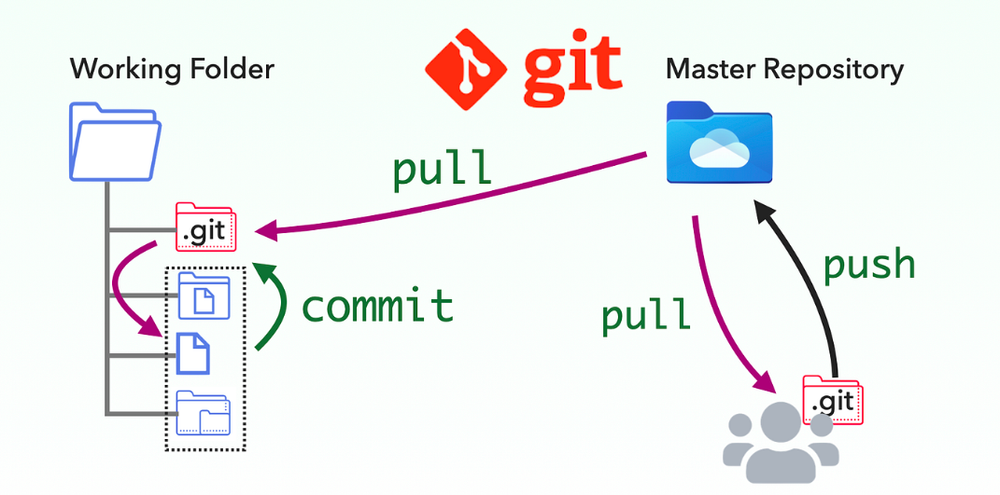
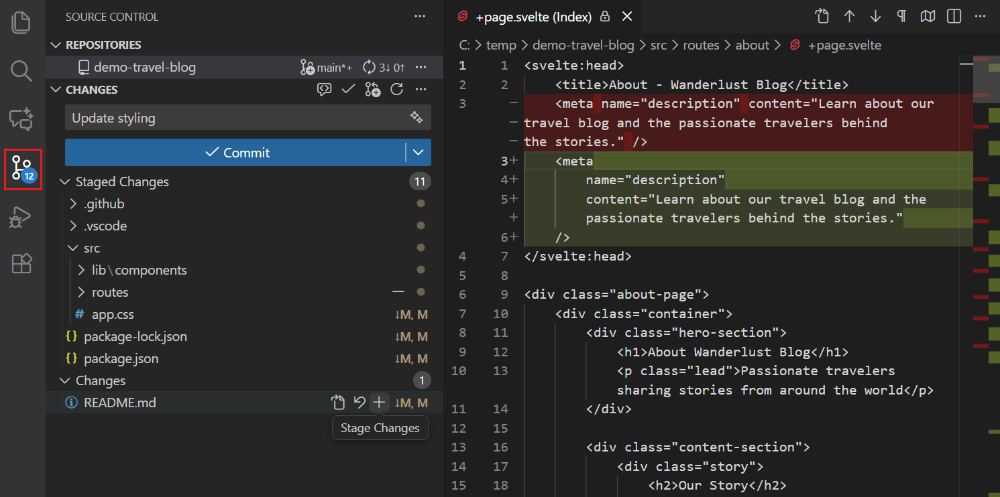
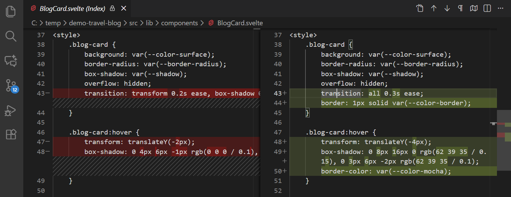
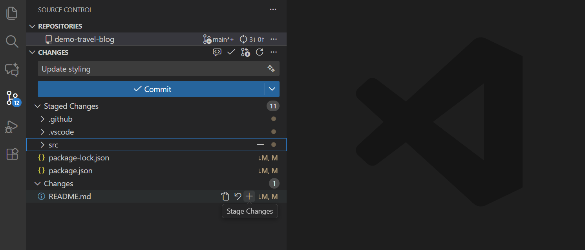
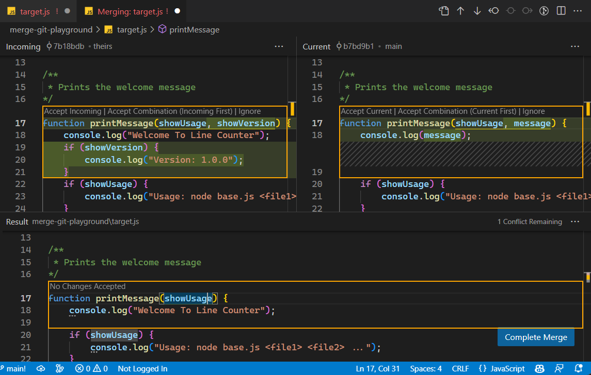
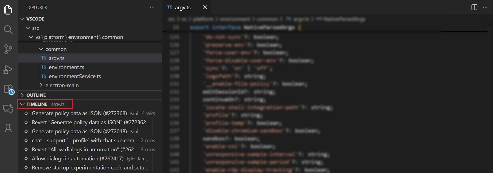
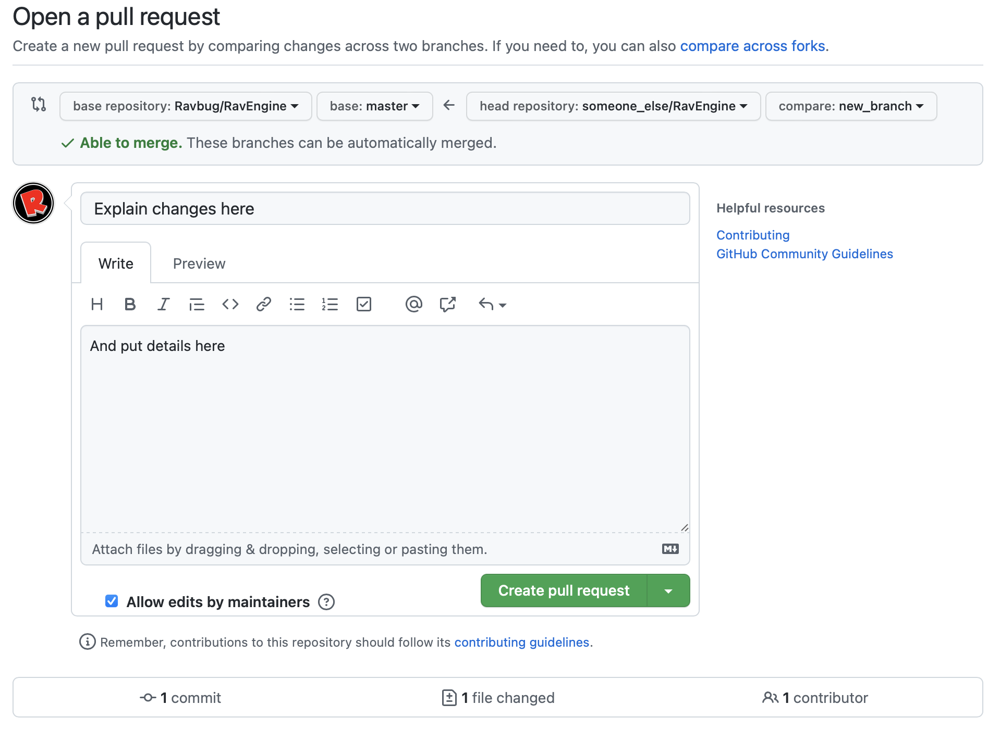

# Git: Version Control System

## Born from Necessity

In 2005, Linus Torvalds (the creator of Linux) had a massive problem. The [Linux kernel project](https://github.com/torvalds/linux) had thousands of contributors, and the proprietary version control system they relied on—BitKeeper—abruptly revoked their free license.

Facing the impossible task of managing millions of lines of code manually, Linus locked himself in a room and built the first version of [Git](https://git-scm.com/) in just about two weeks. He needed something incredibly fast, fully distributed, and capable of handling massive non-linear workflows.

Today, Git is the undisputed king of version control. Over 90% of developers use it globally. It is not just a helpful tool; it is the fundamental infrastructure of modern software engineering. If you cannot use Git, you cannot work on a modern development team.

---

## How `git` Commands Works

<center>



</center>

This diagram perfectly visualizes the core lifecycle of a Git workflow. It breaks down how your local code interacts with a shared cloud server and your teammates.

Here are the key core elements:

### The Three Locations

* **Working Folder:** This is your physical computer. It holds the visible files and folders you are actively editing in VS Code.
* **.git (Local Repository):** The hidden folder sitting inside your project. It acts as your personal database, storing every saved version of your work locally.
* **Master Repository (Remote):** The central hub hosted on the cloud (like GitHub). It acts as the single source of truth for the entire team.

### The Three Key Actions

* **`commit`:** Moving changes from your Working Folder into your local `.git` repository. This is your personal "save point." It does not leave your computer.
* **`push`:** Uploading your saved local commits from your `.git` folder up to the Master Repository. This publishes your work for the rest of the team.
* **`pull`:** Downloading the latest updates from the Master Repository directly into your local `.git` and Working Folder. This ensures you are building on top of the most up-to-date code.

## Project Setup

Let's create a workspace, track it with Git, and set up our ignore rules. Open your terminal and run these sequentially:

```bash
cd Desktop
mkdir my_project
cd my_project

```

Initialize your Git repository:

```bash
git init

```

Create a `.gitignore` file so Git knows which files to ignore (like local environments or generated folders):

```bash
touch .gitignore

```

Append our ignore rules (remember, `>>` appends, `>` overwrites):

```bash
echo ".env" >> .gitignore
echo ".venv" >> .gitignore
echo "outputs/" >> .gitignore

```

---

### 2. Verification & Inspection

Let's make sure those lines were actually written.

**Method A: Print the whole file**

```bash
cat .gitignore

```

*(Alternatively, use `head .gitignore` for the top lines, `tail .gitignore` for the bottom lines, or `less .gitignore` to scroll if it were a massive file).*

**Method B: Search for a specific entry**

```bash
grep ".venv" .gitignore

```

> **How `grep` works:** It stands for **G**lobally search for a **R**egular **E**xpression and **P**rint. It scans the target file line by line, looking for the exact text pattern you provided (`".venv"`). If it finds a match, it prints that specific line to your screen.

---

### 3. The Editor & Git Integration

Now we hand off to our GUI tools while keeping the terminal driving.

Open the current directory (`.`) in VS Code:

```bash
code .

```

1. Inside VS Code, create a file named `script.py`.
2. Write a simple Python script: `print("Hello from the terminal!")`
3. Save the file.

Back in your terminal, verify the code works:

```bash
python script.py

```

Stage the file in Git:

```bash
git add script.py

```

*Visual Check:* Open the "Source Control" (Git) explorer tab in VS Code. You will see `script.py` moved to the "Staged Changes" list.

### 4. Git Configuration (setup once)

Before tracking code, Git needs to know who you are so it can stamp your name on your work. Open your terminal and run this once:

```bash
git config --global user.name "Your Name"
git config --global user.email "your.email@example.com"

```

*(If you haven't installed it yet, macOS users can run `xcode-select --install`, Windows users can download it from `git-scm.com`, and Linux users can run `sudo apt install git`).*


Commit the file:

```bash
git commit -m "Initial commit with hello world script"

```

*Visual Check:* Look at the VS Code Git explorer again. The staging area is now clean, confirming your commit was saved to history.

---

## Git in Scenarios

### 1. Visual Git in VS Code

While terminal commands are powerful, most developers rely on their code editor to visualize changes. VS Code has a robust, built-in Source Control Management (SCM) panel.

**Navigating the Interface:**

* **The Source Control Panel:** Click the "Branch" icon on the far left sidebar. This is your Git command center.

<center>



</center>

* **The Diff Editor:** If you click on any modified file in the Source Control panel, VS Code opens a split screen. Red lines on the left show what you deleted; green lines on the right show what you added. This is essential for reviewing your work before saving it.

<center>



</center>

* **Staging Changes:** Instead of typing commands to stage files, you can simply hover over a file in the list and click the `+` icon.

<center>



</center>

* **Handling Merge Conflicts:** If two people edit the exact same line of code, Git panics. VS Code provides a "3-way merge editor" allowing you to accept the "Incoming" change, keep your "Current" change, or manually combine both.

<center>



</center>

* **File History (Timeline):** Right-click any file in your explorer and select "Open Timeline". You will see every historical change made to that specific file, who made it, and when.

<center>



</center>

---

### 2. Scenario 1: The Regular Commit

**The Context:** Think of a commit exactly like a "Save Point" in a video game. You don't want to save every time you take a single step, but you absolutely want to save after beating a difficult boss. In code, you commit after finishing a logical chunk of work (e.g., "added the login button" or "fixed the database crash").

**The Execution:**
Initialize a brand new repository in your project folder:

```bash
git init

```

Create a file, add some code, and tell Git to track it (Stage it):

```bash
echo "My first draft" > report.txt
git add report.txt

```

Save the snapshot permanently with a descriptive message:

```bash
git commit -m "Create initial report draft"

```

Push it to the cloud (like GitHub) so it is backed up:

```bash
git push

```

---

### 3. Scenario 2: Feature Branches

**The Context:**
Imagine you have a live website making money (`main` branch). You have a great idea for a radical redesign, but it might break the site.

You should **never** experiment directly on `main`. Instead, you create a "Branch"—an exact, isolated clone of your code. It acts like an alternate universe. You can build, break, and test your new design on this branch. Meanwhile, your actual website (`main`) remains perfectly stable. Once your new design is finished and flawless, you merge that alternate universe back into the main timeline.

**The Execution:**

**1. Create the Isolated Branch:**
Switch to a new universe and start building:

```bash
git checkout -b feature/new-header

```

*(You are now safely off the `main` branch).*

**2. Develop the Feature:**
Make your changes, stage them, and commit them to this specific branch:

```bash
echo "New header section" >> report.txt
git add report.txt
git commit -m "Add new header draft"

```

**3. The Pull Request (Code Review):**
In a professional setting, you do not just shove your branch into `main`. You ask for permission.

* You push your branch to GitHub.
* You click **"Compare & pull request"**.
* This creates a dashboard where your senior engineers can read your code, leave comments, and request changes before it goes live.

<center>



</center>

**4. The Merge:**
Once your team approves the Pull Request, the code is merged on GitHub. If you are working solo on your local machine, you merge it yourself:

```bash
# Go back to the stable timeline
git checkout main

# Absorb the finished feature into main
git merge feature/new-header

```